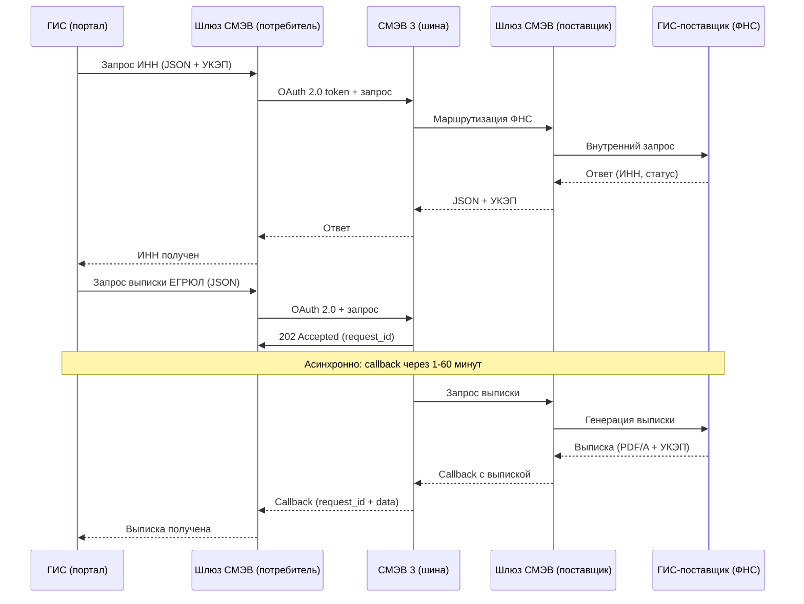

:::info[TL;DR]
Спроектировать интеграцию ГИС с СМЭВ 3: схема взаимодействия, модель данных (JSON), SLA, обработка ошибок, аудит. ГИС запрашивает: ИНН (ФНС), СНИЛС (СФР), выписку ЕГРЮЛ (ФНС).
:::

## Контекст

Ведомство разрабатывает ГИС для выдачи лицензий (100 000 заявителей/год). Система должна получать данные через СМЭВ 3:

- **ИНН** — из ФНС (синхронно, проверка статуса налогоплательщика)
- **СНИЛС** — из СФР (синхронно, проверка СНИЛС)
- **Выписка ЕГРЮЛ** — из ФНС (асинхронно, полная выписка)

Транспорт: REST/HTTP/2, аутентификация: OAuth 2.0 + УКЭП, формат: JSON.

## Цель задачи

Специфицировать интеграцию с СМЭВ 3: схема, модель данных, SLA, ошибки, аудит.

## Пошаговый подход

### Шаг 1: Схема интеграции



### Шаг 2: Модель данных

**Вид сведения 1: ИНН (синхронный, ФНС)**

```json
// Запрос
{
  "requestId": "REQ-INN-001",
  "sender": "7701777777-LICENSE",
  "recipient": "7701888888-FNS",
  "serviceCode": "FNS-INN-GET",
  "data": {
    "documentType": "PASSPORT_RF",
    "documentSeries": "4501",
    "documentNumber": "123456"
  }
}

// Ответ
{
  "requestId": "REQ-INN-001",
  "status": "SUCCESS",
  "data": {
    "inn": "123456789012",
    "status": "ACTIVE",
    "fullName": "Иванов Иван Иванович"
  },
  "signature": "base64(...)",
  "timestamp": "2025-01-01T10:00:00Z"
}
```

**Вид сведения 2: СНИЛС (синхронный, СФР)**

```json
// Запрос
{
  "requestId": "REQ-SNILS-001",
  "sender": "7701777777-LICENSE",
  "recipient": "7701999999-SFR",
  "serviceCode": "SFR-SNILS-GET",
  "data": {
    "passportSeries": "4501",
    "passportNumber": "123456",
    "birthDate": "1990-01-01"
  }
}

// Ответ
{
  "requestId": "REQ-SNILS-001",
  "status": "SUCCESS",
  "data": {
    "snils": "123-456-789 01",
    "valid": true
  },
  "signature": "base64(...)",
  "timestamp": "2025-01-01T10:00:01Z"
}
```

**Вид сведения 3: Выписка ЕГРЮЛ (асинхронный, ФНС)**

```json
// Запрос
{
  "requestId": "REQ-EGRUL-001",
  "sender": "7701777777-LICENSE",
  "recipient": "7701888888-FNS",
  "serviceCode": "FNS-EGRUL-GET",
  "data": {
    "ogrn": "1234567890123",
    "requestReason": "LICENSE_ISSUE"
  }
}

// Ответ (202 Accepted)
{
  "requestId": "REQ-EGRUL-001",
  "status": "ACCEPTED",
  "callbackUrl": "/api/v1/callback/smev"
}

// Callback (от СМЭВ → Шлюз потребителя)
{
  "requestId": "REQ-EGRUL-001",
  "status": "SUCCESS",
  "data": {
    "ogrn": "1234567890123",
    "companyName": "ООО Ромашка",
    "status": "ACTIVE",
    "extract": "base64(PDF/A выписки с УКЭП)"
  },
  "signature": "base64(...)",
  "timestamp": "2025-01-01T10:05:00Z"
}
```

### Шаг 3: SLA и таймауты

| Вид сведений | Тип | Таймаут | Ретраи | Fallback |
|-------------|-----|---------|--------|----------|
| ИНН | Синхронный | 10 сек | 2 (1 сек, 3 сек) | Если таймаут → «сервис недоступен», попросить позже |
| СНИЛС | Синхронный | 10 сек | 2 | Если не найден → запросить у оператора |
| Выписка ЕГРЮЛ | Асинхронный | 24 часа | — | Если > 24 ч → запрос в техподдержку ФНС |

### Шаг 4: Ошибки

| № | Ошибка | HTTP-код | Действие системы | Действие оператора |
|---|--------|----------|-----------------|-------------------|
| 1 | Таймаут (10 сек) | 504 Gateway Timeout | Retry 2 раза, если не успех → «Сервис временно недоступен» | Попробовать позже |
| 2 | Вид сведений не найден | 404 | «Неверный вид сведений» | Проверить serviceCode |
| 3 | Нет ЕСИА-полномочий | 403 Forbidden | «Нет права на запрос» | Обратиться в техподдержку ЕСИА |
| 4 | Невалидные данные | 400 Bad Request | «Неверный формат данных» | Исправить запрос |
| 5 | Поставщик не отвечает | 503 Service Unavailable | Retry 3 раза, queue | Ожидать |
| 6 | Callback не пришёл | Timeout 24 часа | «Выписка не получена» | Запросить повторно |

### Шаг 5: Аудит (ФСТЭК)

| Событие | Логируемые поля | Хранение |
|---------|----------------|----------|
| **Запрос СМЭВ** отправлен | requestId, sender, recipient, serviceCode, timestamp | 5 лет |
| **Ответ СМЭВ** получен | requestId, status, timestamp, signature | 5 лет |
| **Ошибка СМЭВ** | requestId, errorCode, errorMessage, timestamp | 5 лет |
| **Callback** получен | requestId, status, data.size, timestamp | 5 лет |
| **Ретрай** | requestId, attempt, delay, result | 1 год |
| **Изменение ЕСИА-полномочий** | роль, пользователь, timestamp | 5 лет |

## Критерии приемки

- [ ] Схема интеграции содержит 5+ участников (ГИС, шлюз потребителя, СМЭВ, шлюз поставщика, ГИС-поставщик)
- [ ] Для каждого вида сведений (3) — JSON-структура запроса и ответа
- [ ] SLA: таймаут указан для каждого запроса (10 сек, 10 сек, 24 часа)
- [ ] Ошибки: 6 сценариев с описанием реакции системы
- [ ] Аудит: 6 типов событий

## Пример хорошего результата

**Фрагмент спецификации:**

```
Вид сведения: ИНН (FNS-INN-GET)
Тип: Синхронный
Таймаут: 10 сек
Ретраи: 2 (1 сек, 3 сек)
Поставщик: ФНС (7701888888-FNS)

Запрос:
{
  "documentType": "PASSPORT_RF",
  "documentSeries": "4501",
  "documentNumber": "123456"
}

Ответ:
{
  "inn": "123456789012",
  "status": "ACTIVE"
}

Ошибка 504: Retry → если не успех → «Сервис недоступен»
Ошибка 403: «Нет полномочий» — обратиться в техподдержку
```

## Типичные ошибки

- **Синхронный vs асинхронный.** Выписка ЕГРЮЛ генерируется 1-60 минут — должен быть асинхронный запрос. Если сделать синхронным — таймаут.
- **Нет retry.** Запрос упал по таймауту → ошибка. Пользователь видит «сервис недоступен». Нужен retry 2-3 раза с exponential backoff.
- **JSON не согласован с поставщиком.** В спецификации написано `documentSeries`, а API поставщика ждёт `docSeries`. Тестирование интеграции (contract testing) — обязательно.
- **Нет аудита СМЭВ.** ФСТЭК требует: каждый межведомственный запрос должен быть залогирован (кто, когда, что запрашивал, какой ответ).
- **ЕСИА-полномочия не настроены.** ГИС отправляет запрос, а СМЭВ отвечает 403 — нет права на этот вид сведений. Настройка полномочий — в административном интерфейсе ЕСИА.

## Связанные материалы

- [Статья: СМЭВ — межведомственное взаимодействие](/docs/specialization/govtech-smev) — теория СМЭВ
- [Технология: СМЭВ](/tech/smev) — транспорт, версии, SLA
- [Технология: Криптография](/tech/crypto) — УКЭП для подписи запросов
- [Задача: Аттестация ГИС](/tasks/gov-security-audit) — требования ФСТЭК к аудиту
- [Задача: Проектирование госуслуги](/tasks/gov-design-service) — как услуга использует СМЭВ
