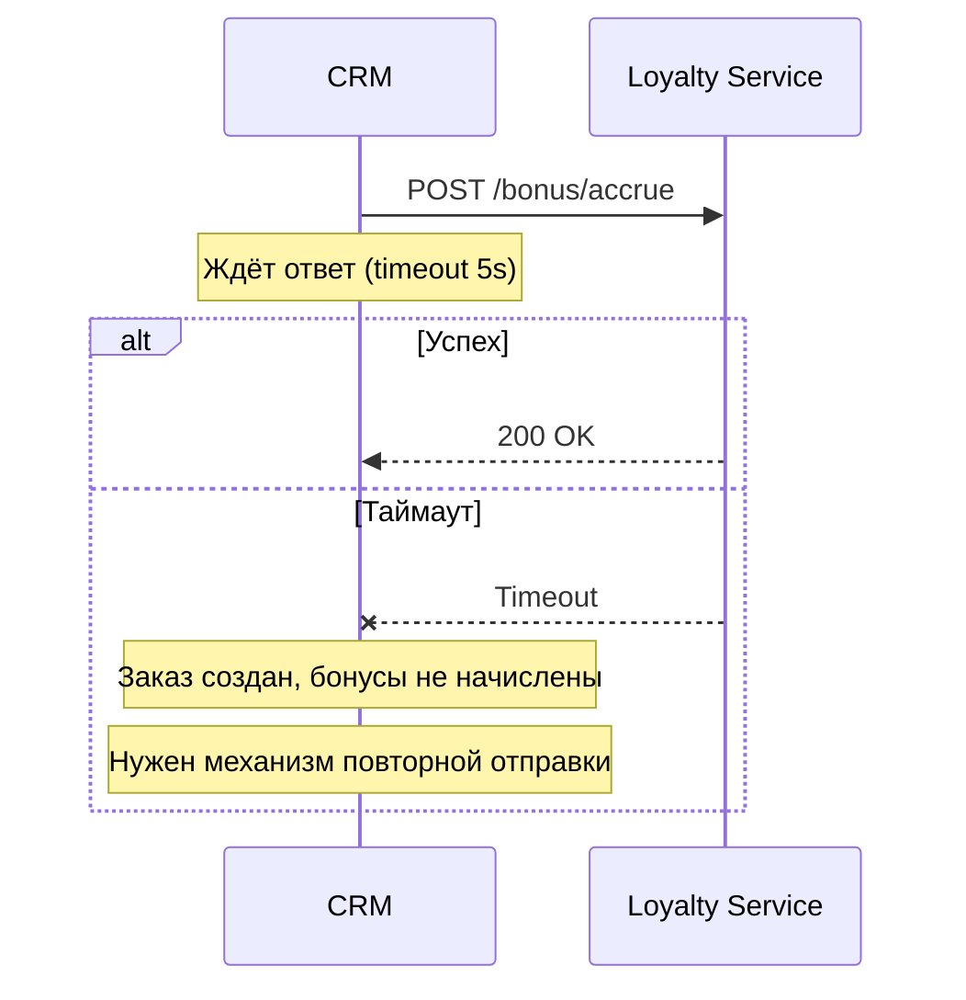
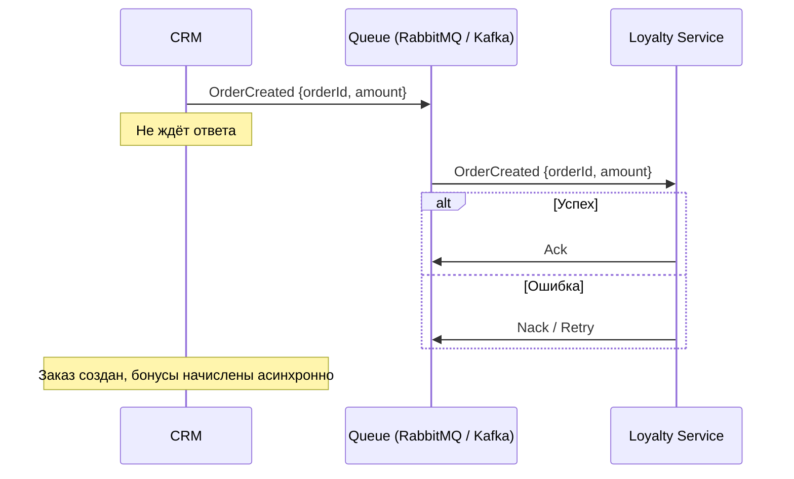

# Проектирование интеграции двух систем

**Тип задачи:** Интеграция
**Уровень:** Strong Junior
**Оценка времени:** ~120 минут

## Контекст

Вы — системный аналитик в компании, разрабатывающей CRM-систему. Руководство решило подключить внешний сервис лояльности (Loyalty Service), который начисляет и списывает бонусные баллы клиентам.

Бизнес-правило:
- При создании заказа клиенту начисляются бонусы (1% от суммы)
- Если сервис лояльности недоступен, заказ всё равно создаётся
- Бонусы должны быть начислены, как только сервис станет доступен
- Один заказ не может начислить бонусы дважды

Ваша задача — спроектировать интеграцию, которая удовлетворяет этим требованиям, и зафиксировать решения.

## Варианты интеграции

### Синхронная (REST over HTTP)

CRM вызывает Loyalty Service при каждом создании заказа и ждёт ответа.



**Плюсы:** Простота реализации
**Минусы:** Заказ зависит от доступности LS, нужен retry-механизм

### Асинхронная (Message Broker)

CRM кладёт событие `OrderCreated` в очередь, LS читает и обрабатывает.



**Плюсы:** Высокая устойчивость, независимость систем
**Минусы:** Сложность, eventual consistency

### Гибридная

CRM создаёт заказ, возвращает ответ клиенту и асинхронно отправляет событие в очередь. Отдельный worker читает очередь и вызывает LS.

## Ключевые решения для ADR

При проектировании нужно задокументировать:

1. **Выбор типа интеграции** (синхронная / асинхронная / гибрид)
2. **Гарантия доставки**: at-most-once, at-least-once, exactly-once
3. **Идемпотентность**: как сервис лояльности поймёт, что заказ уже обработан
4. **Retry-стратегия**: сколько попыток, с каким интервалом, exponential backoff?
5. **Timeout**: сколько ждать ответа от LS
6. **Fallback**: что происходит при недоступности LS

## Пример ADR

```markdown
# ADR-002: Интеграция CRM и Loyalty Service

## Контекст
При создании заказа нужно начислять бонусы. LS может быть недоступен.
Заказ не должен ждать начисления бонусов.

## Варианты
1. Синхронный REST — простой, но зависимый
2. Асинхронный через очередь — сложный, но надёжный
3. Гибрид — баланс простоты и надёжности

## Решение
Гибрид: CRM создаёт заказ синхронно, отправляет событие в RabbitMQ.
Worker (в CRM) читает очередь и вызывает LS с retry и exponential backoff.

## Последствия
- Eventual consistency (бонусы начисляются не мгновенно)
- Нужен мониторинг очереди и dead-letter queue
- Идемпотентность по orderId в LS
```

## Чек-лист проверки

- [ ] Выбран и обоснован тип интеграции
- [ ] Описана retry-стратегия
- [ ] Реализована идемпотентность
- [ ] Определён формат данных (JSON / Protobuf / Avro)
- [ ] Описан fallback-сценарий
- [ ] Составлен ADR
- [ ] Нарисована sequence diagram
- [ ] Определены метрики мониторинга (latency, error rate, queue depth)

## Пример результата

После выполнения задачи у вас будет ADR-документ, sequence diagram двух сценариев (нормальный + ошибка) и спецификация API (если выбран синхронный подход). Решения должны быть обоснованы бизнес-требованиями.
