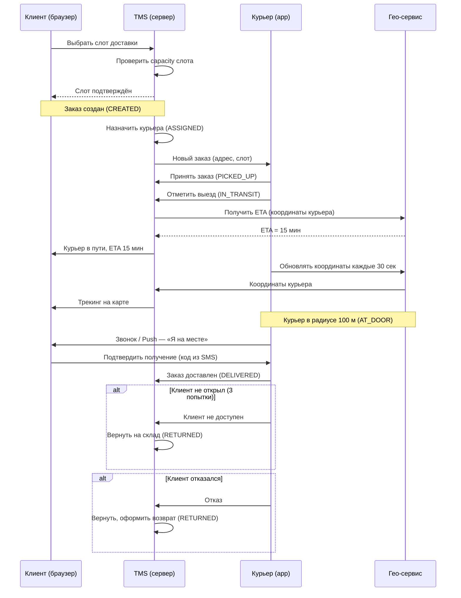

:::info[TL;DR]
Спроектировать систему доставки последней мили для интернет-магазина: слоты доставки, назначение курьеров, трекинг, подтверждение получения. Результат: статусная модель, sequence diagram, спецификация API, обработка ошибок.
:::

## Контекст

Интернет-магазин (1000+ заказов/день, ассортимент 50K+ SKU) запускает собственную доставку в городе-миллионнике. Сейчас — только самовывоз и курьерская служба (СДЭК). Руководство хочет: слоты доставки 2 часа, трекинг курьера на карте, подтверждение получения (код/подпись), возврат при отказе.

## Цель задачи

Спроектировать систему доставки «последней мили»: статусная модель, sequence diagram, спецификация API для мобильного приложения курьера, обработка ошибок.

Артефакты на выходе:
- Status model (state diagram UML + таблица переходов с условиями)
- Sequence diagram (3+ участника: клиент, TMS, курьер, клиент)
- API-спецификация (3+ endpoint с запросом/ответом)
- Сценарии ошибок (3+ кейса с обработкой)

## Пошаговый подход

### Шаг 1: Статусная модель

Определите статусы заказа доставки. Минимум 8:

```
CREATED → ASSIGNED → PICKED_UP → IN_TRANSIT → AT_DOOR → DELIVERED
                                                             → CANCELLED (на любом этапе)
                                                             → RETURNED (после PICKED_UP)
```

Для каждого статуса:
- Кто меняет (система, курьер, клиент)
- Условия перехода (таймаут, действие)
- Бизнес-исключения (клиент не открыл → 3 попытки → RETURNED)

**Таблица переходов:**

| Из статуса | В статус | Условие | Инициатор |
|-----------|----------|---------|-----------|
| CREATED | ASSIGNED | Курьер назначен | TMS (auto) |
| ASSIGNED | PICKED_UP | Курьер забрал заказ | Курьер (app) |
| PICKED_UP | IN_TRANSIT | Курьер выехал | Курьер (app) |
| IN_TRANSIT | AT_DOOR | Курьер на месте | Гео (GPS in radius) |
| AT_DOOR | DELIVERED | Клиент подтвердил (код/подпись) | Клиент |
| * | CANCELLED | Отмена клиентом/магазином | Клиент/Магазин |
| PICKED_UP+ | RETURNED | Отказ/повреждение | Курьер (app) |

### Шаг 2: Слоты доставки

Спроектируйте систему слотов:

| Параметр | Значение | Обоснование |
|----------|----------|-------------|
| Длительность слота | 2 часа | Баланс: удобство клиента vs загрузка курьера |
| Шаг слотов | 30 мин | 08:00-10:00, 08:30-10:30, ... |
| Горизонт планирования | 7 дней | Заказы today + 7 |
| Capacity | 10 заказов/слот/район | Из расчёта 1 курьер = 10 заказов за слот |
| Oversell | +20% | Исторический % отмен |
| Резерв | 10% слотов для срочных | Express delivery + 30% |

**Бизнес-правило:** Если capacity слота исчерпан — слот не показывается клиенту.

### Шаг 3: Sequence diagram



### Шаг 4: API-спецификация

**Endpoint 1: Получить заказы курьера**

```
GET /api/v1/courier/orders?status=ASSIGNED&date=2025-01-01

Response:
{
  "orders": [
    {
      "id": "DEL-123",
      "status": "ASSIGNED",
      "slot": "10:00-12:00",
      "address": {
        "full": "ул. Ленина, д. 10, кв. 5",
        "coordinates": [55.7558, 37.6173],
        "entrance": "3",
        "floor": "5",
        "intercom": "5K"
      },
      "items": [
        {"sku": "12345", "name": "Телефон", "qty": 1, "weight_kg": 0.5}
      ],
      "contact": {
        "name": "Иван Иванов",
        "phone": "+7-999-123-45-67"
      }
    }
  ],
  "pagination": {
    "page": 1,
    "total": 15,
    "limit": 20
  }
}
```

**Endpoint 2: Обновить статус заказа**

```
PATCH /api/v1/courier/orders/DEL-123/status

Request:
{
  "status": "AT_DOOR",
  "timestamp": "2025-01-01T10:30:00Z",
  "coordinates": [55.7558, 37.6173]
}

Response: 200 OK
```

**Endpoint 3: Трекинг курьера (WebSocket)**

```
Topic: /courier/{courier_id}/location
Event:
{
  "type": "location",
  "order_id": "DEL-123",
  "coordinates": [55.7558, 37.6173],
  "speed_kmh": 30,
  "eta_sec": 900,
  "timestamp": "2025-01-01T10:30:00Z"
}
```

### Шаг 5: Сценарии ошибок

| Сценарий | Обработка | API-ответ |
|----------|-----------|-----------|
| **Адрес не найден** (геокодинг вернул null) | Заказ в статус ADDRESS_FAILED, оператор проверяет. Клиенту — «Уточните адрес» | `400 {"error": "geocode_failed", "field": "address"}` |
| **Курьер опаздывает** (>15 мин от ETA) | Push клиенту: «Курьер задерживается, новое ETA». Если >30 мин — переназначить | `200 {"status": "delayed", "new_eta": "2025-01-01T11:00:00Z"}` |
| **Клиент не открыл** (3 попытки, 15 мин ожидания) | Статус RETURNED, возврат на склад. Клиенту — push/SMS «повторить завтра» | `200 {"status": "returned", "reason": "customer_not_available"}` |
| **Товар повреждён** | Фото в приложении курьера → RETURNED. Клиенту — возврат + компенсация | `200 {"status": "returned", "reason": "damaged"}` |
| **Клиент отказался** | RETURNED. Причина отказа (не тот товар, передумал) | `200 {"status": "returned", "reason": "customer_refused"}` |

## Критерии приемки

- Статусная модель содержит 8+ состояний с таблицей переходов
- Sequence diagram отражает полный цикл доставки + ошибки (alt flow)
- API покрывает получение заказов, изменение статуса, трекинг
- Обработка ошибок для 5+ кейсов

## Пример хорошего результата

**Фрагмент статусной модели:**

```
CREATED → ASSIGNED → PICKED_UP → IN_TRANSIT → AT_DOOR → DELIVERED
    ↓          ↓          ↓           ↓           ↓
CANCELLED  CANCELLED  CANCELLED  RETURNED    RETURNED
                       RETURNED
```

**Таблица capacity слотов:**

| Слот | Capacity | Заказов | Осталось | Oversell (20%) |
|------|----------|---------|----------|----------------|
| 08:00-10:00 | 10 | 8 | 2 | 12 |
| 08:30-10:30 | 10 | 10 | 0 | 12 (2 слот заблокирован, 2 — oversell) |
| 10:00-12:00 | 10 | 3 | 7 | 12 |

## Типичные ошибки

- **Статусная модель без бизнес-исключений.** Статусы CREATED → DELIVERED только happy path. Реальные кейсы: клиент не открыл, товар повреждён, отказ, частичная доставка. Каждый — отдельный статус + переход.
- **Overselling слотов.** Если продать 10 слотов, а пришло 15 заказов — курьер не успеет. Нужен capacity + oversell buffer.
- **Нет обработки геокодинга.** Адрес «ул. Ленина, д. 10» бывает в 5 городах. Без региона/района — неверный ETA. Должен быть fallback: если не найден → ручная проверка.
- **API без пагинации.** Курьер получает 100 заказов за день — приложение тормозит. Пагинация + фильтры (по статусу, дате) обязательны.
- **Sequence diagram без error flow.** Сценарий «всё хорошо» не отражает реальность. Нужны alt/else для ошибок: отмена, возврат, задержка.

## Связанные материалы

- [Статья: Последняя миля](/docs/specialization/logistics-last-mile) — теория последней мили
- [Статья: TMS](/docs/specialization/logistics-tms) — как TMS управляет доставкой
- [Технология: Геоданные](/tech/geodata) — геокодинг, матрица расстояний, ETA
- [Задача: Интеграция с курьерской службой](/tasks/logistics-integration-courier) — следующий шаг после проектирования
- [Задача: Оптимизация маршрутов](/tasks/logistics-optimization) — как оптимизировать маршруты курьеров
