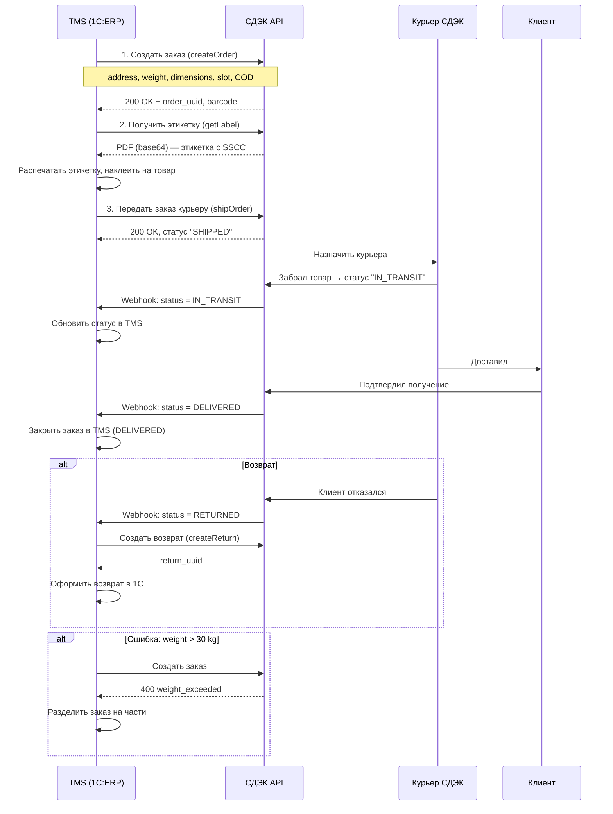

:::info[TL;DR]
Спроектировать интеграцию TMS с курьерской службой (СДЭК / Boxberry). Описать API-вызовы: создание заказа, генерация этикетки, трекинг, возврат. Результат: sequence diagram, спецификация API, статусная модель, обработка ошибок.
:::

## Контекст

Ритейлер (500 заказов/день, товары от 0.1 до 30 кг) подключает СДЭК. Текущий процесс:

1. Менеджер копирует заказ из 1С → вручную создаёт в ЛК СДЭК
2. Генерирует PDF-этикетку → сохраняет
3. Передаёт курьеру при передаче товара
4. Статус отслеживает через ЛК СДЭК

**Проблемы:** ошибки (неверный адрес, вес), 10 мин/заказ, задержки обновления статусов (4-6 часов). Задача — автоматизировать через API.

## Цель задачи

Спроектировать интеграцию TMS → Курьерская служба (СДЭК):

- Sequence diagram: TMS → создание заказа → этикетка → трекинг → подтверждение → возврат
- API-спецификация (4+ операции)
- Статусная модель (TMS ↔ СДЭК)
- Обработка ошибок (timeout, невалидные данные, отмена)

## Пошаговый подход

### Шаг 1: Sequence diagram



### Шаг 2: API-спецификация

**Операция 1: Создать заказ**

```
POST /api/v1/orders/create

Request:
{
  "type": 1,                    // 1 = доставка, 2 = возврат
  "number": "DEL-123",
  "recipient": {
    "name": "Иван Иванов",
    "phone": "+7-999-123-45-67",
    "address": {
      "full": "г. Москва, ул. Ленина, 10, кв. 5",
      "city": "Москва",
      "street": "Ленина",
      "house": "10",
      "flat": "5",
      "coordinates": [55.7558, 37.6173]
    }
  },
  "package": {
    "weight_kg": 2.5,
    "length_cm": 30,
    "width_cm": 20,
    "height_cm": 15
  },
  "delivery": {
    "slot_date": "2025-01-01",
    "slot_time_start": "10:00",
    "slot_time_end": "12:00"
  },
  "cod": {
    "amount": 5000,              // наложенный платёж
    "currency": "RUB"
  }
}

Response: 201
{
  "entity": {
    "uuid": "CDEK-12345",
    "barcode": "CDEK-12345",
    "status": "CREATED"
  },
  "requests": [{
    "request_id": "REQ-1",
    "type": "CREATE"
  }]
}
```

**Операция 2: Получить этикетку**

```
GET /api/v1/orders/CDEK-12345/label?format=pdf

Response: 200
Content-Type: application/pdf
Content-Disposition: attachment; filename="label-CDEX-12345.pdf"

<binary PDF data>
```

**Операция 3: Получить статус заказа**

```
GET /api/v1/orders/CDEK-12345/status

Response: 200
{
  "uuid": "CDEK-12345",
  "status": "IN_TRANSIT",
  "status_detail": "Курьер выехал",
  "location": {
    "city": "Москва",
    "coordinates": [55.7558, 37.6173],
    "timestamp": "2025-01-01T10:30:00Z"
  },
  "eta": "2025-01-01T11:00:00Z",
  "history": [
    {"status": "CREATED", "timestamp": "2025-01-01T08:00:00Z"},
    {"status": "SHIPPED", "timestamp": "2025-01-01T09:00:00Z"},
    {"status": "IN_TRANSIT", "timestamp": "2025-01-01T10:00:00Z"}
  ]
}
```

**Операция 4: Создать возврат**

```
POST /api/v1/orders/return

Request:
{
  "order_uuid": "CDEK-12345",
  "reason": "customer_refused",    // refused, damaged, wrong_item
  "package": {
    "weight_kg": 2.5,
    "length_cm": 30,
    "width_cm": 20,
    "height_cm": 15
  },
  "recipient": {                    // склад, куда вернуть
    "name": "ООО Ритейлер (склад)",
    "address": {
      "full": "г. Москва, ул. Складская, д. 5",
      "coordinates": [55.8000, 37.5000]
    }
  }
}

Response: 201
{
  "return_uuid": "CDEK-67890",
  "status": "CREATED"
}
```

**Операция 5: Webhook (СДЭК → TMS)**

```
POST /api/v1/webhooks/cdek/status

Event Types:
- ORDER_CREATED
- ORDER_SHIPPED
- ORDER_IN_TRANSIT
- ORDER_DELIVERED
- ORDER_RETURNED
- ORDER_CANCELLED

Payload:
{
  "event": "ORDER_DELIVERED",
  "order_uuid": "CDEK-12345",
  "timestamp": "2025-01-01T12:00:00Z",
  "signature": "sha256(body + secret)"
}
```

### Шаг 3: Статусная модель (TMS ↔ СДЭК)

| Статус TMS | Статус СДЭК | Описание |
|------------|-------------|----------|
| DELIVERY_CREATED | CREATED | Заказ создан, ожидает передачи курьеру |
| LABEL_GENERATED | CREATED | Этикетка сгенерирована |
| HANDED_TO_COURIER | SHIPPED | Передан курьеру |
| IN_TRANSIT | IN_TRANSIT | В пути к клиенту |
| AT_DELIVERY | AT_DOOR | Курьер на месте |
| DELIVERED | DELIVERED | Вручён клиенту |
| RETURN_CREATED | RETURN_CREATED | Создан возврат |
| RETURNED | RETURNED | Товар возвращён на склад |
| CANCELLED | CANCELLED | Отменён (до передачи курьеру) |

### Шаг 4: Обработка ошибок

| Ошибка | Код HTTP | Действие TMS |
|--------|----------|-------------|
| **Неверный адрес** (геокодинг не нашёл) | 400 | Статус ADDRESS_FAILED. Уведомить оператора, запросить уточнение |
| **Превышение веса** (СДЭК: max 30 кг) | 400 | Разделить заказ на части. Если товар неделимый — альтернативный перевозчик |
| **Превышение габаритов** (сумма сторон > 250 см) | 400 | Согласовать с СДЭК индивидуально или выбрать Boxberry |
| **Таймаут** (нет ответа 10 сек) | 504 | Retry 3 раза (1s, 3s, 5s). Если всё failed — сохранить в очередь, retry через 1 час |
| **Rate limit** (СДЭК: 10 req/s) | 429 | Exponential backoff (1s → 3s → 10s). Очередь с приоритетом |
| **Отмена заказа** (клиент отказался до передачи) | — | `DELETE /api/v1/orders/{uuid}` |

## Критерии приемки

- API-спецификация покрывает создание, этикетку, трекинг, возврат, webhook
- Маппинг статусов TMS ↔ СДЭК (9 статусов)
- Sequence diagram показывает flow end-to-end: создание → этикетка → передача → трекинг → возврат
- Ошибки обработаны (retry, timeout, невалидные данные, rate limit)

## Пример хорошего результата

**Фрагмент API-спецификации (OpenAPI 3.0):**

```yaml
/cdek/orders/create:
  post:
    summary: Создать заказ в СДЭК
    requestBody:
      required: true
      content:
        application/json:
          schema:
            type: object
            required: [number, recipient, package]
            properties:
              number:
                type: string
                example: "DEL-123"
              recipient:
                $ref: '#/components/schemas/Recipient'
              package:
                $ref: '#/components/schemas/Package'
    responses:
      '201':
        description: Заказ создан
      '400':
        description: weight_exceeded / invalid_address
      '429':
        description: Too Many Requests
```

**Фрагмент маппинга статусов:**

```
TMS CREATED          → СДЭК CREATED
TMS HANDED_TO_COURIER → СДЭК SHIPPED
TMS DELIVERED        → СДЭК DELIVERED
```

## Типичные ошибки

- **Не учтены лимиты API.** СДЭК: 10 запросов/сек. Если TMS отправляет 50 заказов сразу — 40 получат 429. Нужна очередь с rate limiter.
- **Нет маппинга статусов.** TMS называет статус «Вручён», СДЭК — «DELIVERED». Без маппинга TMS не поймёт, что заказ выполнен. Должна быть таблица TMS ↔ внешняя система.
- **Отсутствие retry-логики.** Сеть упала на 5 секунд — заказ не создан. Нужен retry с exponential backoff и очередь недоставленных сообщений.
- **Не обработан возврат.** Клиент отказался — курьер увёз товар. TMS не знает про возврат, статус висит «IN_TRANSIT». Webhook RETURNED должен создавать возврат в 1С.
- **Этикетка без проверки габаритов.** Оператор указал вес 5 кг, а реальный — 32 кг. СДЭК вернёт 400. Нужна интеграция с WMS: фактические вес/габариты до отправки.

## Связанные материалы

- [Статья: Интеграции с маркетплейсами и курьерами](/docs/specialization/logistics-integrations) — теория интеграций
- [Статья: TMS](/docs/specialization/logistics-tms) — как TMS управляет доставкой
- [Технология: EDI](/tech/edi) — стандарты обмена документами
- [Задача: Проектирование системы доставки](/tasks/logistics-design-delivery) — предыдущий шаг
- [Задача: Оптимизация маршрутов](/tasks/logistics-optimization) — следующий шаг
