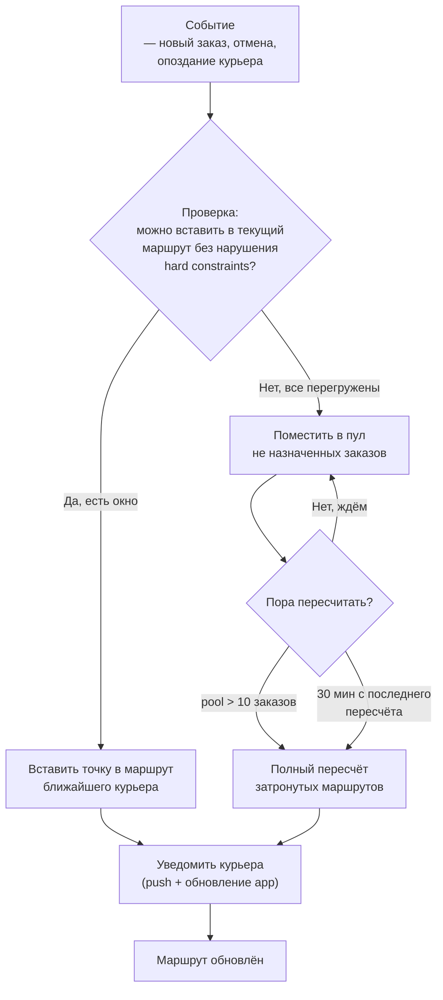

:::info[TL;DR]
Описать требования к системе оптимизации маршрутов для курьерской доставки: входные данные (заказы, адреса, временные окна), ограничения (вес, объём, время работы), бизнес-правила и метрики качества. Результат: спецификация VRP-задачи, матрица ограничений, метрики, правила ребалансировки.
:::

## Контекст

Служба доставки (200 курьеров, 5000 заказов/день, автопарк 150 машин + 50 пеших) в городе-миллионнике. Сейчас:

- Планировщик строит маршруты вручную в Excel (3 часа/день)
- Utilization курьеров: 55% (45% холостой пробег)
- On-time delivery: 82% (18% опозданий)
- Средний пробег: 120 км/день на курьера
- Ребалансировка: ручная, при новых заказах — звонок курьеру

**Цель:** автоматическая оптимизация маршрутов → utilization 80%+, on-time 95%+, пробег -20%.

## Цель задачи

Специфицировать требования к VRP-солверу (Vehicle Routing Problem) для курьерской доставки:

- Матрица ограничений (5+ бизнес-правил: hard/soft)
- Спецификация входных данных (формат, поля, откуда берутся)
- Метрики качества (3+ метрики)
- Ребалансировка (правила для новых/отменённых заказов)

## Пошаговый подход

### Шаг 1: Бизнес-правила маршрутизации

Бизнес-правила делятся на **hard constraints** (нарушать нельзя) и **soft constraints** (нарушать можно, но с penalty).

| № | Правило | Тип | Описание | Параметры |
|---|---------|-----|----------|-----------|
| 1 | **Временные окна клиентов** | Hard | Доставка только в выбранный слот (2 часа) | 08-10, 10-12, ..., 18-20 |
| 2 | **Вместимость курьера** | Hard | Вес + объём товаров ≤ вместимость | Машина: 500 кг / 2 м³. Пеший: 20 кг |
| 3 | **Рабочее время курьера** | Hard | Смена ≤ 8 часов, перерыв 30 мин после 4ч | 08:00-17:00 с перерывом 12:00-12:30 |
| 4 | **Обед курьера** | Hard | Перерыв не может быть во время доставки | Блок 30 мин, не пересекать слоты |
| 5 | **Приоритет VIP** | Soft | VIP-клиенты — первые 2 слота (08-12) | penalty = 1000 за перенос на вечер |
| 6 | **Срочные заказы** | Hard | Express — доставка за 2 часа с заказа | Не назначать на вечер |
| 7 | **Закрепление курьера за районом** | Soft | Курьер знает район — быстрее на 15% | penalty = 500 за смену района |
| 8 | **Равномерная загрузка** | Soft | Разница заказов между курьерами ≤ 20% | penalty = 200 за каждый % отклонения |

### Шаг 2: Входные данные для VRP-солвера

**Список заказов:**

```json
{
  "orders": [
    {
      "id": "ORD-123",
      "address": {
        "full": "ул. Ленина, 10",
        "coordinates": [55.7558, 37.6173],
        "district": "Центральный"
      },
      "slot": {
        "start": "2025-01-01T10:00:00Z",
        "end": "2025-01-01T12:00:00Z"
      },
      "package": {
        "weight_kg": 2.5,
        "volume_m3": 0.01
      },
      "priority": 0,           // 0 = normal, 1 = VIP, 2 = express
      "service_time_min": 10,  // время на вручение (вход, подпись)
      "cod_amount": 0
    }
  ]
}
```

**Курьеры:**

```json
{
  "couriers": [
    {
      "id": "C-001",
      "type": "car",               // car, bike, foot
      "capacity": {
        "weight_kg": 500,
        "volume_m3": 2.0
      },
      "working_hours": {
        "start": "2025-01-01T08:00:00Z",
        "end": "2025-01-01T17:00:00Z"
      },
      "break": {
        "start": "2025-01-01T12:00:00Z",
        "end": "2025-01-01T12:30:00Z"
      },
      "start_location": [55.7600, 37.6200],  // склад
      "end_location": [55.7600, 37.6200],     // возврат на склад
      "district": "Центральный",
      "speed_kmh": 30                          // средняя по городу
    }
  ]
}
```

**Матрица расстояний:**

```json
{
  "matrix": [
    [0, 5.2, 3.1, ...],    // от склада до точек
    [5.2, 0, 4.5, ...],
    [3.1, 4.5, 0, ...],
    ...
  ],
  "matrix_time": [
    [0, 15, 10, ...],       // минуты с учётом пробок
    [15, 0, 12, ...],
    [10, 12, 0, ...],
    ...
  ]
}
```

**Источники данных:**

| Поле | Источник | Формат |
|------|----------|--------|
| Адрес заказа | 1С:ERP / сайт | Текст + координаты (геокодинг) |
| Вес/объём | WMS (факт) или ERP (номинал) | кг, м³ |
| Слот доставки | TMS (система слотов) | datetime range |
| Курьер (capacity) | HR-система / TMS | JSON |
| Матрица расстояний | Яндекс.Маршрутизация / OSRM | JSON (N×N) |
| Пробки (dynamic) | Яндекс.Пробки / Geotab | Коэффициент 0.5-2.0 |

### Шаг 3: Метрики оптимизации

| Метрика | Формула | До | После (target) |
|---------|---------|----|-----------------|
| **Общий пробег** | ∑ км всех курьеров | 24 000 км/день | 19 200 км (-20%) |
| **Utilization** | (заказов × время доставки) / смена курьера | 55% | 80%+ |
| **On-time delivery** | доставлено в слот / всего | 82% | 95%+ |
| **Заказов на курьера** | ∑ заказов / кол-во курьеров | 25 | 30+ |
| **Среднее время маршрута** | ∑ время маршрута / кол-во маршрутов | 6.5 часов | 6.0 часов |
| **Отклонение загрузки** | max(загрузка) - min(загрузка) | 50% | 20% |
| **Холостой пробег** | км без заказа / общий км | 45% | 15-20% |

**Пример расчёта utilization:**

```
Курьер: смена 8 часов (480 мин)
В пути: 200 мин
У заказчиков (service time): 200 мин (20 заказов × 10 мин)
Простой между заказами: 50 мин
Обед: 30 мин

Utilization = (200 + 200) / 480 = 83%
```

### Шаг 4: Ребалансировка в реальном времени

Ребалансировка — пересчёт маршрутов при событиях (новый заказ, отмена, опоздание).



**Правила ребалансировки:**

| Событие | Действие | Условие |
|---------|----------|---------|
| **Новый заказ (normal)** | Вставить в маршрут ближайшего курьера | Если есть окно в слоте и capacity |
| **Новый заказ (express)** | Вставить в маршрут курьера с наименьшей загрузкой | Если сможет доставить за 2 часа |
| **Отмена заказа** | Удалить точку из маршрута курьера | Автоматически |
| **Опоздание курьера** (>30 мин) | Передать 2-3 заказа другому курьеру | Если есть кто рядом |
| **Курьер заболел** | Перераспределить все его заказы | +5% к загрузке других курьеров |
| **Полный пересчёт** | Заново построить маршруты для всех курьеров | Если pool > 10 или 30 мин прошло |

## Критерии приемки

- 5+ бизнес-правил описаны с типом (hard/soft) и параметрами
- Входные данные специфицированы: поля, формат, источник данных
- 3+ метрики для оценки маршрутов с формулой и target
- Ребалансировка: правила для 4+ событий (новый, отмена, опоздание, болезнь)

## Пример хорошего результата

**Фрагмент constraints для OR-Tools (Python):**

```python
# OR-Tools VRP constraints
def create_constraints(manager, routing, data):
    # 1. Временные окна
    time_dimension = routing.GetDimensionOrDie('Time')
    for i, order in enumerate(data['orders']):
        time_dimension.CumulVar(i+1).SetRange(
            order['slot_start'], order['slot_end']
        )

    # 2. Вместимость
    weight_dimension = routing.GetDimensionOrDie('Weight')
    weight_dimension.SetGlobalSpanCostCoefficient(100)

    # 3. Приоритет VIP (soft — penalty за перенос)
    for i, order in enumerate(data['orders']):
        if order['priority'] == 1:  # VIP
            routing.AddSoftSameVehicleConstraint(
                time_dimension.CumulVar(i+1), penalty=1000
            )

    # 4. Равномерная загрузка (soft)
    routing.AddSoftSpanUpperBound(
        time_dimension, span_ub=360, penalty=200 * len(data['orders'])
    )
```

**Фрагмент метрик:**

```
До оптимизации:
  Пробег: 24 000 км/день
  Utilization: 55%
  On-time: 82%
  Холостой пробег: 45%

После внедрения OR-Tools (симуляция):
  Пробег: 19 000 км/день (-21%)
  Utilization: 81%
  On-time: 96%
  Холостой пробег: 18%
```

## Типичные ошибки

- **Матрица расстояний линейная (as crow flies) вместо дорожной.** Координаты → расчёт по прямой даёт +30% к пробегу. Всегда использовать дорожную матрицу (Яндекс.Маршруты, OSRM).
- **Полный пересчёт на каждое событие.** Пришёл 1 новый заказ → пересчитали 200 маршрутов → курьеры в замешательстве. Нужен инкрементальный подход: вставить в текущий маршрут, полный пересчёт — раз в 30 мин или при 10+ изменениях.
- **Не учтён dwell time (время загрузки/разгрузки).** Солвер считает: 1 мин на точку. Реально — 10 мин (парковка, вход, подпись). Результат: маршрут на 8 часов, а реально — 10 часов.
- **Hard constraints vs soft penalties.** Все ограничения сделаны hard. Солвер не может построить маршрут → отказ. Нужно: приоритет VIP — soft (можно перенести, но дорого), вместимость — hard (не влезет).
- **Ребалансировка без уведомления курьера.** Маршрут изменился — курьер узнаёт об этом, когда приехал к старому адресу. Нужен push + звуковой сигнал в приложении.

## Связанные материалы

- [Статья: Маршрутизация и оптимизация](/docs/specialization/logistics-routing) — теория VRP
- [Статья: Последняя миля](/docs/specialization/logistics-last-mile) — слоты, курьеры, трекинг
- [Технология: Геоданные](/tech/geodata) — матрица расстояний, H3-кластеризация
- [Задача: Проектирование системы доставки](/tasks/logistics-design-delivery) — статусная модель, слоты
- [Задача: Интеграция с курьерской службой](/tasks/logistics-integration-courier) — API с курьером
