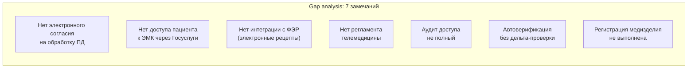

:::info[TL;DR]
Составить чек-лист проверки МИС на соответствие 323-ФЗ (охрана здоровья) и 152-ФЗ (ПД). 20+ требований: ведение ЭМК, телемедицина, согласие на обработку ПД, локализация данных, УЗ-1, регистрация медизделия. Для каждого — конкретный критерий проверки. Результат: таблица compliance, RACI, gap analysis, классификация медизделия.
:::

## Контекст

Многопрофильная больница (1000 коек, 3000 сотрудников). МИС на базе 1С:Медицина + Postgres Pro. Готовится к проверке Росздравнадзора.

**Анализ рисков:**
- МИС влияет на врачебные решения (подсказки по лекарствам)
- Штраф за отсутствие регистрации медизделия: до 300 тыс. руб.
- Штраф за нарушение 152-ФЗ: до 300 тыс. руб. + блокировка

## Цель задачи

Составить чек-лист compliance, matrix RACI, gap analysis, классифицировать медизделие.

## Пошаговый подход

### Шаг 1: Требования 323-ФЗ

| N | Требование | Статья | Критерий проверки | Статус |
|---|-----------|--------|-------------------|--------|
| 1 | Ведение ЭМК | ст. 22, 92 | Каждая запись подписана УКЭП врача | ⚠️ Частично |
| 2 | Доступ пациента к ЭМК | ст. 22 | Пациент может просмотреть карту через Госуслуги | ❌ Нет |
| 3 | Информированное согласие | ст. 20 | Электронное согласие на обработку через ЕСИА | ❌ Нет |
| 4 | Телемедицина | ст. 36.2 | Есть порядок и регламент | ⚠️ Частично |
| 5 | Электронный рецепт | ст. 78 | Рецепт с УКЭП, передача в ФЭР | ❌ Нет |
| 6 | Передача в ЕГИСЗ | Пост. № 1275 | Данные передаются по HL7 FHIR | ✅ Есть |

### Шаг 2: Требования 152-ФЗ

| N | Требование | Статья | Критерий проверки | Статус |
|---|-----------|--------|-------------------|--------|
| 7 | ПД особой категории | ст. 10 | Данные о здоровье — особая категория | ✅ Верно |
| 8 | Согласие на обработку | ст. 9 | Отдельное, явное, в электронном виде | ❌ Нет |
| 9 | Локализация данных | ст. 18 + 242-ФЗ | Все серверы на территории РФ | ✅ Есть |
| 10 | УЗ-1 (максимальный) | Приказ ФСТЭК | Криптография, RBAC, аудит, антивирус | ⚠️ Частично |
| 11 | Уведомление РКН | ст. 22 | Уведомление об обработке ПД подано | ✅ Есть |
| 12 | Уничтожение при отзыве | ст. 21 | При отзыве согласия — безвозвратное удаление | ❌ Нет |

### Шаг 3: Приказы Минздрава

| N | Приказ | Суть | Критерий | Статус |
|---|--------|------|----------|--------|
| 13 | № 947н | Правила ведения ЭМК | Структура, сроки, УКЭП | ⚠️ Частично |
| 14 | № 797н | Порядок телемедицины | Регламент, запись, согласие | ❌ Нет |
| 15 | № 785н | Требования к рецептам | Форма, УКЭП, передача в ФЭР | ❌ Нет |

### Шаг 4: Классификация медизделия

**Вопрос:** Влияет ли МИС на принятие врачебных решений?

**Анализ:**
- МИС показывает подсказки по лекарствам (дозировки, взаимодействия) — влияет
- МИС предупреждает о критических значениях анализов — влияет
- МИС не ставит диагноз автоматически — не влияет

**Вывод:** Система частично влияет на врачебные решения (подсказки, предупреждения). Класс риска: **2a** (система поддержки принятия решений низкого риска). Требуется регистрация в Росздравнадзоре.

### Шаг 5: Gap analysis



**План устранения:**

| № | Замечание | Решение | Срок | Ответственный | Бюджет |
|---|-----------|---------|------|--------------|--------|
| 1 | Нет согласия на ПД | Форма через ЕСИА | 2 мес. | SA + Юрист | 500K |
| 2 | Нет доступа к ЭМК | Личный кабинет через ЕМИАС | 3 мес. | SA + Разработка | 1.5M |
| 3 | Нет рецептов (ФЭР) | Интеграция с ФЭР | 2 мес. | SA + Разработка | 800K |
| 4 | Нет телемедицины | Регламент + платформа | 4 мес. | SA + Врачи | 2M |
| 5 | Неполный аудит | Внедрение ELK | 1 мес. | Админ | 300K |
| 6 | Дельта-проверка | ЛИС — доработка | 1 мес. | SA + Разработка | 400K |
| 7 | Регистрация медизделия | Росздравнадзор | 8 мес. | Юрист + SA | 1.2M |

## Критерии приемки

- [ ] Чек-лист содержит 15+ требований (323-ФЗ + 152-ФЗ + приказы)
- [ ] Для каждого требования — конкретный критерий проверки (да/нет/частично)
- [ ] Классификация медизделия с обоснованием
- [ ] Gap analysis: 5+ замечаний с планом устранения
- [ ] RACI: 4+ роли

## Пример хорошего результата

**Матрица ответственности (RACI):**

```
┌─────────────────────────────┬────────┬────────┬────────┬─────────┬────────┐
│ Решение                    │ SA     │ Архит.│ Юрист │ Врач    │ Админ  │
├─────────────────────────────┼────────┼────────┼────────┼─────────┼────────┤
│ Согласие на ПД (ЕСИА)      │ R      │ C      │ A     │ C      │ I      │
│ Доступ к ЭМК (Госуслуги)   │ R      │ A      │ C     │ I      │ C      │
│ Регистрация медизделия     │ C      │ I      │ R     │ C      │ A      │
│ Регламент телемедицины     │ A/R    │ I      │ C     │ R      │ I      │
└─────────────────────────────┴────────┴────────┴────────┴─────────┴────────┘
R = ответственный, A = утверждающий, C = консультант, I = информируемый
```

**Фрагмент чек-листа:**

```
┌─────┬──────────────────────────┬──────────────────────────────────┬──────────┐
│  № │ Требование               │ Критерий                        │ Статус  │
├─────┼──────────────────────────┼──────────────────────────────────┼──────────┤
│  1  │ Ведение ЭМК (323-ФЗ)    │ УКЭП на каждой записи врача     │ Частично │
│  2  │ Доступ пациента к ЭМК   │ Просмотр через Госуслуги       │ Нет      │
│  3  │ Согласие на ПД (152-ФЗ) │ Электронное, через ЕСИА         │ Нет      │
│ ... │ ...                     │ ...                              │ ...      │
└─────┴──────────────────────────┴──────────────────────────────────┴──────────┘
```

## Типичные ошибки

- **Неверная классификация медизделия.** Если МИС только хранит данные (архив ЭМК) — медизделие не нужно. Если подсказывает врачу — нужно. Если ставит диагноз (ИИ) — класс 3. Ошибка в классификации — штраф или лишние затраты.
- **Локализация не проверена.** Руководство уверено, что серверы в РФ, а dev-окружение — в Нидерландах. 152-ФЗ — и к разработке тоже.
- **Согласие — текст, не электронное.** По 323-ФЗ и 152-ФЗ согласие на обработку ПД о здоровье — электронное, через Госуслуги или ЕСИА.
- **Приказы Минздрава не учтены.** 323-ФЗ — рамочный. Конкретные требования — в приказах (№ 947н, № 797н). Если проверили только 323-ФЗ — Росздравнадзор найдёт нарушения.
- **Нет gap analysis.** Найдены замечания, но нет плана их устранения со сроками и ответственными — аудит не зачтут.

## Связанные материалы

- [Статья: Регуляторика в медицине](/docs/specialization/medtech-regulations) — теория
- [Технология: ЕМИАС / ЕГИСЗ](/tech/emias) — гос. системы
- [Технология: HL7 FHIR](/tech/hl7) — интеграция для передачи данных
- [Задача: Интеграция ЛИС с МИС](/tasks/medtech-lis-integration) — предыдущая задача
- [Задача: Проектирование ЭМК](/tasks/medtech-design-emk) — требования к ЭМК
