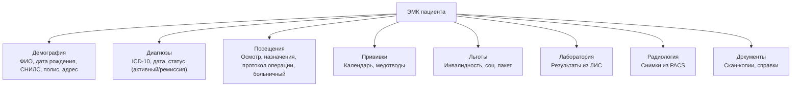
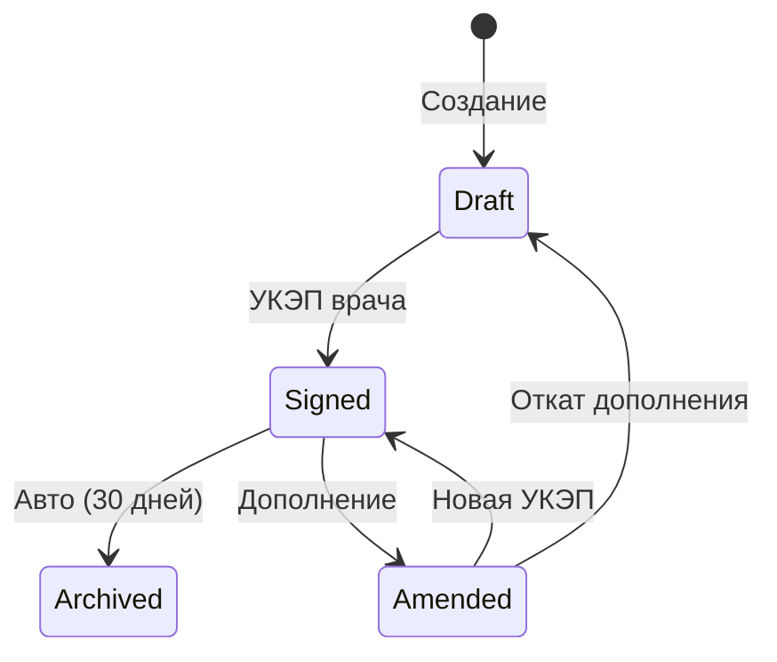
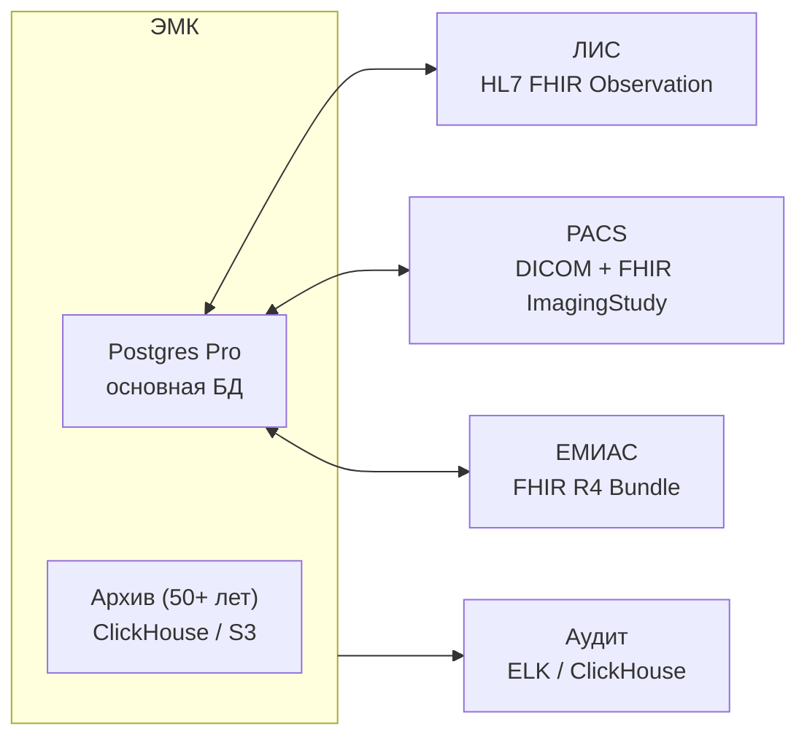

:::info[TL;DR]
Спроектировать структуру ЭМК для городской поликлиники: 5 разделов (демография, диагнозы, посещения, прививки, документы), 5 ролей (врач, медсестра, заведующий, администратор, пациент), жизненный цикл с УКЭП, интеграции с ЛИС, PACS и ЕМИАС. Результат: ER-диаграмма, use-case, матрица доступов, state diagram, схема интеграций.
:::

## Контекст

Поликлиника на 500 посещений/день (150 врачей, 50 медсестёр, 20 администраторов). 150 000 бумажных карт. Переход на ЭМК.

**Текущие проблемы:**
- Карты теряются (5% случаев)
- Поиск карты: 15 мин
- Невозможность вести статистику
- Нет интеграции с ЕГИСЗ

## Цель задачи

Спроектировать ЭМК: структура данных, права доступа, жизненный цикл, интеграции.

## Пошаговый подход

### Шаг 1: Разделы ЭМК



### Шаг 2: Матрица доступов (RBAC)

| Раздел | Врач | Медсестра | Заведующий | Администратор | Пациент |
|--------|------|-----------|------------|--------------|---------|
| Демография | Чтение | Чтение | Чтение | Чтение/Запись | Чтение |
| Диагнозы | Чтение/Запись | — | Чтение/Запись | — | Чтение |
| Посещения | Чтение/Запись | Чтение/Запись (назначения) | Чтение | Чтение | Чтение |
| Прививки | Чтение/Запись | Чтение/Запись | Чтение | Чтение | Чтение |
| Льготы | Чтение | Чтение | Чтение/Запись | Чтение/Запись | Чтение |
| Лаборатория | Чтение | — | Чтение | — | Чтение |
| Радиология | Чтение | — | Чтение | — | Чтение |
| Аудит | — | — | Полный | — | — |

### Шаг 3: Жизненный цикл записи



### Шаг 4: Интеграции



### Шаг 5: Use-case диаграмма

| Участник | Действия |
|----------|----------|
| **Врач** | Создать запись, подписать УКЭП, назначить анализ, выписать рецепт |
| **Медсестра** | Выполнить назначение, ввести витальные, отметить прививку |
| **Заведующий** | Аудит, просмотр статистики, разблокировка |
| **Администратор** | Регистрация пациента, поиск карты, печать справки |
| **Пациент** | Просмотр карты (Госуслуги), запись к врачу |

## Критерии приемки

- [ ] ER-диаграмма содержит 5+ сущностей (Patient, Visit, Diagnosis, Prescription, Document)
- [ ] Матрица доступов: 5 ролей × 8 разделов
- [ ] State diagram: 4 состояния (Draft → Signed → Archived / Amended)
- [ ] Интеграции: ЛИС, PACS, ЕМИАС — протоколы указаны
- [ ] Use-case: 4+ участника с действиями

## Пример хорошего результата

**Матрица доступов (фрагмент):**

```
┌──────────────┬───────┬─────────┬───────────┬──────────────┬────────┐
│ Раздел       │ Врач  │Медсестра│Заведующий │Администратор │Пациент │
├──────────────┼───────┼─────────┼───────────┼──────────────┼────────┤
│ Демография   │ R     │ R       │ R         │ RW           │ R      │
│ Диагнозы     │ RW    │ –       │ RW        │ –            │ R      │
│ Посещения    │ RW    │ RW      │ R         │ R            │ R      │
│ ...          │ ...   │ ...     │ ...       │ ...          │ ...    │
└──────────────┴───────┴─────────┴───────────┴──────────────┴────────┘
```

**State diagram (описание):**

```
Draft → Signed: Врач завершил запись и подписал УКЭП.
Signed → Archived: Прошло 30 дней, запись закрыта для изменений.
Signed → Amended: Врач делает дополнение (новый UUID, ссылка на исходную).
Amended → Signed: Дополнение подписано новой УКЭП.
```

## Типичные ошибки

- **Нет УКЭП.** Если запись в ЭМК не подписана — она не имеет юридической силы. По 323-ФЗ врач обязан подписывать каждую запись.
- **Администратор может редактировать диагнозы.** Нарушение 152-ФЗ: диагнозы может устанавливать только врач.
- **Нет интеграции с ЕМИАС.** Без передачи данных в ЕГИСЗ — штраф до 300 тыс. руб. Пациенты не видят карту на Госуслугах.
- **Нет версионности.** Врач исправил подписанную запись — исходная запись потеряна. Должна быть immutable история: дополнение, а не замена.
- **Не рассчитан объём хранения.** 150 000 пациентов × 100 записей/год × 50 лет = 750 млн записей. Нужен tiered storage.

## Связанные материалы

- [Статья: ЭМК — электронные медкарты](/docs/specialization/medtech-emk) — теория
- [Статья: МИС — медицинские ИС](/docs/specialization/medtech-mis) — контекст МИС
- [Технология: HL7 FHIR](/tech/hl7) — протокол интеграции
- [Технология: ЕМИАС](/tech/emias) — передача в ЕГИСЗ
- [Задача: Интеграция ЛИС с МИС](/tasks/medtech-lis-integration) — следующий шаг
