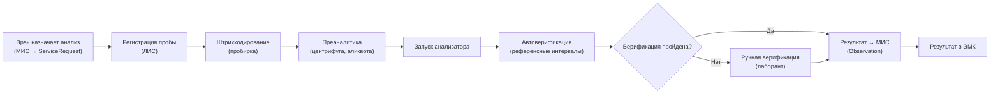
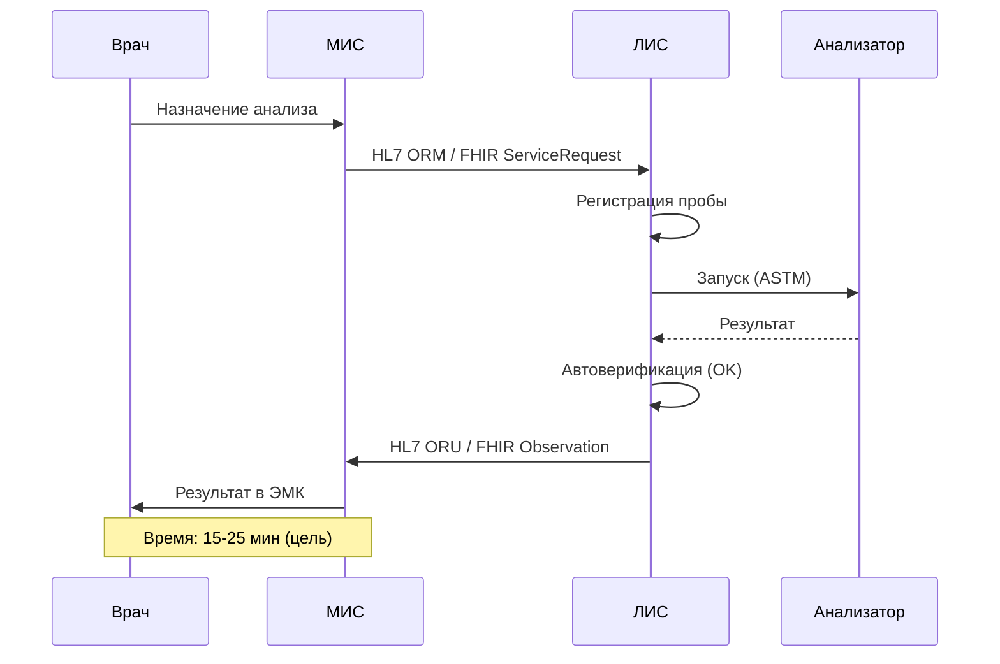
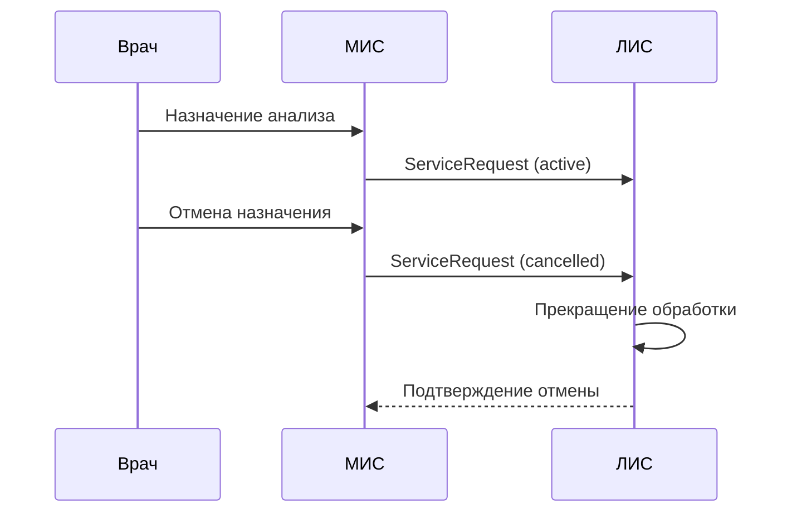

:::info[TL;DR]
Спроектировать интеграцию ЛИС с МИС по HL7 FHIR. Поток: назначение врача → ServiceRequest → ЛИС → забор пробы → анализ → Observation/DiagnosticReport → ЭМК. 15 000 проб/день, автоверификация 70%, обработка ошибок (отмена, таймаут, брак). Результат: sequence-диаграмма, FHIR-спецификация, таблица статусов, схема ретраев.
:::

## Контекст

Больница, 15 000 проб/день. Сейчас: анализаторы печатают на бумаге → лаборант вводит вручную → 3% ошибок, среднее время 4 часа.

**Цели интеграции:**
- HL7 FHIR: МИС → ЛИС (назначение), ЛИС → МИС (результат)
- Автоверификация: 70%+ результатов без участия лаборанта
- Время выдачи результата: с 4 часов → 25 мин

## Цель задачи

Специфицировать интеграцию ЛИС с МИС: flow, FHIR-модель, ошибки, автоверификация, таймауты.

## Пошаговый подход

### Шаг 1: Flow-диаграмма



### Шаг 2: FHIR-спецификация

**1. Назначение анализа (МИС → ЛИС):**

```json
POST /fhir/ServiceRequest
{
  "resourceType": "ServiceRequest",
  "status": "active",
  "code": {
    "coding": [
      { "system": "urn:oid:1.2.643.5.1.13.13", "code": "A09.05.003" }
    ]
  },
  "subject": { "reference": "Patient/123" },
  "requester": { "reference": "Practitioner/456" },
  "encounter": { "reference": "Encounter/789" },
  "specimen": [{ "type": { "text": "Кровь венозная" } }]
}
```

**2. Результат анализа (ЛИС → МИС):**

```json
POST /fhir/Observation
{
  "resourceType": "Observation",
  "status": "final",
  "code": {
    "coding": [{ "system": "http://loinc.org", "code": "718-7" }]
  },
  "subject": { "reference": "Patient/123" },
  "valueQuantity": { "value": 5.8, "unit": "mmol/l" },
  "referenceRange": [
    { "low": { "value": 3.5 }, "high": { "value": 5.5 } }
  ],
  "device": { "reference": "Device/sysmex-XN" },
  "performer": [{ "reference": "Practitioner/789" }]
}
```

**3. Отчёт по группе анализов (ЛИС → МИС):**

```json
POST /fhir/DiagnosticReport
{
  "resourceType": "DiagnosticReport",
  "status": "final",
  "code": {
    "coding": [{ "code": "58410-2", "display": "Complete blood count" }]
  },
  "subject": { "reference": "Patient/123" },
  "result": [
    { "reference": "Observation/1" },
    { "reference": "Observation/2" },
    { "reference": "Observation/3" }
  ],
  "conclusion": "Показатели в норме"
}
```

### Шаг 3: Таблица статусов и таймауты

| Статус заказа | Описание | Таймаут | Действие |
|--------------|----------|---------|----------|
| Ordered | Назначение создано | — | — |
| Specimen Collected | Проба взята | 30 мин (от назначения) | Если прошло 30 мин — напоминание медсестре |
| In Progress | Анализ на анализаторе | Зависит от типа: 15 мин (глюкоза) — 48 ч (микробиология) | Если превышен — уведомление лаборанту |
| Completed | Результат готов (Observation) | — | — |
| Verified | Прошёл автоверификацию | — | — |
| Reviewed | Проверен лаборантом | 30 мин | — |
| Error | Ошибка анализатора | — | Уведомление лаборанту, повтор |
| Cancelled | Назначение отменено врачом | — | Проба не обрабатывается |

### Шаг 4: Автоверификация

**Правила автоверификации (70% результатов):**

| Правило | Описание | Действие при нарушении |
|---------|----------|----------------------|
| Референсный интервал | Значение в пределах нормы по возрасту и полу | Ручная проверка |
| Контрольный образец (IQC) | Контрольный образец в норме | Ручная проверка |
| Дельта-проверка | Результат не отличается от предыдущего > 50% | Ручная проверка |
| Формат результата | Числовое значение в допустимом диапазоне | Ручная проверка |
| Критическое значение | Результат требует срочного уведомления врача | Ручная проверка + уведомление |

### Шаг 5: Sequence-диаграмма (успешный сценарий)



**Sequence-диаграмма (сценарий ошибки: отмена назначения):**



## Критерии приемки

- [ ] Flow-диаграмма: 8 шагов (назначение → ... → ЭМК)
- [ ] FHIR: ServiceRequest + Observation + DiagnosticReport с примерами JSON
- [ ] Таблица статусов: 8 статусов с таймаутами
- [ ] Автоверификация: 5 правил
- [ ] Sequence: 2 диаграммы (успех + ошибка)

## Пример хорошего результата

**Таблица статусов (фрагмент):**

```
┌─────────────────┬─────────────────────────────────┬──────────────┬──────────────────────┐
│ Статус         │ Описание                        │ Таймаут     │ Действие             │
├─────────────────┼─────────────────────────────────┼──────────────┼──────────────────────┤
│ Ordered         │ Назначение создано              │ –           │ –                    │
│ SpecimenCollected│ Проба взята                    │ 30 мин      │ Напоминание медсестре│
│ InProgress      │ Анализ на анализаторе           │ 15 мин–48 ч │ Уведомление          │
│ Completed       │ Результат готов                │ –           │ Автоверификация      │
│ Error           │ Ошибка анализатора              │ –           │ Повтор + уведомление │
└─────────────────┴─────────────────────────────────┴──────────────┴──────────────────────┘
```

## Типичные ошибки

- **Синхронный вызов для микробиологии.** Посев растёт 48 часов. Если сделать синхронно — таймаут через 30 сек. Нужен async: назначение → 202 Accepted → callback.
- **Нет отмены назначения.** Врач отменил анализ, а проба уже в анализаторе. Нужно: ServiceRequest → cancelled → ЛИС прекращает обработку.
- **Автоверификация без дельта-проверки.** Глюкоза была 5.5, стала 25.0 (ошибка анализатора). Без дельта-проверки — автоматически пройдёт и попадёт в ЭМК.
- **Не указаны таймауты для анализаторов.** Анализатор «завис» — проба не обработана, лаборант не знает. Нужен таймер на каждый тип анализа.
- **Нет поддержки референсных интервалов.** Если ЛИС не знает пол и возраст пациента — автоверификация невозможна.

## Связанные материалы

- [Статья: ЛИС — лабораторные ИС](/docs/specialization/medtech-lis) — теория ЛИС
- [Технология: HL7 FHIR](/tech/hl7) — протокол интеграции
- [Статья: МИС — медицинские ИС](/docs/specialization/medtech-mis) — контекст МИС
- [Задача: Проектирование ЭМК](/tasks/medtech-design-emk) — проектирование ЭМК (предыдущая задача)
- [Задача: Чек-лист 323-ФЗ](/tasks/medtech-compliance) — требования к безопасности
