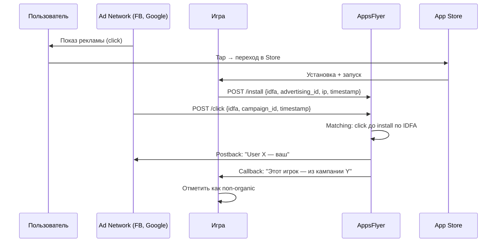
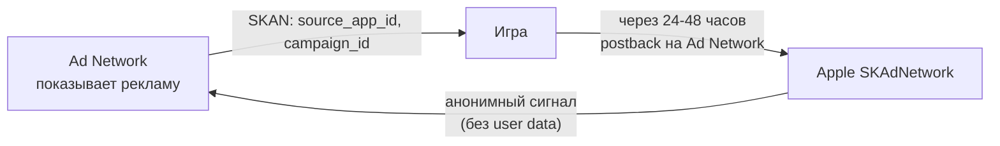
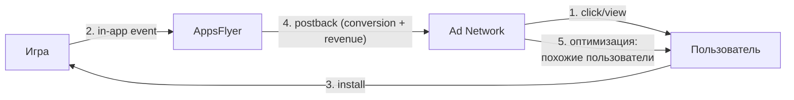

:::info[TL;DR]
AppsFlyer и Adjust — платформы mobile-атрибуции и аналитики. Они определяют **откуда пришёл пользователь** (какая реклама привела к установке), связывают установки с рекламными кампаниями и передают данные в ad networks для оптимизации. В эпоху Apple SKAdNetwork и ATT (App Tracking Transparency) роль атрибуции кардинально изменилась: детерминированная атрибуция (по IDFA) уступила место вероятностной (probabilistic) и SKAdNetwork. Аналитик настраивает in-app events (покупки, достижения), postback-колбеки для ad networks, когортные отчёты и интеграцию с DWH.
:::

## Что это и зачем — атрибуция

### Как работает атрибуция (до ATT 2021)



**Детерминированная атрибуция (pre-ATT):** AppsFlyer получает IDFA (iOS) / GAID (Android) при клике по рекламе и при запуске игры. Сопоставляет — `click_time < install_time < 7 дней` → attribution.

**После ATT (iOS 14.5+, 2021):**
- IDFA больше не доступен без явного согласия (popup)
- Согласие дают ~20–30% пользователей
- Для остальных — **SKAdNetwork** (Apple) и **вероятностная атрибуция**

### SKAdNetwork (SKAN) — новый стандарт iOS

Apple SKAdNetwork — API для атрибуции без раскрытия данных пользователя:



**Как работает SKAN 4:**
1. Ad Network регистрирует показ/клик в Apple
2. Игра вызывает `updatePostbackConversionValue(value)` при событиях (например, `value=1` — установка, `value=3` — первая покупка)
3. Через 24–48 часов Apple шлёт postback Ad Network: `{source_app, campaign_id, coarse_conversion_value}`
4. Ad Network получает агрегированные данные без привязки к конкретному пользователю

**Что это значит для аналитика:**
- Нет данных по отдельному пользователю — только агрегированные (cohort)
- Conversion value (0–63) кодирует действия пользователя (например, 1 = install, 3 = tutorial, 7 = first purchase)
- Postback приходит с задержкой 24–48 часов (no real-time)
- ATT consent rate ~25% → только 25% трафика имеет точную атрибуцию

## Сравнение платформ

| Параметр | AppsFlyer | Adjust | Singular | Branch | Kochava |
|----------|-----------|--------|----------|--------|---------|
| **Рыночная доля** | ~70% (лидер) | ~20% | ~5% | ~3% | ~2% |
| **Цена** | Free (до 20K MAU) / Enterprise | Free (до 10K MAU) / Enterprise | Free (до 5K MAU) | Free (до 10K MAU) | Enterprise only |
| **SKAdNetwork** | Полная поддержка SKAN 4 | Полная поддержка SKAN 4 | Поддержка SKAN 4 | Поддержка SKAN 4 | Поддержка SKAN 4 |
| **Fraud Detection** | Встроенный (ACE) | Встроенный | Встроенный | Встроенный | Встроенный |
| **Cohort Analysis** | Да (Cohort Lab) | Да (Cohort) | Да | Да | Да |
| **Retargeting** | Да | Да | Да | Да | Да |
| **In-app events** | Да (500+ событий) | Да (500+) | Да | Да | Да |
| **Postback** | Real-time + Batch | Real-time + Batch | Real-time | Real-time | Batch |
| **Deep Linking** | OneLink (собственный) | Adjust Links | Universal Links | Branch Links (лучший) | Limited |
| **Raw Data Export** | Да (S3, BigQuery) | Да (S3, GCS) | Да | Да | Да |
| **Data Locker (DWH)** | Да (за отдельную плату) | Да | Да | Да | Да |
| **API** | REST + Pull/Postback | REST + Pull/Postback | GraphQL + REST | REST | REST |
| **Web to App** | Да | Да | Да | Да (лучший) | Нет |
| **Интеграция с Unity** | Да (Native SDK) | Да (Native SDK) | Да | Да | Да |

**Для GameDev:** AppsFlyer — стандарт индустрии. Выбор по умолчанию для мобильных игр. Adjust — второй по популярности. Singular — растёт благодаря простому UI и хорошей интеграции с ad networks.

## In-App Events

События внутри игры, которые нужно передавать в AppsFlyer:

```json
// Пример установки postback
{
  "event_name": "iap_purchase",
  "event_time": "2024-12-01T10:00:00Z",
  "player_id": "player_123456",
  "params": {
    "af_content_id": "com.game.gems_100",
    "af_currency": "USD",
    "af_revenue": 0.99,
    "af_quantity": 1,
    "receipt_id": "receipt_abc123"
  }
}
```

**Обязательные события для GameDev (Industry benchmarks):**

| Событие | Описание | Revenue Type | Важность |
|---------|----------|-------------|----------|
| `af_install` | Установка (авто) | — | mandatory |
| `af_first_open` | Первый запуск (авто) | — | mandatory |
| `af_reengagement` | Возврат через ретаргетинг | — | mandatory |
| `af_purchase` | IAP покупка | revenue | mandatory |
| `af_level_achieved` | Достижение уровня | — | optional |
| `af_tutorial_completion` | Прохождение туториала | — | recommended |
| `af_ad_revenue` | Доход от рекламы | revenue | recommended |
| `af_subscription` | Начало подписки | revenue | recommended |
| `af_achieved` | Достижение (любое) | — | optional |
| `af_add_to_cart` | Добавление в корзину (магазин) | — | optional |
| `af_spent_credits` | Трата валюты | — | optional |

**Revenue events критичны** — они передаются в ad networks для ROAS-оптимизации. Если revenue не передаётся — ad networks не могут оптимизировать кампании на платящих игроков.

## Postback Flow



Postback — HTTP-колбек от AppsFlyer к Ad Network с данными о конверсии:
```
POST https://adnetwork.com/callback
{
  "campaign_id": "camp_123",
  "adset_id": "adset_456",
  "country": "RU",
  "os": "iOS",
  "event": "purchase",
  "revenue": 0.99,
  "currency": "USD",
  "timestamp": 1712345678,
  "skad_postback": false
}
```

**Зачем:** Ad Network видит, что кампания приводит платящих игроков → увеличивает ставки. Если кампания приводит только тех, кто не платит → снижает ставки.

## Fraud Detection (защита от накруток)

Мобильная реклама — одна из самых фродовых индустрий. До 30% трафика может быть фродом.

| Тип фрода | Как работает | Как защищается |
|-----------|-------------|----------------|
| **Click Injection** | Вредоносное приложение генерирует click за долю секунды до install | AppsFlyer ACE сверяет время click → install |
| **Click Flooding** | Массовая отправка кликов на случайные устройства | Проверка уникальности device + IP |
| **SDK Spoofing** | Эмуляция отправки событий (фейковые инсталлы) | Проверка сертификатов SDK, device fingerprint |
| **Bot Traffic** | Автоматические клики с серверов | IP blacklists, поведенческий анализ |
| **Reinstall Fraud** | Удаление и переустановка для повторного получения бонуса | AppsFlyer идентифицирует device как known |
| **Store Bot** | Эмуляция установки из Store | Проверка receipt установки |

**AppsFlyer ACE** (Active Click Evaluation) — встроенный антифрод, который анализирует каждый click и присваивает `af_attribution_flag: "organic" | "non_organic" | "fraud"`.

## Retargeting

Ретаргетинг — показ рекламы тем, кто уже установил игру, но перестал играть. AppsFlyer передаёт cohort lapsed players в Ad Network.

**Segment definition:**
- Lapsed: не было сессии 7–14 дней
- Churned: не было сессии 30+ дней
- Payers: платили, но перестали играть
- High-value: LTV > $10, churned

## Ключевые метрики в AppsFlyer/Adjust

| Метрика | Описание | Где смотреть |
|---------|----------|-------------|
| **Installs** | Количество установок | Dashboard |
| **Organic vs Non-Organic** | Доля органики vs платный трафик | Dashboard |
| **eCPI** | Effective CPI (cost per install) = Spend / Installs | UA Dashboard |
| **CPA (event)** | Cost per action (регистрация, покупка) | Cohort Reports |
| **ROAS D1/D7/D30** | Return on Ad Spend по дням | Cohort Reports |
| **Retargeting CVR** | Конверсия возврата | Retargeting Dashboard |
| **SKAN installs** | Установки через SKAdNetwork (iOS) | SKAN Dashboard |
| **Fraud rate** | % отбракованных кликов | ACE Dashboard |
| **Click-to-install time** | Время между кликом и установкой | Funnel Reports |
| **View-through attribution** | Конверсия без клика (только просмотр) | Attribution Dashboard |

## Интеграция с UA-процессом

```
Ad Network (FB/Google/TikTok) ←→ AppsFlyer ←→ Игра ←→ DWH

1. UA Manager настраивает кампании в Facebook
2. Facebook шлёт трафик → User устанавливает игру
3. Игра шлёт событие в AppsFlyer (install, purchase)
4. AppsFlyer отправляет Postback в Facebook «этот user — ваш, он заплатил $0.99»
5. Facebook оптимизирует кампанию на похожих пользователей
6. AppsFlyer экспортирует сырые данные в DWH (S3 → ClickHouse)
7. Аналитик строит когорты, выгружает LTV, считает ROAS
```

## Что важно аналитику про атрибуцию

1. **Стандарт индустрии — AppsFlyer.** 70% игр используют AppsFlyer. Adjust — второй. Singular — тренд последних лет.
2. **SKAdNetwork изменил всё.** После iOS 14.5 нельзя полагаться только на детерминированную атрибуцию. Нужно уметь читать SKAN-данные и вероятностную атрибуцию.
3. **Revenue events — самые важные.** Без передачи `af_purchase` ad networks не могут оптимизировать кампании. Проверяй, что revenue передаётся корректно (в USD).
4. **Fraud — это ~20-30% трафика.** Не удивляйся, если ROAS низкий — возможно, это фрод. Проверяй ACE Dashboard.
5. **Postback может быть медленным.** В SKAN — задержка 24–48 часов. Real-time по IDFA — только у 20–30% iOS-пользователей.
6. **Export data в DWH.** AppsFlyer пишет сырые данные в S3/BigQuery — оттуда аналитик строит свои отчёты.

## Ссылки для самостоятельного изучения

| Ресурс | Описание | Ссылка |
|--------|----------|--------|
| AppsFlyer Docs | Полная документация (SDK, API, SKAN) | https://dev.appsflyer.com/ |
| AppsFlyer Unity SDK | Интеграция с Unity | https://dev.appsflyer.com/hc/docs/integrate-unity-plugin |
| AppsFlyer SKAdNetwork Guide | Настройка SKAN 4 в AppsFlyer | https://dev.appsflyer.com/hc/docs/skadnetwork |
| Adjust Documentation | Документация Adjust (SDK, API) | https://help.adjust.com/ |
| Adjust Unity SDK | Интеграция Adjust c Unity | https://github.com/adjust/unity_sdk |
| Singular Docs | Документация Singular | https://docs.singular.net/ |
| Apple SKAdNetwork | Официальная документация SKAN | https://developer.apple.com/documentation/storekit/skadnetwork |
| Apple ATT (App Tracking Transparency) | Описание ATT-попапа | https://developer.apple.com/documentation/apptrackingtransparency |
| AppsFlyer Fraud Guide | Защита от click injection | https://www.appsflyer.com/ace/ |
| Mobile Attribution Overview | Статья «Mobile Attribution 101» | https://www.appsflyer.com/mobile-attribution-101/ |
| GamesIndustry.biz — UA | Статьи про user acquisition в играх | https://www.gamesindustry.biz/user-acquisition |

## Проверь себя

1. **Что такое атрибуция в mobile-аналитике?**
   *Ответ:* Определение источника установки: какой канал/кампания привели пользователя. AppsFlyer сопоставляет клик по рекламе с установкой игры.

2. **Как изменилась атрибуция после iOS 14.5 (ATT)?**
   *Ответ:* IDFA больше не доступен по умолчанию. Только 20–30% пользователей дают согласие. Работает SKAdNetwork (агрегированные данные с задержкой 24–48 часов) и вероятностная атрибуция.

3. **Почему важно передавать revenue events (af_purchase) в AppsFlyer?**
   *Ответ:* Ad networks получают данные о платящих пользователях через postback → оптимизируют кампании (показывают рекламу похожим пользователям). Без revenue — нельзя оптимизировать ROAS.

4. **Какие виды фрода бывают в mobile-атрибуции?**
   *Ответ:* Click injection, click flooding, SDK spoofing, bot traffic, reinstall fraud. AppsFlyer ACE отбраковывает до 30% фрод-трафика.

5. **Какую платформу атрибуции выбрать для GameDev и почему?**
   *Ответ:* AppsFlyer — стандарт индустрии (70%+ рынка), лучшая поддержка SKAN 4, мощный антифрод, интеграция со всеми ad networks, есть Unity SDK.
