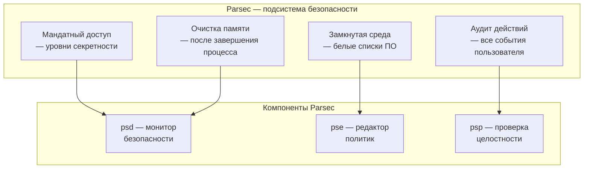

:::info[TL;DR]
Astra Linux — отечественная ОС на базе Debian, основная для ГИС в рамках импортозамещения (80%+ госорганов РФ). Редакции: Common Edition (общего назначения), Special Edition (до уровня «особой важности», сертифицирована ФСТЭК). Ключевые возможности: защищённая среда (пакеты Parsec), мандатный доступ, совместимость с Postgres Pro, 1С и КриптоПро. Аналитик в спецификации указывает: Astra Linux Special Edition (версия 1.7+), режим «Орёл» или «Смоленск» в зависимости от уровня защищённости.
:::

## Для кого эта статья

Middle SA, участвующий в импортозамещении ГИС на Astra Linux. После прочтения вы:

- Поймёте редакции Astra Linux и их совместимость
- Узнаете подсистему безопасности Parsec (мандатный доступ, замкнутая среда)
- Сможете выбрать версию под УЗ-1/УЗ-2/УЗ-3
- Поймёте совместимость с прикладным ПО (1С, Postgres Pro, КриптоПро)

## 1. Редакции Astra Linux

| Редакция | Для кого | Уровень ФСТЭК | Ядро | Цена (рабочее место) |
|----------|----------|--------------|------|---------------------|
| **Common Edition** | Серверы, рабочие станции без работы с секретными данными | — | 6.6 LTS | 10-30K ₽ |
| **Special Edition «Орёл»** | ГИС с УЗ-1, УЗ-2 (ПД) | УЗ-1, УЗ-2 | 6.6 LTS (с патчами) | 20-50K ₽ |
| **Special Edition «Смоленск»** | ГИС с УЗ-3 (гостайна, секретно, особой важности) | УЗ-3 | 6.6 LTS (усиленный) | 50-150K ₽ |

## 2. Подсистема безопасности Parsec

**Мандатный доступ:**

| Уровень | Метка | Кто может читать | Кто может писать |
|---------|-------|-----------------|------------------|
| 0 | Несекретно | Все | Все |
| 1 | Конфиденциально | 1+ | 1+ |
| 2 | Секретно | 2+ | 2+ |
| 3 | Особой важности | Только 3 | Только 3 |

## 3. Совместимость с ПО

| ПО | Совместимость | Комментарий |
|----|--------------|-------------|
| **1С:ERP, 1С:Документооборот** | ✅ Полная | Сертифицировано, 32/64 бит |
| **Postgres Pro** | ✅ Полная | Сертифицировано |
| **КриптоПро CSP** | ✅ Полная | Astra — эталонная платформа |
| **МойОфис** | ✅ Полная | Нативная версия для Astra |
| **Р7-Офис** | ✅ Полная | |
| **Directum** | ✅ Полная | |
| **Docker / контейнеризация** | ⚠️ Ограниченная | «Смоленск» — запрещён, «Орёл» — через аудит |
| **Kubernetes** | ⚠️ Требует доработки | Не сертифицирован под Parsec |

## 4. Установка и развёртывание

| Параметр | Common Edition | Special Edition |
|----------|---------------|----------------|
| **Архитектура** | x86_64, ARM, Эльбрус | x86_64, ARM, Эльбрус |
| **Мин. RAM** | 2 GB | 4 GB |
| **Мин. диск** | 20 GB | 40 GB |
| **Установка** | ISO / PXE / образ | ISO + активация (ключ) |
| **Ограничения** | Нет | Parsec — вкл. по умолчанию |
| **ЦОД** | Система добровольной сертификации | Обязательная сертификация ФСТЭК |

## Ссылки для самостоятельного изучения

| Ресурс | Описание | Ссылка |
|--------|----------|--------|
| Astra Linux — официальный сайт | Документация, загрузка | https://astralinux.ru |
| Astra Linux Special Edition — паспорт | Характеристики редакции | https://astralinux.ru/products/astra-linux-special/ |
| Parsec — документация | Защищённая среда | https://wiki.astralinux.ru |
| Реестр ПО — Astra Linux | Запись в реестре | https://reestr.digital.gov.ru |
| Совместимость Astra + 1С | Инструкция | https://astralinux.ru/ecosystem/ |

## Проверь себя

1. **Какие редакции Astra Linux существуют?**
   *Ответ:* Common Edition (общего назначения, до 30K ₽/место), Special Edition «Орёл» (УЗ-1/УЗ-2, ПД, до 50K ₽), Special Edition «Смоленск» (УЗ-3, гостайна, до 150K ₽).

2. **Что такое Parsec?**
   *Ответ:* Подсистема безопасности Astra Linux: мандатный доступ (4 уровня секретности), замкнутая среда (белые списки ПО), аудит действий, очистка памяти. Только для Special Edition.

3. **С каким ПО совместима Astra Linux?**
   *Ответ:* 1С (полная), Postgres Pro, КриптоПро, МойОфис, Р7-Офис, Directum. Ограничения: Docker/K8s (Special Edition — под аудитом).

4. **Какую редакцию выбрать для ГИС с ПД?**
   *Ответ:* Special Edition «Орёл» (УЗ-2). Если есть гостайна — «Смоленск» (УЗ-3). Common — только для несекретных систем.

5. **Какие риски при миграции на Astra Linux?**
   *Ответ:* Совместимость legacy-приложений (Windows → Linux: не всё портировано), Docker/K8s в Special Edition (Parsec ограничивает контейнеризацию), обучение пользователей (отличие от Windows), поиск драйверов для периферии.
