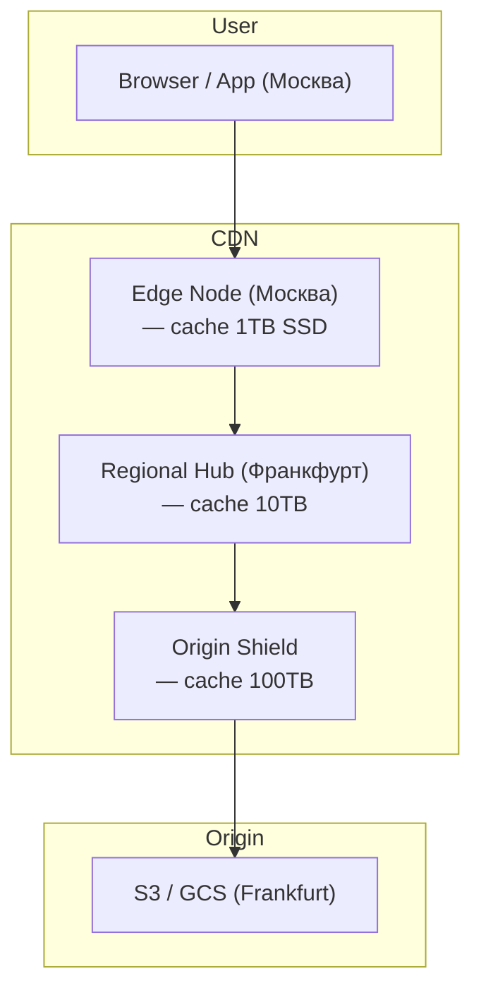
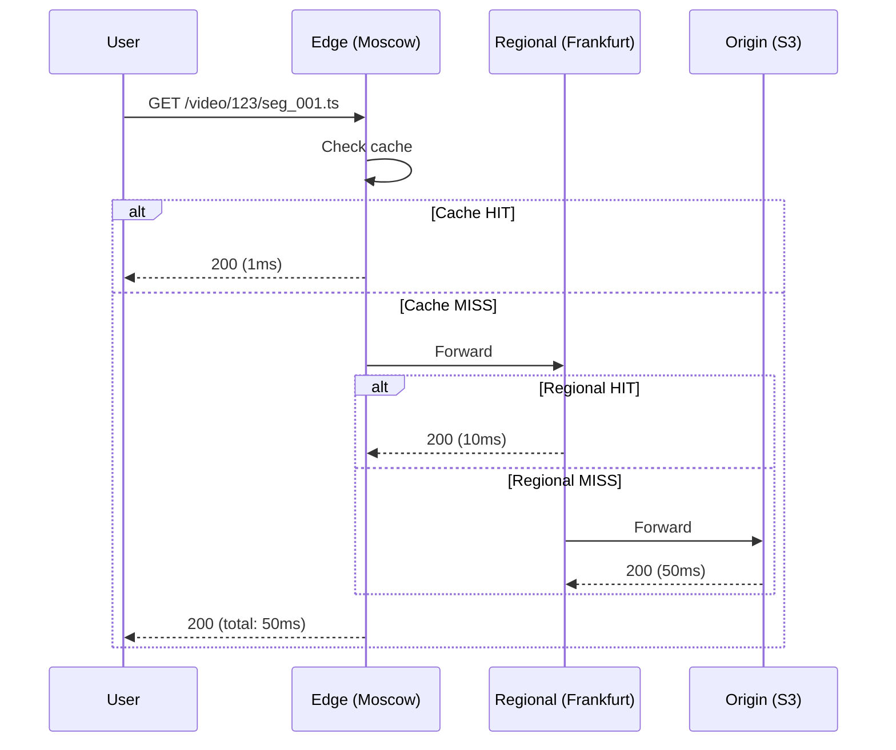

:::info[TL;DR]
CDN (Content Delivery Network) — географически распределённая сеть серверов (edge nodes / PoP) для быстрой доставки контента пользователям. Кэширует статику (видео, изображения, JS/CSS) на узлах рядом с пользователем. Основные провайдеры: Cloudflare (350+ PoP), Akamai (4000+ PoP), CloudFront (600+ PoP), Fastly, Google Cloud CDN. Аналитик учитывает CDN при проектировании контент-платформ: cache strategy (TTL, cache-control, purging), origin shield, multi-CDN, cost optimization (egress bandwidth) и метрики (hit ratio, latency, bandwidth).
:::

## Для кого эта статья

Middle/Senior SA, проектирующий доставку контента. После прочтения вы:

- Поймёте архитектуру CDN: edge nodes, regional hubs, origin shield, cache layers
- Узнаете стратегии кэширования: TTL, Cache-Control, ETag, stale-while-revalidate
- Сможете выбрать CDN-провайдера и настроить multi-CDN для отказоустойчивости
- Поймёте метрики CDN: hit ratio, origin shield, bandwidth cost, PoP coverage

## 1. Архитектура CDN



### Cache Layers

| Layer | Название | Размер кэша | Latency (miss) |
|-------|----------|-------------|----------------|
| **L1** | Edge Node (ближайший PoP) | 1-10TB SSD | 1-5ms to regional |
| **L2** | Regional Hub | 10-100TB | 5-20ms to origin |
| **L3** | Origin Shield | 100TB+ | 20-100ms to origin |
| **Origin** | S3 / Custom | Unlimited | - |

**Origin Shield:** если 1000 edge nodes запрашивают один контент, shield получает 1 запрос вместо 1000. Экономия origin bandwidth (AWS S3 egress: $0.09/GB).

## 2. Стратегии кэширования

### Cache Headers

```http
Cache-Control: public, max-age=3600, stale-while-revalidate=86400
  - public: кэшировать на CDN
  - max-age=3600: TTL = 1 час
  - stale-while-revalidate: отдавать устаревший 24ч при фоновом обновлении

Cache-Control: private, max-age=300  — только браузер (персонализация)
Cache-Control: no-cache, no-store   — не кэшировать (sensitive data)

ETag: "abc123" — Entity Tag: если совпадает → 304 Not Modified
Last-Modified: Mon, 01 Jan 2025 — conditional request
```

### Стратегии по типу контента

| Тип контента | TTL | Cache-Control | Purge policy |
|-------------|-----|---------------|--------------|
| **Изображения** | 7-30 days | `max-age=2592000` | При ресайзе |
| **CSS/JS** | 1 year (hash) | `max-age=31536000, immutable` | При деплое |
| **HLS segments** | 1-24 hours | `max-age=3600` | При реэнкоде |
| **Long video** | 1-7 days | `max-age=86400` | При модерации |
| **Live HLS** | 5-30 seconds | `max-age=30` | Auto-expire |
| **API responses** | 0-60 seconds | `private` / `public` | При изменении |

### Cache Hit/Miss Flow



## 3. Multi-CDN

Крупные платформы (YouTube, Netflix, Meta) используют несколько CDN:

| Причина | Описание |
|---------|----------|
| **Отказоустойчивость** | Cloudflare упал → Fastly handles |
| **Coverage** | Akamai хорош в Азии, CloudFront в США |
| **Cost** | Разные цены по регионам |
| **Performance** | Разные CDN лучше в разных ISP |

**Multi-CDN routing:**

```
User → DNS (CNAME latency-based) → Best CDN
User → All CDNs → Client picks fastest (HLS multi-CDN)
```

## 4. CDN провайдеры — сравнение

| Провайдер | PoP | Cost (egress/GB) | Origin shield | Мульти-CDN |
|-----------|-----|-----------------|---------------|------------|
| **Cloudflare** | 350+ | Free-$0.03 | Enterprise only | Bandwidth Alliance |
| **Akamai** | 4000+ | $0.05-0.15 | Yes | Best-in-class |
| **CloudFront** | 600+ | $0.02-0.08 | Yes (Origin Shield) | Limited |
| **Fastly** | 100+ | $0.03-0.10 | Yes (POP-to-POP) | Yes |
| **Google Cloud CDN** | 200+ | $0.02-0.08 | Yes (GCS) | Limited |

## 5. Метрики CDN

| Метрика | Описание | Хорошо | Плохо |
|---------|----------|--------|-------|
| **Cache hit ratio** | % запросов из кэша | > 90% | < 70% |
| **P95 latency** | Время доставки | < 50ms | > 200ms |
| **TTFB** | Time to First Byte | < 100ms | > 500ms |
| **Bandwidth** | Egress (GB/month) | — | Cost |
| **Error rate** | 5xx/4xx | < 0.1% | > 1% |
| **Purge time** | Время инвалидации | < 1min | > 10min |

### Cost Optimization

CDN — один из главных расходов контент-платформы:

```
YouTube: 1B+ часов/день × 5 Mbps avg → $50M+/месяц на CDN
Netflix: 200M+ часов/день × 3 Mbps avg → $10M+/месяц
```

| Метод | Экономия | Описание |
|-------|----------|----------|
| **Origin Shield** | 40-60% | Снижает нагрузку на origin |
| **Multi-CDN** | 20-40% | Дешёвый провайдер по региону |
| **Compression** | 30-50% | Brotli, AVIF |
| **Pre-caching (Netflix)** | 70-90% | Кэш внутри ISP |

## 6. Практический кейс: Netflix Open Connect

**Проблема:** Netflix — 260M+ подписчиков, 200M+ часов просмотра/день. Трафик через публичный интернет не выдержит.

**Решение:** Open Connect — собственная CDN, установленная в сетях ISP.

```
Архитектура:
1. Netflix кодирует контент (4K HDR, H.265, Dolby Atmos)
2. Open Connect Appliances (OCA) — сервера в ISP (1U, 2TB SSD, 10Gbps)
3. OCA предварительно кеширует популярный контент
4. User → ISP → OCA (внутренняя сеть ISP) — 95%+ cache hit
5. Контент не идёт через публичный интернет
```

**Результат:**
- Cache hit ratio: 95%+
- Latency: < 5ms (локальная сеть ISP) vs 50-100ms
- ISP: экономия на транзите ($M)
- Netflix: лучше качество, меньше buffering

**Метрики Netflix QoE:**

| Метрика | Target | Результат |
|---------|--------|-----------|
| **Startup time** | < 2 sec | 1.2 sec |
| **Rebuffering rate** | < 0.5% | 0.3% |
| **Average bitrate** | > 5 Mbps | 6 Mbps |

## Ссылки для самостоятельного изучения

| Ресурс | Описание | Ссылка |
|--------|----------|--------|
| Cloudflare CDN Documentation | Документация Cloudflare | https://developers.cloudflare.com/cache/ |
| AWS CloudFront Developer Guide | Документация CloudFront | https://docs.aws.amazon.com/AmazonCloudFront/latest/DeveloperGuide/ |
| Akamai TechDocs | Документация Akamai | https://techdocs.akamai.com/ |
| Fastly Documentation | VCL, cache, purge | https://docs.fastly.com/ |
| Google Cloud CDN | Документация Google CDN | https://cloud.google.com/cdn/docs |
| HTTP Caching (MDN) | Стандарты кэширования HTTP | https://developer.mozilla.org/en-US/docs/Web/HTTP/Caching |
| Netflix Open Connect | Open-source CDN Netflix | https://openconnect.netflix.com/ |
| CDN Perf Comparison | Сравнение CDN по скорости | https://www.cdnperf.com/ |

## Проверь себя

1. **Что такое CDN и как он работает?**
   *Ответ:* CDN — распределённая сеть edge-серверов (PoP). Кэширует контент на узлах рядом с пользователем. Архитектура: Edge Node → Regional Hub → Origin Shield → Origin. Cache hit = быстрая доставка (1-5ms), miss = запрос к origin.

2. **Какие стратегии кэширования существуют?**
   *Ответ:* TTL (max-age), Cache-Control (public/private), ETag/Last-Modified (conditional requests), stale-while-revalidate (background refresh). Для статики — long TTL, для API — short TTL/no-cache, для live — seconds.

3. **Зачем нужен Origin Shield?**
   *Ответ:* Снижает нагрузку на origin. Если 1000 edge nodes запрашивают один контент, shield получает 1 запрос. Экономия bandwidth + снижение latency (shield ближе к edge, чем origin).

4. **Почему Netflix построил собственную CDN?**
   *Ответ:* Масштаб (260M+ подписчиков) — публичный интернет не выдержит. Open Connect — сервера внутри ISP, 95%+ cache hit, < 5ms latency. ISP экономят на транзите, Netflix получает контроль над качеством.

5. **Как работает Multi-CDN?**
   *Ответ:* DNS с latency-based routing → выбор лучшего CDN для пользователя. Или HLS multi-CDN: плеер получает сегменты из нескольких CDN, выбирает быстрый. Даёт отказоустойчивость (если один CDN упал), лучшее покрытие по регионам, cost arbitrage.
