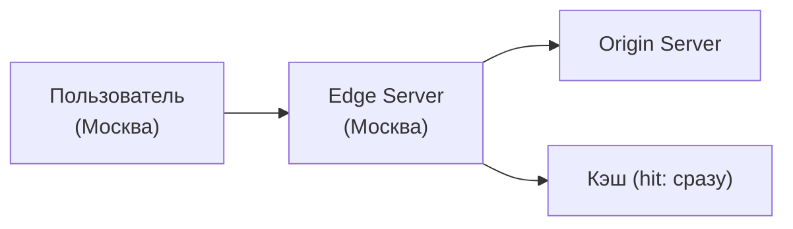

:::info[TL;DR]
CDN (Content Delivery Network) — географически распределённая сеть серверов (edge) для быстрой доставки контента пользователям. Кэширует статику (видео, изображения, JS/CSS) на узлах рядом с пользователем. Основные провайдеры: Cloudflare, Akamai, CloudFront, Fastly. Аналитик учитывает CDN при проектировании контент-платформ.
:::

## Как работает CDN

## Метрики CDN

| Метрика | Описание |
|---------|----------|
| **Hit ratio** | % запросов из кэша |
| **Latency** | Время доставки |
| **PoP coverage** | Количество точек присутствия |
| **Bandwidth** | Пропускная способность |
| **TTL** | Время жизни кэша |

## Что дальше

- [Платформа контента](/docs/specialization/socnet-platform)

## Проверь себя

1. **Что такое CDN?**
   *Ответ:* Сеть edge-серверов для быстрой доставки контента — кэширует статику рядом с пользователем.
