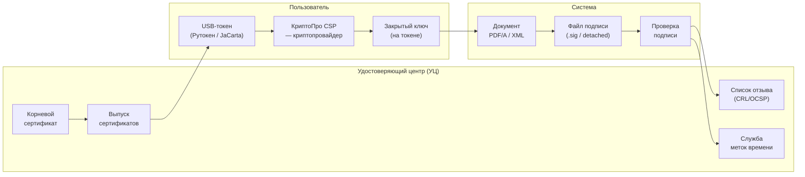

:::info[TL;DR]
Криптография в ГИС обязательна: подписание документов (УКЭП по ГОСТ Р 34.10), шифрование каналов (ГОСТ 28147-89) и данных (ГОСТ Р 34.11). Ключевые технологии: УКЭП — усиленная квалифицированная подпись (юридическая сила, аналог собственноручной), PKI — инфраструктура открытых ключей + Удостоверяющий центр, КриптоПро CSP — библиотека криптоопераций (95%+ госорганов РФ). Аналитик специфицирует: где нужна УКЭП (документы, СМЭВ-запросы), какой УЦ (Минцифры, ФНС), формат подписи (откреплённая .sig), уровень СКЗИ (КС1/КС2/КС3).
:::

## Для кого эта статья

Middle SA, работающий с требованиями безопасности в ГИС. После прочтения вы:

- Поймёте стандарты РФ: ГОСТ Р 34.10 (подпись), ГОСТ 28147-89 (шифрование), ГОСТ Р 34.11 (хеш)
- Узнаете разницу УКЭП vs простая ЭП vs усиленная неквалифицированная
- Сможете выбрать уровень СКЗИ (КС1-КС3) под класс защищённости ГИС
- Поймёте инфраструктуру: УЦ, сертификаты, токены (Рутокен, JaCarta)

## 1. Стандарты РФ

| Стандарт | Назначение | Размер ключа | Международный аналог |
|----------|-----------|-------------|---------------------|
| **ГОСТ Р 34.10-2012** | Электронная подпись | 256 / 512 бит | ECDSA (Elliptic Curve) |
| **ГОСТ Р 34.11-2012** | Хеширование | 256 / 512 бит («Стрибог») | SHA-256 / SHA-512 |
| **ГОСТ 28147-89** | Симметричное шифрование | 256 бит («Магма») | AES-256 |
| **ГОСТ Р 34.12-2015** | Блочное шифрование | 128 бит («Кузнечик») | AES-128 |

## 2. Типы электронных подписей

| Тип | Юридическая сила | Технология | Где применяется |
|-----|-----------------|------------|----------------|
| **Простая ЭП** | Низкая (соглашение сторон) | Пароль, SMS-код | Вход на портал, подпись заявления |
| **Усиленная неквалифицированная (НЭП)** | Средняя (не приравнена к собственноручной) | Криптография, но не ФСБ | Внутренний ЭДО |
| **Усиленная квалифицированная (УКЭП)** | Полная (аналог собственноручной) | Криптография + ФСБ + УЦ | ГИС, СМЭВ, документы, закупки |

## 3. Архитектура PKI

## 4. КриптоПро CSP

КриптоПро CSP — основной криптопровайдер для ГИС (95%+ госорганов).

| Возможность | Описание |
|-------------|----------|
| **Подпись** | УКЭП по ГОСТ Р 34.10 (откреплённая/встроенная) |
| **Шифрование** | ГОСТ 28147-89, ГОСТ Р 34.12 (диски, файлы) |
| **Хеширование** | ГОСТ Р 34.11 («Стрибог») |
| **Платформы** | Windows, Linux (Astra Linux — эталон), macOS |
| **Интеграция** | 1С, Directum, браузеры (Яндекс.Браузер, Атом) |
| **Токены** | Рутокен, JaCarta, eToken |

## 5. Уровни СКЗИ

| Уровень | Для каких систем | Требования | Срок сертификации |
|---------|-----------------|-----------|------------------|
| **КС1** | УЗ-1 (ОПД) | Базовая криптография | 1-2 года |
| **КС2** | УЗ-2 (ПД) | Защита от программных атак | 2-3 года |
| **КС3** | УЗ-3 (гостайна) | Защита от аппаратных атак + ФСБ | 3-5 лет |

## Ссылки для самостоятельного изучения

| Ресурс | Описание | Ссылка |
|--------|----------|--------|
| ГОСТ Р 34.10-2012 (УКЭП) | Стандарт электронной подписи | https://docs.cntd.ru/document/1200093682 |
| ГОСТ 28147-89 (шифрование) | Стандарт шифрования | https://docs.cntd.ru |
| КриптоПро CSP — документация | Криптопровайдер | https://www.cryptopro.ru/products/csp |
| КриптоПро JCP | Криптография для Java | https://www.cryptopro.ru/products/jcp |
| Рутокен — USB-токен | Аппаратное хранение ключей | https://www.rutoken.ru |
| JaCarta — USB-токен | Альтернатива Рутокен | https://www.aladdin-rd.ru |
| 63-ФЗ об электронной подписи | Правовая база | https://www.consultant.ru |

## Проверь себя

1. **Какие стандарты криптографии применяются в РФ?**
   *Ответ:* ГОСТ Р 34.10-2012 — УКЭП (256/512 бит, эллиптические кривые), ГОСТ 28147-89 — шифрование (256 бит), ГОСТ Р 34.11-2012 — хеш («Стрибог»), ГОСТ Р 34.12-2015 — блочное шифрование («Кузнечик»).

2. **Чем УКЭП отличается от простой ЭП?**
   *Ответ:* УКЭП — криптография + сертификат ФСБ + УЦ, аналог собственноручной подписи (юридическая сила = бумажной). Простая ЭП — пароль/SMS, низкая юридическая сила. УКЭП обязательна для ГИС, СМЭВ, госзакупок.

3. **Как работает УКЭП?**
   *Ответ:* Закрытый ключ на USB-токене (Рутокен) → КриптоПро CSP вычисляет хеш (ГОСТ Р 34.11) → хеш шифруется закрытым ключом (ГОСТ Р 34.10) → создаётся .sig-файл → получатель проверяет через открытый ключ и УЦ.

4. **Что такое КС1, КС2, КС3?**
   *Ответ:* Уровни криптографической защиты. КС1 — УЗ-1 (базовый), КС2 — УЗ-2 (программные атаки), КС3 — УЗ-3 (аппаратные атаки, разрешение ФСБ). Чем выше — тем дороже и дольше сертификация.

5. **Какие метрики криптографии важны?**
   *Ответ:* Доля документов с УКЭП (> 95% для ГИС), время подписания (< 3 сек), % ошибок верификации (< 0.1%), срок действия сертификата УЦ (1-3 года, отслеживать просрочку).
