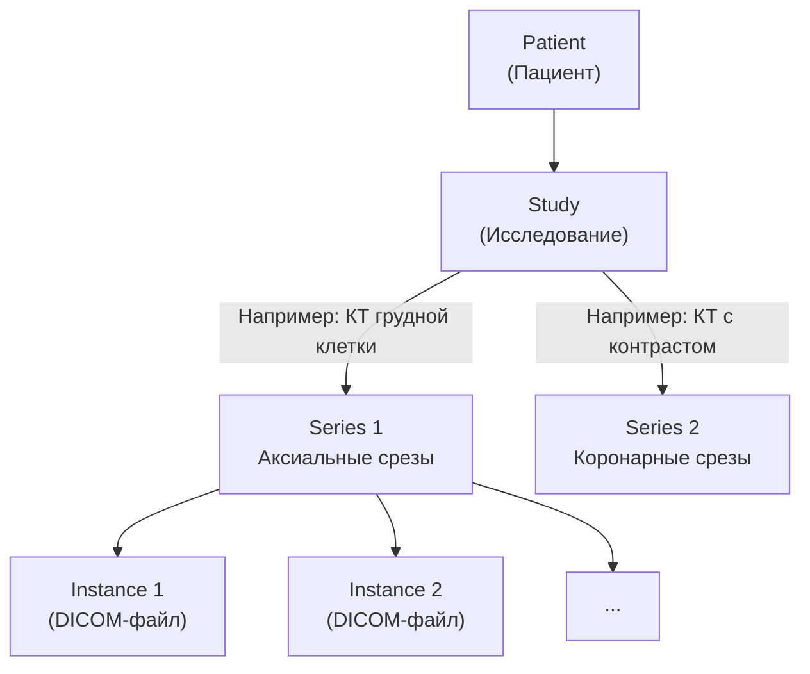

:::info[TL;DR]
DICOM (Digital Imaging and Communications in Medicine) — международный стандарт для передачи, хранения и обработки медицинских изображений. Охватывает: формат файла (снимки + метаданные в тегах), сетевые протоколы (Store, Query/Retrieve, Worklist), сжатие и хранение. Используется во всех PACS-системах. В мире > 1 млрд DICOM-исследований (2024). Ключевой стандарт для радиологии, маммографии, УЗИ.
:::

## Для кого эта статья

- SA, интегрирующий PACS с МИС через DICOM
- Middle SA в радиологическом проекте
- Разработчик, работающий с медицинскими изображениями

После прочтения вы:
- Поймёте иерархию DICOM: Patient → Study → Series → Instance
- Узнаете сетевые протоколы (C-STORE, C-FIND, C-MOVE, Worklist)
- Сможете спроектировать DICOM-интеграцию: модальность → PACS → МИС

## Что это такое

DICOM — не просто формат файла (хотя `.dcm` — одно из расширений). Это полный набор стандартов:

- **Формат данных:** снимок + метаданные (теги) в одном файле
- **Сетевые протоколы:** передача, поиск, получение изображений
- **Хранение:** требования к архивам, сжатие
- **Workflow:** расписание, статус процедуры (MPPS)
- **Структура отчётов:** связь с HL7-сообщениями

## Для чего используется

- Хранение и передача снимков КТ, МРТ, рентгена, маммографии, УЗИ
- Связь модальностей (аппаратов) с PACS-архивом
- Передача назначений через Modality Worklist (КТ не начнёт сканирование без Worklist)
- Второе мнение: передача снимков между больницами (DICOM Query/Retrieve)
- Сжатие и долговременный архив

## Ключевые концепции

### Иерархия DICOM

### DICOM-теги

Изображение хранится как набор тегов (группа, элемент → значение):

| Тег (Group,Element) | Имя | Пример значения |
|---------------------|-----|----------------|
| (0010,0020) | Patient ID | `123456` |
| (0010,0010) | Patient Name | `Иванов Иван` |
| (0008,0060) | Modality | `CT` |
| (0008,1030) | Study Description | `КТ органов грудной клетки` |
| (0028,0030) | Pixel Spacing | `0.5\0.5` |
| (0028,0010) | Rows | `512` |
| (0028,0011) | Columns | `512` |
| (7FE0,0010) | Pixel Data | (бинарные данные снимка) |

### DICOM-протоколы

| Протокол | Описание | Пример |
|----------|----------|--------|
| **C-STORE** | Отправка DICOM-объекта (изображения) в PACS | Аппарат КТ → PACS |
| **C-FIND** | Поиск исследований/серий | Врач ищет снимки пациента |
| **C-MOVE** | Копирование между PACS-станциями | Передача в архив |
| **C-GET** | Запрос конкретного экземпляра | Веб-вьювер запрашивает серию |
| **Modality Worklist (MWL)** | Получение расписания на аппарат | КТ получает: «кто пациент, что сканировать» |
| **MPPS** | Статус выполнения процедуры | «Начало сканирования», «Завершено» |

## Когда использовать

- Любая работа с медицинскими изображениями (КТ, МРТ, рентген, УЗИ, маммография)
- Интеграция модальностей с PACS
- Построение радиологического архива

## Когда НЕ использовать

- Передача не-изображений (анализы, документы) — используйте HL7 FHIR
- Высокопроизводительный обмен между системами, не работающими со снимками
- Простое хранение файлов (DICOM-сервер — более сложная инфраструктура, чем NAS)

## Сравнение форматов сжатия

| Тип | Алгоритм | Степень сжатия | Для чего |
|-----|----------|----------------|----------|
| **Lossless** | JPEG-LS, JPEG 2000 Lossless | 2:1 — 3:1 | Диагностический архив (без потери качества) |
| **Lossy** | JPEG 2000 | 10:1 — 20:1 | Быстрый предварительный просмотр |
| **RLE** | Run-length encoding | 2:1 (для масок/бинарных изображений) | Отсканированные документы |

## Альтернативы

| Стандарт | Когда использовать | Ограничения |
|----------|-------------------|-------------|
| **DICOM** | Медицинские изображения (радиология) | Не поддерживает видео (только отдельные кадры) |
| **DICOM Web (QIDO-RS, STOW-RS, WADO-RS)** | Связь PACS с веб-приложениями | Меньше функций, чем C-STORE, но через REST |
| **HL7 FHIR ImagingStudy** | Ссылки на снимки в ЭМК | Не хранит пиксели — только метаданные + ссылка на PACS |
| **JPEG / DICOM-конвертер** | Просмотр без вьювера | Потеря тегов (метаданных пациента) |

## Практический кейс: Оптимизация архива PACS

**Проблема:** Больница скорой помощи, PACS на 25 ТБ. Каждый день — 150 исследовании (КТ, МРТ, рентген). Через 3 года диск заполнен. Решение: докупить диски (дорого) или архивировать на ленту (медленно).

**Анализ:**
- 80% снимков — для диагностики (должны быть lossless)
- 20% — старые снимки (>2 лет), нужны редко
- Средняя скорость запроса архивных снимков: 20 раз/день
- Бюджет на хранение: 2 млн руб./год

**Решение:**
1. Tiered storage: SSD (30 дней) → HDD (2 года) → LTO-лента (5+ лет)
2. Весь новый PACS — lossless JPEG-LS (экономия 50% против raw)
3. Только для просмотра через веб — lossy JPEG 2000 (10:1)
4. DICOM Query/Retrieve — автоматическая загрузка с ленты при запросе

**Результат:**
- Стоимость хранения: 2 млн → 0.6 млн руб./год (экономия 70%)
- Время доступа к горячим снимкам: < 1 сек (SSD)
- Время доступа к архивным: < 30 сек (LTO → HDD cache)
- Хранение увеличилось: 25 ТБ → 60 ТБ без дополнительных затрат

## Проверь себя

1. **Какие теги DICOM обязательны?**  
   *Ответ:* Patient ID, Patient Name, Modality, StudyInstanceUID, PixelData — минимальный набор для идентификации и хранения снимка.

2. **Как DICOM-изображение связано с пациентом?**  
   *Ответ:* Через теги PatientID (0010,0020) и PatientName (0010,0010). Все снимки содержат эти метаданные — нельзя потерять связь с пациентом даже при экспорте файла.

3. **В чём разница между C-STORE и C-FIND?**  
   *Ответ:* C-STORE — отправка снимка в PACS (запись). C-FIND — поиск снимка в PACS (чтение метаданных). Оба — часть DICOM-сетевого протокола.

4. **Что такое Modality Worklist и зачем он нужен?**  
   *Ответ:* MWL — расписание, которое аппарат КТ/МРТ получает из RIS/PACS: «кто пациент, что сканировать, какой протокол». Без него техник укладки вводит данные вручную — риск ошибки.

5. **Почему для просмотра снимков через браузер используют JPEG 2000 lossy, а для архива — JPEG-LS lossless?**  
   *Ответ:* Lossless сохраняет каждый пиксель — для диагностики (изменение может скрыть патологию). Lossy (10:1) — для быстрого просмотра по сети, врач не заметит потери качества на экране, но трафик в 10 раз меньше.

## Ссылки для самостоятельного изучения

| Что | Описание | URL |
|-----|----------|-----|
| DICOM 3.0 — официальный стандарт | NEMA — полная документация в 20+ частях | dicom.nema.org |
| DICOM Web (QIDO-RS, STOW-RS, WADO-RS) | REST API для DICOM | dicomweb.org |
| OHIF Viewer | Open-source веб-просмотрщик DICOM | ohif.org |
| Orthanc | Open-source DICOM-сервер (PACS lite) | orthanc-server.com |
| DCMTK | Библиотека для работы с DICOM | dicom.offis.de |

## Что дальше

- [PACS / DICOM](/docs/specialization/medtech-pacs) — архитектура PACS в больнице
- [HL7 FHIR](/tech/hl7) — связь DICOM + FHIR ImagingStudy
- [ЕМИАС](/tech/emias) — гос. система и радиология
