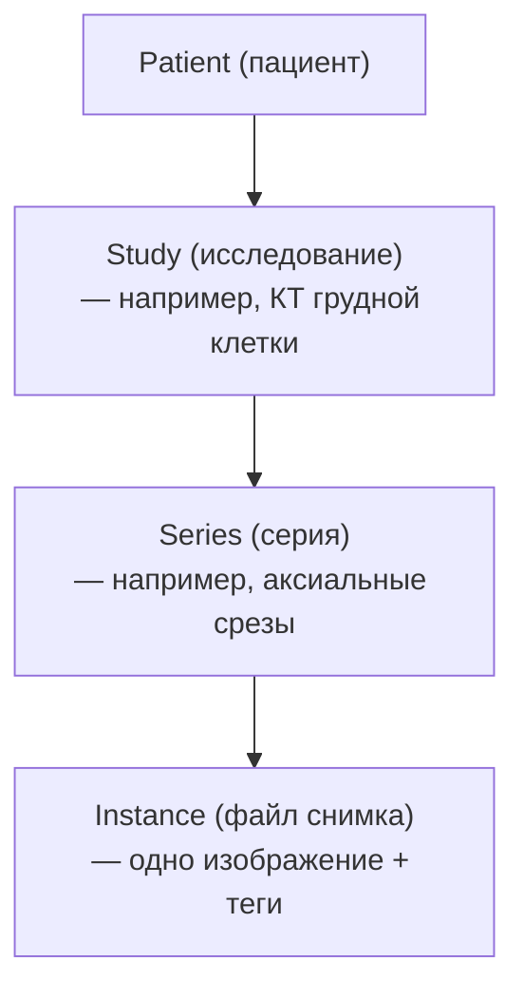

:::info[TL;DR]
DICOM (Digital Imaging and Communications in Medicine) — международный стандарт для передачи, хранения и обработки медицинских изображений и их метаданных. Охватывает: формат файла (снимки + теги), сетевые протоколы (Store, Query/Retrieve, Worklist), хранение и сжатие. Ключевой стандарт для PACS.
:::

## DICOM-теги

Изображение хранится как набор тегов (ключ → значение):

| Тег | Имя | Пример |
|-----|-----|--------|
| (0010,0020) | PatientID | `123456` |
| (0010,0010) | PatientName | `Иванов Иван` |
| (0008,0060) | Modality | `CT` (компьютерная томография) |
| (0028,0030) | PixelSpacing | `0.5\\0.5` |
| (0008,0008) | ImageType | `ORIGINAL\\PRIMARY\\AXIAL` |
| (0020,000D) | StudyInstanceUID | `1.2.840.113619.2.55.3.2831` |

## Иерархия DICOM

## DICOM-протоколы

| Протокол | Описание |
|----------|----------|
| **C-STORE** | Отправка DICOM-объекта (изображения) |
| **C-FIND** | Поиск (Query/Retrieve) |
| **C-MOVE** | Передача копии на другую станцию |
| **C-GET** | Получение объекта |
| **Modality Worklist** | Расписание для аппарата КТ/МРТ |
| **MPPS** | Статус выполнения процедуры |

## Сжатие в DICOM

| Тип | Описание | Пример |
|-----|----------|--------|
| **Lossless** | Без потерь | JPEG-LS, JPEG 2000 Lossless |
| **Lossy** | С потерями | JPEG 2000 (сжатие 10:1) |
| **RLE** | Run-length encoding | Для бинарных масок |

## Типовой размер DICOM-исследования

| Модальность | Снимков | Размер |
|-------------|---------|--------|
| Рентген | 2 | 20 MB |
| КТ (грудная клетка) | 300–500 | 300–500 MB |
| МРТ (голова) | 200–400 | 200–400 MB |
| Маммография | 4 | 160 MB |
| Full-body КТ | 1000+ | 1+ GB |

## Что дальше

- [Телемедицина](/docs/specialization/medtech-telemedicine)
- [Регуляторика](/docs/specialization/medtech-regulations)

## Проверь себя

1. **Какие теги DICOM обязательны?**
   *Ответ:* Patient ID, Patient Name, Modality, StudyInstanceUID, PixelData — минимальный набор для идентификации и хранения.

2. **Как DICOM-изображение связано с пациентом?**
   *Ответ:* Чрез теги (0010,0020) PatientID и (0010,0010) PatientName — все снимки содержат эти метаданные.
