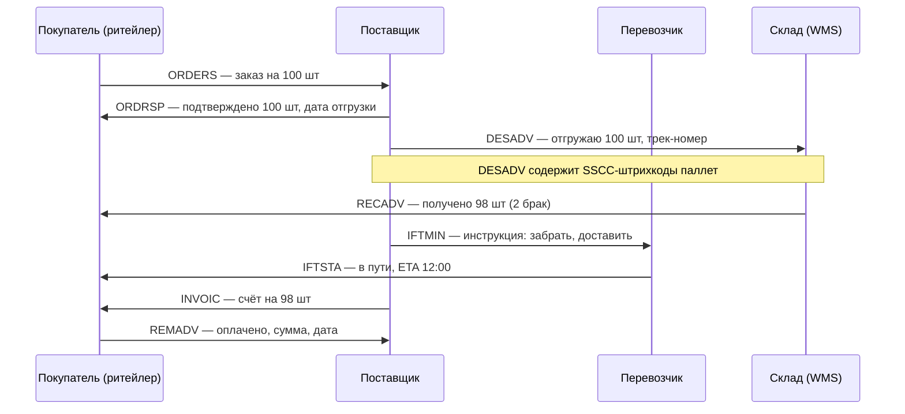
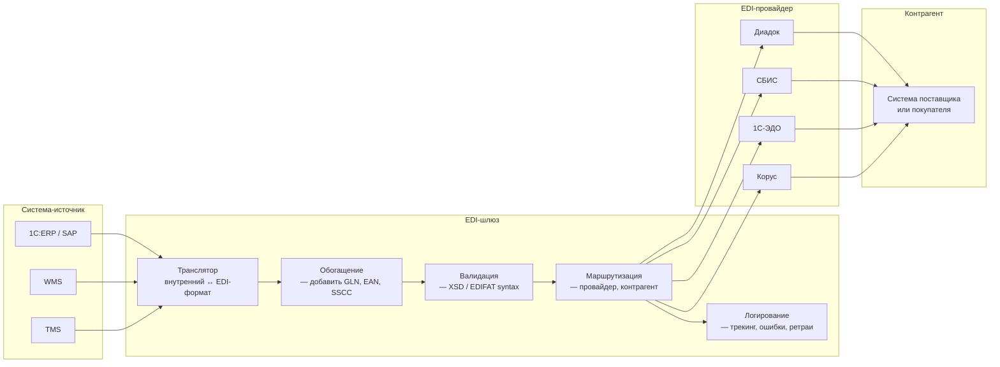

:::info[TL;DR]
EDI (Electronic Data Interchange) — стандарт электронного обмена структурированными документами между участниками логистической цепочки (поставщик ↔ ритейлер ↔ перевозчик ↔ маркетплейс). В РФ EDI-оборот реализуется через провайдеров (Диадок, СБИС, 1С-ЭДО, Корус) и форматы: EDIFACT (международный стандарт ООН), XML (универсальный), JSON (современные API). Типовые сообщения: ORDERS (заказ на поставку), DESADV (уведомление об отгрузке), RECADV (подтверждение получения), INVOIC (счёт-фактура). EDI снижает операционные издержки на 30-50% по сравнению с бумажным документооборотом. Аналитик специфицирует карты трансформации (mapping) между форматами и настраивает статусную модель документов.
:::

## Для кого эта статья

Junior/Middle SA, работающий с интеграциями B2B. После прочтения вы:

- Поймёте роль EDI в логистике и типы сообщений (8+ типов)
- Узнаете форматы EDI: EDIFACT, XML, JSON — и когда что применять
- Сможете проектировать EDI-поток: провайдер → трансформация → статусная модель
- Поймёте разницу между EDI-провайдером (Диадок) и EDI-сообщением (ORDERS)

## 1. EDI в цепочке поставок

EDI — это язык, на котором «разговаривают» компании в логистике. Вместо бумаги, факса и email — структурированные файлы, которые автоматически обрабатываются системами.

```
Без EDI:     email/факс → ручной ввод → ошибки → задержки
С EDI:       система → EDI → система → нет ошибок → real-time
```

**Эффект от внедрения EDI:**

| Показатель | До EDI | После EDI | Эффект |
|-----------|--------|-----------|--------|
| Время обработки заказа | 2-4 часа | 1-5 мин | 96% быстрее |
| Ошибки в заказах | 5-10% | < 0.5% | 90% меньше |
| Задержки документов | 3-5 дней | same-day | Мгновенно |
| Операционные затраты | 100% | 50-70% | -30-50% |
| Оборачиваемость ДЗ | 45 дней | 30 дней | -33% |

## 2. Типы EDI-сообщений в логистике

### Стандартные GS1-сообщения

| EDI-сообщение | Описание | От кого → Кому |
|---------------|----------|----------------|
| **ORDERS** | Заказ на поставку | Покупатель → Поставщик |
| **ORDRSP** | Подтверждение заказа | Поставщик → Покупатель |
| **DESADV** | Уведомление об отгрузке | Поставщик → Покупатель (+ склад) |
| **RECADV** | Подтверждение получения | Склад/магазин → Поставщик |
| **INVOIC** | Счёт-фактура | Поставщик → Покупатель |
| **REMADV** | Уведомление об оплате | Покупатель → Поставщик |
| **IFTMIN** | Инструкция по перевозке | Грузоотправитель → Перевозчик |
| **IFTSTA** | Статус перевозки | Перевозчик → Грузоотправитель |
| **PRICAT** | Каталог товаров | Поставщик → Покупатель |
| **PARTIN** | Данные участника | Любой → Провайдер |

### Пример: Flow заказа с EDI



### Статусная модель документа EDI

```
ORDERS → ORDRSP → DESADV → RECADV → INVOIC → REMADV
(заказ)  (подтв.) (отгрузка) (получение) (счёт)  (оплата)
```

Каждое сообщение — статус сделки. Если нет RECADV — товар не оприходован, счёт не оплачивается.

## 3. Форматы EDI

### 3.1 EDIFACT (UN/EDIFACT)

Стандарт ООН для международной торговли. Основной в Европе и Азии.

```
UNH+ME000001+ORDERS:D:22A:UN'
BGM+220+123456+9'
DTM+137:20250101:102'
NAD+BY::92+1234567'
LIN+1++8901234567890:EN'
QTY+21:100:PCE'
MOA+203:5000:EUR'
UNT+12+ME000001'
```

**Структура:**

| Сегмент | Описание |
|---------|----------|
| `UNH` | Header сообщения |
| `BGM` | Тип документа (220 = ORDERS) |
| `DTM` | Дата/время |
| `NAD` | Участник (BY = покупатель) |
| `LIN` | Позиция товара |
| `QTY` | Количество |
| `MOA` | Сумма |
| `UNT` | Trailer |

### 3.2 XML-EDI

РФ-стандарт: УПД (универсальный передаточный документ), УКД.

```xml
<Invoice>
  <Header>
    <DocId>УПД-123</DocId>
    <Date>2025-01-01</Date>
    <Seller>ООО Поставщик</Seller>
    <Buyer>ООО Покупатель</Buyer>
  </Header>
  <Items>
    <Item>
      <ProductCode>1234567890123</ProductCode>
      <EAN>8901234567890</EAN>
      <Quantity>100</Quantity>
      <Price>50.00</Price>
    </Item>
  </Items>
</Invoice>
```

### 3.3 JSON (современные API)

Маркетплейсы (WB, Ozon) и провайдеры переходят на JSON.

```json
{
  "order": {
    "id": "ORD-123",
    "date": "2025-01-01",
    "items": [
      {
        "sku": "8901234567890",
        "qty": 100,
        "price": 50
      }
    ],
    "buyer": { "id": "BUY-001" },
    "seller": { "id": "SELL-001" }
  }
}
```

### Сравнение форматов

| Параметр | EDIFACT | XML | JSON |
|----------|---------|-----|------|
| **Размер** | 0.5 KB (простой) | 5 KB (в 10 раз больше) | 2 KB |
| **Читаемость** | Низкая (сегменты) | Средняя | Высокая |
| **Стандарт** | UN/CEFACT, GS1 | Любой (XSD-схема) | Любой (OpenAPI) |
| **Валидация** | Синтаксис (EDIFACT) | XSD-схема | JSON Schema |
| **Интеграция** | Сложная (парсер) | Средняя | Простая |
| **Где используется** | Европа, Азия, ритейл | РФ (УПД, УКД) | РФ (маркетплейсы) |
| **Поддержка EDI-провайдеров** | Полная | Полная | Растёт |

## 4. Архитектура EDI-шлюза



## 5. EDI-провайдеры в РФ

| Провайдер | Форматы | Типы документов | Интеграция | Стоимость |
|-----------|---------|-----------------|------------|-----------|
| **Диадок** (СКБ Контур) | XML, PDF, подпись | УПД, УКД, Договоры, счета | API, 1С, SAP | 1-5 ₽/док |
| **СБИС** (Тензор) | XML, EDIFACT | УПД, УКД, ORDERS, DESADV | API, 1С, SAP, WMS | 0.5-3 ₽/док |
| **1С-ЭДО** | XML | УПД, УКД | 1С (встроен) | В составе 1С |
| **Корус** | XML, EDIFACT, JSON | ORDERS, DESADV, INVOIC | API, Salesforce | Договорная |
| **GS1 Russia** | EDIFACT, GS1 XML | ORDERS, DESADV, RECADV | API | Членство GS1 |

**Ключевые факторы выбора:**

| Фактор | Вопрос |
|--------|--------|
| **Контрагенты** | Какие провайдеры используют ваши поставщики/покупатели? |
| **Документы** | Какие типы документов нужны (УПД только или EDI-сообщения)? |
| **Интеграция** | 1С (лёгкая — 1С-ЭДО), SAP (сложная — Диадок/SBIS) |
| **Объём** | 10K док/мес → любой. 1M+ → Корус/прямое подключение |
| **Юридическая значимость** | Все РФ-провайдеры — юр. значимость (КЭП, ФНС) |

## 6. Ключевые термины EDI

| Термин | Пояснение |
|--------|-----------|
| **GLN** | Global Location Number — ID юрлица/склада (13 цифр, GS1) |
| **EAN / GTIN** | Global Trade Item Number — ID товара (13 цифр, штрихкод) |
| **SSCC** | Serial Shipping Container Code — ID паллеты/короба (18 цифр) |
| **DESADV** | Despatch Advice — уведомление об отгрузке с SSCC-кодами |
| **Mapping / Трансформация** | Преобразование внутреннего формата в EDI-формат |
| **EDI-провайдер** | Посредник: принимает EDI-сообщение, доставляет контрагенту |
| **Юридически значимый документооборот** | Документы с КЭП (квалифицированная электронная подпись) |

## 7. Когда использовать EDI и когда НЕ использовать

### Когда нужен EDI

- B2B с крупными контрагентами (ритейлеры: X5, Магнит, Metro — требуют EDI)
- Объём > 1000 заказов/месяц
- Работа с маркетплейсами (WB, Ozon) — их API замена EDI
- Международная торговля (EDIFACT — стандарт)
- Юридически значимый документооборот (КЭП, ФНС)

### Когда EDI избыточен

- B2C / прямой e-commerce (клиентам не нужен EDI)
- Маленькие поставщики (10-50 заказов/мес) — ЛК EDI-провайдера
- Внутренний обмен между своими системами — достаточно API/JSON
- Одноразовые поставки — бумага + email

## 8. Практический кейс: Внедрение EDI в X5 Retail Group

**Проблема:** X5 (5 000+ магазинов, 10 000+ поставщиков) обрабатывает 2M+ документов/месяц. Ручной ввод заказов → 8% ошибок, задержки поставок, потери выручки.

**Решение — EDI с поставщиками:**
1. **Стандарт:** GS1 EDIFACT (ORDERS, DESADV, RECADV, INVOIC)
2. **Обязательное требование:** все поставщики обязаны подключить EDI
3. **Провайдер:** Диадок + СБИС (поставщик выбирает)
4. **Процесс:** ORDERS (X5) → DESADV (поставщик) → RECADV (склад) → INVOIC → REMADV

**Результат:**
- Ошибки в заказах: 8% → 0.3%
- Время обработки заказа: 4 часа → 3 минуты
- Задержки поставок: -50%
- Операционные затраты: -40% на документооборот
- Доля поставщиков на EDI: 95% (через 2 года)

## Ссылки для самостоятельного изучения

| Ресурс | Описание | Ссылка |
|--------|----------|--------|
| GS1 — EDI-стандарты | Глобальные стандарты EDI | https://www.gs1.org/standards/edi |
| UN/EDIFACT — D.22A | Стандарт EDIFACT, версия 2022 | https://service.unece.org/trade/untdid/d22a/ |
| Диадок — документация API | EDI-провайдер, РФ | https://docs.diadoc.ru/ |
| СБИС — документация EDI | EDI-провайдер, РФ | https://sbis.ru/help/edi |
| 1С-ЭДО — документация | Встроенный EDI в 1С | https://v8.1c.ru/edo/ |
| Корус — EDI-решения | EDI для enterprise | https://www.croc.ru/solutions/edi/ |
| GS1 Russia — EDI-стандарты | РФ-стандарты EDI | https://www.gs1ru.org/services/edi/ |
| Форматы УПД и УКД (ФНС) | Юридически значимые форматы РФ | https://www.nalog.gov.ru/rn77/trading/ |
| X5 EDI-требования к поставщикам | Как X5 подключает EDI | https://www.x5.ru/ru/suppliers/edi/ |

## Проверь себя

1. **Что такое EDI и какие сообщения бывают?**
   *Ответ:* EDI — электронный обмен структурированными документами. Основные: ORDERS (заказ), DESADV (отгрузка), RECADV (получение), INVOIC (счёт), REMADV (оплата), IFTMIN (инструкция перевозчику).

2. **Чем EDIFACT отличается от XML и JSON?**
   *Ответ:* EDIFACT — компактный (0.5 KB), низкая читаемость, стандарт ООН, Европа/Азия. XML — крупный (5 KB), человекочитаемый, РФ-стандарт (УПД). JSON — современный, маркетплейсы (WB, Ozon). EDIFACT — legacy, но стандарт B2B; JSON — будущее.

3. **Как устроен EDI-шлюз?**
   *Ответ:* Источник (ERP/WMS/TMS) → Транслятор (внутренний → EDI-формат) → Обогащение (GLN, EAN) → Валидация → Маршрутизация (выбор провайдера) → Логирование → EDI-провайдер → Контрагент.

4. **Когда нужен EDI, а когда достаточно API?**
   *Ответ:* EDI: B2B, крупные контрагенты (X5, Магнит), международная торговля, юридически значимые документы. API: B2C, внутренние системы, мелкие поставщики, обмен с маркетплейсами (WB API — это не EDI, а REST).

5. **Какие метрики показывают эффект EDI?**
   *Ответ:* Снижение ошибок (5-10% → < 0.5%), ускорение обработки (4 часа → 3 мин), сокращение операционных затрат (-30-50%), ускорение оборачиваемости ДЗ (-33%), доля контрагентов на EDI (target > 90%).
