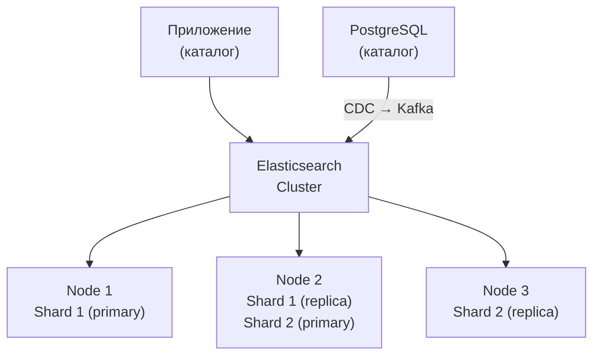

:::info[TL;DR]
Elasticsearch — распределённая поисковая система на базе Lucene. Используется в e-commerce для полнотекстового поиска по каталогу товаров, faceted фильтрации и аггрегаций. Обрабатывает миллиарды документов, поиск — миллисекунды. Не замена БД, а поисковый слой поверх неё. Синхронизация с каталогом — через CDC (Kafka / Logstash).
:::

## Для кого эта статья

- Middle SA, проектирующий поиск по каталогу
- SA, работающий с Elasticsearch в e-commerce

После прочтения вы:
- Поймёте key concepts (index, mapping, shard, replica)
- Сможете определить, какие поля товара индексировать, фильтровать или отображать
- Узнаете типовые запросы: full-text, filters, aggregations, autocomplete

## Что это такое

Elasticsearch — NoSQL-хранилище и поисковый движок. Документы — JSON. Поиск — через REST API. Основан на Apache Lucene.

**Архитектура:**



## Ключевые понятия

| Понятие | Аналог в SQL | Описание |
|---------|-------------|----------|
| **Index** | Таблица | `products` — все товары |
| **Document** | Строка | JSON-документ товара |
| **Mapping** | Schema | Типы полей: text, keyword, integer, geo_point |
| **Shard** | Шард (горизонтальное деление) | Часть индекса для распределения нагрузки |
| **Replica** | Реплика | Копия шарда для отказоустойчивости |
| **Query DSL** | SQL | JSON-запросы для поиска |

## Для чего используется в e-commerce

- **Full-text search** — поиск по названию, описанию, бренду
- **Fuzzy search** — исправление опечаток («айфон» → «iPhone»)
- **Faceted search** — фильтры с количеством (цвет: чёрный (25), белый (10))
- **Autocomplete** — подсказки при вводе
- **Sort** — по цене, популярности, новизне
- **Boost** — релевантность (бренд Apple — выше)
- **Geo search** — товары рядом с ПВЗ

## Mapping: какие поля и как индексировать

```json
{
  "mappings": {
    "properties": {
      "name":        { "type": "text", "analyzer": "russian" },
      "description": { "type": "text", "analyzer": "russian" },
      "brand":       { "type": "keyword" },
      "category":    { "type": "keyword" },
      "color":       { "type": "keyword" },
      "price":       { "type": "integer" },
      "stock":       { "type": "integer" },
      "rating":      { "type": "float" },
      "created_at":  { "type": "date" },
      "suggest":     { "type": "completion" }
    }
  }
}
```

| Тип поля | Для чего | Пример |
|----------|----------|--------|
| `text` | Полнотекстовый поиск | name, description |
| `keyword` | Фильтры, сортировка, аггрегации | brand, category, color |
| `integer / float` | Числовые фильтры | price, stock, rating |
| `date` | Сортировка по дате | created_at |
| `completion` | Автокомплит | suggest |
| `geo_point` | Геопоиск | location |

## Типовые запросы

**Full-text search:**
```
GET /products/_search?q=iphone+15
```

**Фильтры + аггрегации:**
```json
GET /products/_search
{
  "query": {
    "bool": {
      "must": [
        { "match": { "name": "iphone" } }
      ],
      "filter": [
        { "term": { "brand.keyword": "Apple" } },
        { "range": { "price": { "gte": 50000, "lte": 100000 } } }
      ]
    }
  },
  "aggs": {
    "by_category": { "terms": { "field": "category.keyword" } },
    "by_color":    { "terms": { "field": "color.keyword" } }
  }
}
```

**Autocomplete:**
```json
GET /products/_search
{
  "suggest": {
    "product-suggest": {
      "prefix": "iph",
      "completion": { "field": "suggest" }
    }
  }
}
```

## Когда использовать

- Поиск в каталоге товаров (e-commerce)
- Faceted search с фильтрами
- Autocomplete / подсказки
- Логи / мониторинг (ELK stack)
- Geo-поиск (ПВЗ, доставка)

## Когда НЕ использовать

- Основная БД для заказов (не ACID)
- Сложные join-запросы (связанные данные)
- Транзакционные данные (OMS, WMS)

## Альтернативы

| Инструмент | Когда выбрать |
|------------|-------------|
| **Elasticsearch** | Поиск, faceted, аггрегации |
| **Meilisearch** | Быстрый запуск, малый проект |
| **Algolia** | SaaS, платно, но без администрирования |
| **PostgreSQL FTS** | Встроенный поиск, без внешних зависимостей |
| **Typesense** | Open-source, быстрый, но менее популярный |

## Ссылки для самостоятельного изучения

| Что | Описание | URL |
|-----|----------|-----|
| Elasticsearch Guide | Полная документация | elastic.co/guide |
| Elasticsearch: Mapping | Типы полей и индексация | elastic.co |
| Оптимизация поиска в e-commerce | Практические советы | elastic.co |
| Logstash — синхронизация БД | CDC для Elasticsearch | elastic.co/logstash |

## Проверь себя

1. **Чем `text` отличается от `keyword` в mapping?**
   *Ответ:* `text` — для полнотекстового поиска (анализируется, разбивается на токены). `keyword` — для точных значений (фильтры, сортировка, аггрегации).

2. **Почему Elasticsearch — не замена БД?**
   *Ответ:* Нет ACID транзакций, нет join, eventual consistency. ES — поисковый слой. Основные данные — в PostgreSQL / MySQL.

3. **Как синхронизировать каталог с Elasticsearch?**
   *Ответ:* CDC (Debezium → Kafka), Logstash, или direct push из приложения при изменении товара.

4. **Что такое shard и replica?**
   *Ответ:* Shard — часть данных (для параллельной обработки). Replica — копия шарда (для отказоустойчивости).
