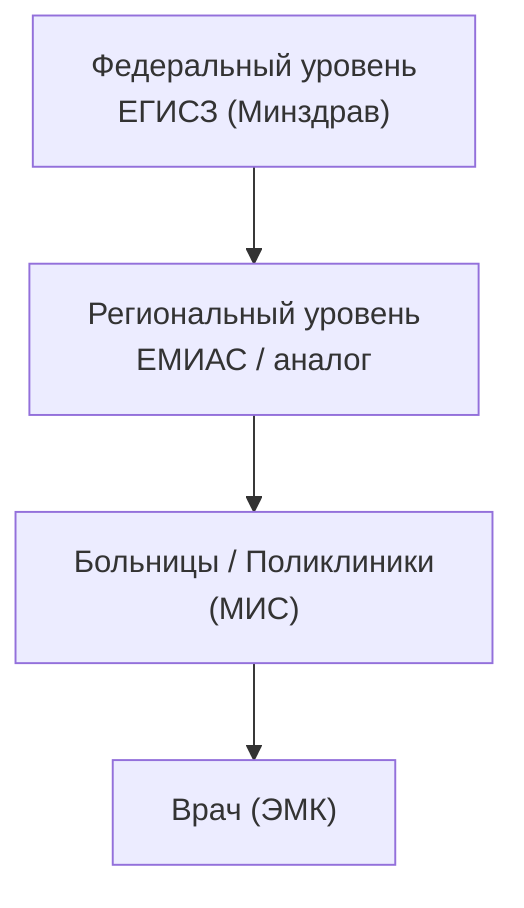

:::info[TL;DR]
ЕМИАС (Единая медицинская информационно-аналитическая система) — региональная система управления здравоохранением (Москва, Московская область). Обеспечивает: запись к врачу, ведение ЭМК, передачу в ЕГИСЗ (федеральный уровень). Аналитик: интеграция МИС с ЕМИАС (HL7 FHIR), работа с расписаниями, справочниками.
:::

## Уровни ЕГИСЗ

## Что делает ЕМИАС

| Функция | Описание |
|---------|----------|
| **Запись к врачу** | Централизованное расписание для региона |
| **ЭМК** | Хранение электронных медкарт |
| **Справочники** | Номенклатура услуг, ICD-10, должности |
| **Отчётность** | Статистика в Минздрав |
| **ОМС** | Выставление счетов за оказанные услуги |

## Интеграция МИС ↔ ЕМИАС

| Направление | Данные | Стандарт |
|-------------|--------|----------|
| МИС → ЕМИАС | Факт оказания услуги | HL7 FHIR |
| МИС → ЕМИАС | ЭМК (выписной эпикриз) | FHIR Bundle |
| ЕМИАС → МИС | Расписание (слоты) | FHIR Schedule |
| ЕМИАС → МИС | Справочники (услуги, врачи) | FHIR Terminology |
| МИС → ЕМИАС | Счёт в ОМС | СФОМС (отдельный протокол) |

## Справочники ЕМИАС

| Справочник | Пример |
|------------|--------|
| ICD-10 | Диагнозы (E11 — сахарный диабет) |
| Номенклатура услуг | A09.05.003 — анализ крови |
| Должности | Врач-терапевт, врач-хирург |
| Услуги ОМС | Приём врача, КТ, УЗИ |

## Что дальше

- [DICOM — медицинские изображения](/tech/dicom)

## Проверь себя

1. **Чем ЕМИАС отличается от ЕГИСЗ?**
   *Ответ:* ЕМИАС — региональная система (уровень Москвы/области), ЕГИСЗ — федеральный уровень (Минздрав).

2. **Какие данные МИС передаёт в ЕМИАС?**
   *Ответ:* Факт услуги, ЭМК (выписной эпикриз), счёт в ОМС. По стандарту HL7 FHIR.
