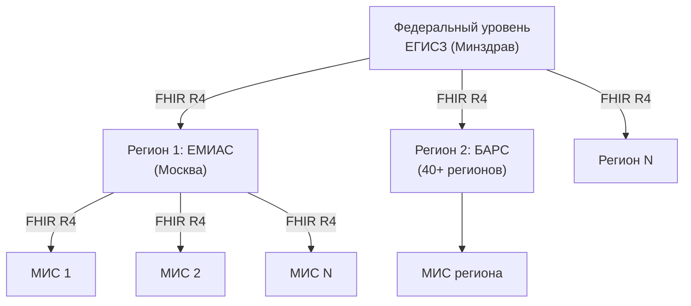
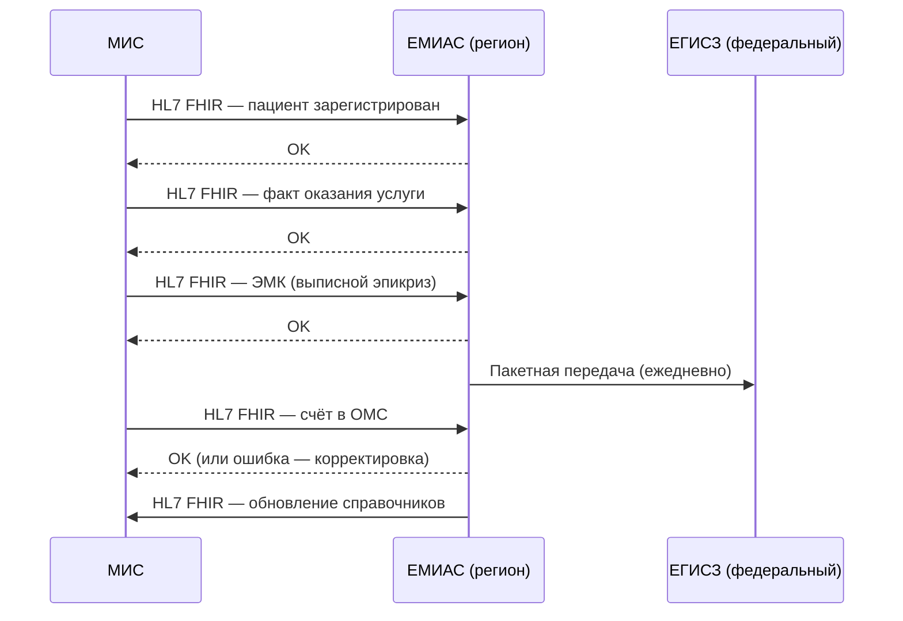

:::info[TL;DR]
ЕМИАС (Единая медицинская ИС Москвы) — крупнейшая региональная система здравоохранения РФ: 1000+ поликлиник, 10M+ пациентов, 100M+ записей/год. ЕГИСЗ — федеральный уровень (Минздрав). Аналитик интегрирует МИС с региональной и федеральной системами по HL7 FHIR. Ключевое: расписание, ЭМК, ОМС, справочники. Штраф за отсутствие интеграции — до 300 тыс. руб.
:::

## Для кого эта статья

- SA, интегрирующий МИС с региональной ЕГИСЗ
- Middle SA в государственном медицинском проекте
- Middle SA в частной клинике, подключающейся к ЕГИСЗ

После прочтения вы:
- Поймёте различие между ЕМИАС, ЕГИСЗ и региональными системами
- Узнаете, какие данные и по каким протоколам передавать
- Сможете спроектировать интеграцию МИС ↔ ЕМИАС/ЕГИСЗ

## Что это такое

**ЕГИСЗ** — Единая государственная информационная система в сфере здравоохранения (федеральный уровень, Минздрав РФ). Собирает данные из всех регионов.

**ЕМИАС** — Единая медицинская ИС Москвы (региональный уровень). Аналоги есть в каждом регионе: «БАРС Груп» (40+ регионов), «Соцмед» (Татарстан), региональные разработки.

## Уровни системы

## Что делает ЕМИАС

| Функция | Описание | Для кого |
|---------|----------|----------|
| **Запись к врачу** | Централизованное расписание для всего региона | Пациент (Госуслуги / ЕМИАС) |
| **ЭМК** | Хранение электронных медкарт на уровне региона | Врач, пациент |
| **Справочники** | Номенклатура услуг, ICD-10, должности, услуги ОМС | МИС (получает справочники) |
| **Отчётность** | Статистика в Минздрав (заболеваемость, нагрузка) | Минздрав |
| **ОМС** | Выставление счетов за оказанные услуги | ФОМС |
| **Электронные рецепты** | Реестр выписанных рецептов (ФЭР) | Аптеки |

## Интеграция МИС ↔ ЕМИАС

### Таблица интеграции

| Направление | Данные | Стандарт | Частота |
|-------------|--------|----------|---------|
| МИС → ЕМИАС | Регистрация пациента | FHIR Patient | При создании |
| МИС → ЕМИАС | Факт оказания услуги | FHIR Encounter | По факту приёма |
| МИС → ЕМИАС | ЭМК (выписной эпикриз) | FHIR Bundle | При выписке |
| МИС → ЕМИАС | Счёт в ОМС | FHIR + СФОМС | Ежемесячно |
| ЕМИАС → МИС | Расписание (слоты) | FHIR Schedule | При изменении |
| ЕМИАС → МИС | Справочники | FHIR Terminology | При обновлении |

## Требования к интеграции

| Параметр | Значение | Почему это важно |
|----------|----------|------------------|
| Версия FHIR | R4 | ЕГИСЗ требует именно R4 (не R5, не v2) |
| Профиль | Russian FHIR Core | Обязательные поля для РФ (ИНН, СНИЛС, ОМС) |
| Сертификаты | TLS 1.2, ГОСТ | Канал должен быть защищён (ПД особой категории) |
| УКЭП | Подпись передаваемых данных | Юридическая значимость |
| Отказоустойчивость | Queue + retry 3 раза | ЕМИАС может не ответить |
| SLA | 99.9% по доступности API | Штрафные санкции к оператору |

## Справочники ЕМИАС

| Справочник | Система кодирования | Пример |
|------------|---------------------|--------|
| Диагнозы | ICD-10, МКБ-10 | E11 — сахарный диабет 2 типа |
| Номенклатура услуг | NOMEN (РФ) | A09.05.003 — анализ крови |
| Должности | Справочник должностей | Врач-терапевт, врач-хирург |
| Услуги ОМС | ТПОМС | Приём врача, КТ, УЗИ |
| Лекарства | ЧЗ + ЕСКЛП | DataMatrix-код |

## Региональные варианты ЕГИСЗ

| Регион | Система | Масштаб |
|--------|---------|---------|
| **Москва** | ЕМИАС | 1000+ поликлиник, 10M+ пациентов |
| **Московская область** | ЕМИАС МО | 100+ больниц |
| **Татарстан** | Соцмед / РЕГИЗ | 500+ организаций |
| **40+ регионов** | БАРС Груп | Каждой своя |
| **Санкт-Петербург** | Региональная ЕГИСЗ | Специфическая |

## Практический кейс: Подключение частной клиники к ЕМИАС

**Проблема:** Частная клиника (Москва) хочет подключиться к ЕМИАС, чтобы пациенты могли записываться через Госуслуги. Без подключения — поток пациентов падает на 30%.

**Анализ:**
- Клиника использует Medesk (SaaS-МИС)
- Medesk уже поддерживает FHIR R4
- Нужно: создать Accredited Clinic в ЕМИАС, настроить FHIR-шлюз, пройти тестирование

**Решение:**
1. Подача заявки на аккредитацию в Департамент здравоохранения
2. Настройка FHIR-шлюза (Mirth Connect) — конвертация Medesk → ЕМИАС
3. Создание пользователей ЕМИАС для администраторов
4. Тестирование: 100 тестовых транзакций (пациент, запись, приём, ЭМК)
5. Аудит безопасности (УЗ-1)

**Результат:**
- Подключение через 3 месяца (бюрократия: 2 мес., техника: 1 мес.)
- Поток пациентов через Госуслуги: +25%
- Стоимость: 1.5 млн руб. (шлюз + настройка + тестирование)
- Окупаемость: 8 месяцев

## Проверь себя

1. **Чем ЕМИАС отличается от ЕГИСЗ?**  
   *Ответ:* ЕМИАС — региональная система (Москва/область), ЕГИСЗ — федеральный уровень (Минздрав). ЕМИАС передаёт данные в ЕГИСЗ.

2. **Какие данные МИС передаёт в ЕМИАС?**  
   *Ответ:* Регистрация пациента, факт оказания услуги (Encounter), ЭМК (выписной эпикриз), счёт в ОМС. По стандарту HL7 FHIR R4 (Russian Core).

3. **Какой стандарт интеграции обязателен для ЕГИСЗ?**  
   *Ответ:* HL7 FHIR R4 (постановление № 1275). HL7 v2 не принимается.

4. **Что произойдёт, если МИС не передаёт данные в ЕГИСЗ?**  
   *Ответ:* Штраф до 300 тыс. руб. (КоАП). Клиника не может выставлять счета в ОМС. Пациенты не могут записаться через Госуслуги.

5. **Почему нужен FHIR-профиль Russian Core?**  
   *Ответ:* Базовый FHIR не определяет обязательность полей для РФ (ИНН, СНИЛС, полис ОМС). Russian Core говорит: при передаче пациента — обязательно СНИЛС и ОМС. Без этого ЕГИСЗ отклонит транзакцию.

## Ссылки для самостоятельного изучения

| Что | Описание | URL |
|-----|----------|-----|
| ЕМИАС — документация для разработчиков | Портал интеграции | dev.emias.info |
| HL7 FHIR R4 — Russian Core | Профиль РФ | fhir.ru |
| Постановление № 1275 | О ЕГИСЗ | government.ru |
| Минздрав — методические материалы | Нормы по интеграции | minzdrav.gov.ru |
| ОМС — СФОМС | Документация по счетам | ffoms.gov.ru |

## Что дальше

- [Регуляторика в медицине](/docs/specialization/medtech-regulations) — 323-ФЗ, 152-ФЗ, требования к МИС
- [HL7 FHIR](/tech/hl7) — протокол интеграции с ЕМИАС
- [МИС — медицинские ИС](/docs/specialization/medtech-mis) — как МИС встраивается в ЕГИСЗ
