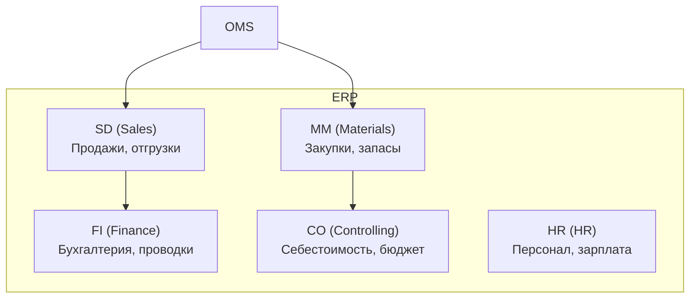
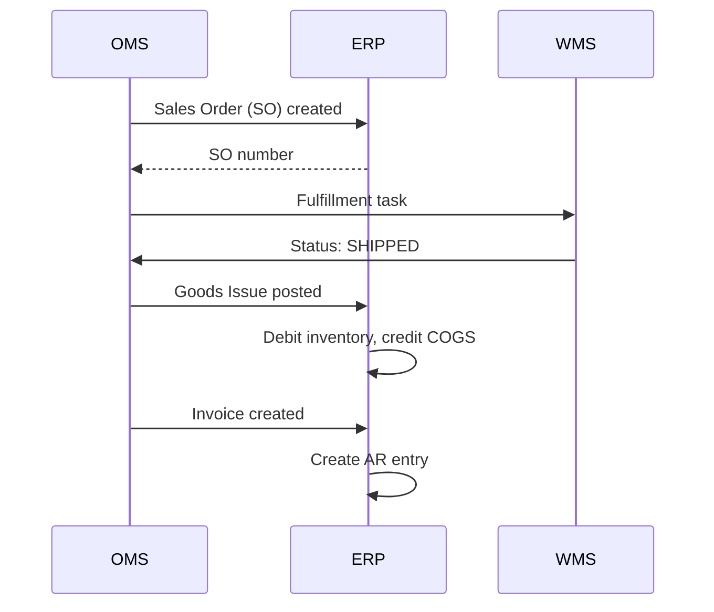

:::info[TL;DR]
ERP (Enterprise Resource Planning) — система управления ресурсами предприятия: финансы, закупки, производство, склад, персонал. В e-commerce ERP — система учёта (а не операционного контура). OMS создаёт заказ, ERP отражает его в бухгалтерии (проводки, себестоимость). Интеграция — через REST / EDI / 1С-разъёмы. Ключевое: синхронность данных между OMS и ERP.
:::

## Для кого эта статья

- Middle SA, интегрирующий OMS с ERP
- SA в e-commerce, работающий с учётом

После прочтения вы:
- Поймёте 5 ключевых модулей ERP для e-commerce (FI, CO, MM, SD, WM)
- Узнаете, какие данные OMS передаёт в ERP
- Сможете спроектировать интеграцию OMS → ERP

## Что это такое

ERP — система учёта всех ресурсов компании:

- Финансы (деньги)
- Материалы (запасы)
- Производство (себестоимость)
- Персонал (зарплата)
- Продажи (отгрузки, счета)

В e-commerce ERP — **учётный слой**, а OMS — **операционный слой**.

## Ключевые модули ERP для e-commerce

| Модуль | Что делает | Для e-commerce |
|--------|-----------|---------------|
| **FI (Finance)** | Проводки, главная книга, дебиторка | Отражает продажи, возвраты |
| **CO (Controlling)** | Себестоимость, бюджет, план | Нормативная себестоимость товара |
| **MM (Materials)** | Закупки, управление запасами | Поступление товаров |
| **SD (Sales & Distribution)** | Продажи, отгрузки, счета | Заказ → отгрузка → счёт-фактура |
| **WM (Warehouse)** | Складской учёт | Часто заменяется WMS |

## Интеграция OMS → ERP

**События интеграции:**

| Событие | Откуда | Куда | Данные |
|---------|--------|-----|--------|
| **Заказ создан** | OMS | ERP SD | Customer, items, totals |
| **Отгрузка** | WMS → OMS | ERP MM/SD | Shipment, tracking, weight |
| **Возврат** | OMS | ERP SD/FI | Return items, refund amount |
| **Поступление товара** | WMS | ERP MM | Goods receipt, PO |
| **Оплата получена** | Платёжный шлюз → OMS | ERP FI | Payment, bank statement |

**Типовой поток:**

## Для чего ERP нужна в e-commerce

- **Себестоимость** — ERP знает, сколько реально стоил товар (закупка + логистика + хранение)
- **Налоги** — проводки для налоговой (НДС, прибыль)
- **Закупки** — ERP управляет закупками (когда и сколько заказать)
- **Финансовая отчётность** — P&L, Balance Sheet
- **Аудит** — кто, когда, что сделал с товаром

## Когда использовать

- Бизнес с оборотом > 100 млн ₽/год
- Нужна налоговая отчётность
- Несколько юридических лиц
- Сложная себестоимость

## Когда НЕ использовать

- Стартап (OMS + Excel достаточно)
- Только услуги (без товаров)

## Альтернативы

| Система | Тип | Когда выбрать |
|---------|-----|-------------|
| **SAP S/4HANA** | Enterprise | Крупный бизнес (> 5 млрд) |
| **1С:ERP** | РФ, Enterprise | Российский рынок |
| **Oracle ERP Cloud** | Cloud Enterprise | Международный бизнес |
| **Microsoft Dynamics 365** | Cloud Enterprise | Средний + крупный |
| **Odoo** | Open-source | Малый / средний бизнес |

## Проверь себя

1. **Чем ERP отличается от OMS?**
   *Ответ:* OMS — операционный контур (создать заказ, оплатить, отгрузить). ERP — учётный контур (отразить проводку, рассчитать себестоимость, сдать отчётность).

2. **Какие модули ERP нужны e-commerce?**
   *Ответ:* FI (бухгалтерия), CO (себестоимость), MM (закупки), SD (продажи).

3. **Какие данные OMS передаёт в ERP?**
   *Ответ:* Sales Order (заказ), Goods Issue (отгрузка), Invoice (счёт), Return (возврат), Payment (оплата).

4. **Почему ERP не может заменить OMS?**
   *Ответ:* ERP — учётная система, не рассчитана на high-load операций (10 000 заказов/час). OMS — операционная, с event-driven, машиной состояний, интеграциями. ERP — T+1, OMS — real-time.

## Ссылки для самостоятельного изучения

| Что | Описание | URL |
|-----|----------|-----|
| SAP Help Portal | Документация | help.sap.com |
| 1С:ERP | Управление предприятием | 1c.ru |
| Microsoft Dynamics 365 | Cloud ERP | dynamics.microsoft.com |
| Odoo — open-source ERP | Документация | odoo.com |
