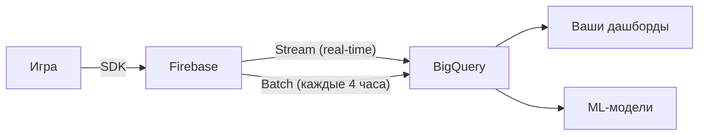
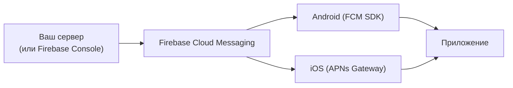

:::info[TL;DR]
Firebase (Google) — стандарт де-факто для мобильных игр. Не просто аналитика, а целая экосистема: Analytics, Crashlytics, Remote Config, Cloud Messaging (Push), Performance Monitoring, Cloud Firestore, Authentication и A/B Testing. Firebase покрывает 80% потребностей мобильной игры без собственного бэкенда. Аналитик настраивает события (event tracking), Remote Config для A/B тестов, Crashlytics для мониторинга качества и интеграцию с BigQuery для сырых данных.
:::

## Обзор продуктов Firebase для игр

| Продукт | Зачем | Аналог | Бесплатный лимит |
|---------|-------|--------|-----------------|
| **Analytics** | События, user properties, когорты | Amplitude, Mixpanel | Безлимит (события) |
| **Crashlytics** | Краш-репортинг, логи, ассерты | Sentry, Bugsnag | Безлимит |
| **Remote Config** | A/B тесты, параметры без апдейта | LaunchDarkly, Split | Безлимит (10M MAU) |
| **Cloud Messaging (FCM)** | Push-уведомления | OneSignal, Airship | Безлимит |
| **Performance Monitoring** | Лаги, загрузка, network | New Relic, Datadog | Безлимит (100M событий) |
| **Cloud Firestore** | NoSQL-база для сохранений | MongoDB Atlas, Supabase | 1GB storage |
| **Authentication** | Анонимная + OAuth (Google, FB) | Auth0, AWS Cognito | 10K пользователей/мес |
| **A/B Testing** | A/B тесты через Remote Config | Optimizely, Split | Безлимит |
| **Cloud Functions** | Серверный код (Node.js) | AWS Lambda, Vercel | 2M вызовов/мес |
| **Cloud Storage** | Asset Bundles, скриншоты | AWS S3, Cloudinary | 5GB storage |

**Для игр минимальный набор:** Analytics + Crashlytics + Remote Config + FCM.

## Firebase Analytics: как устроен

### События и параметры

Каждое действие игрока — событие с параметрами:

```
Событие:        level_complete
Параметры:      {level_id: 10, score: 4500, stars: 3, time_spent: 120}
User Property:  player_level: 10
Автоматически:  app_version, platform, country, device_model
```

**Базовые рекомендованные события (от Firebase):**

```csharp
// Unity SDK
Firebase.Analytics.FirebaseAnalytics
  .LogEvent("level_complete", 
    new Parameter("level_id", 10),
    new Parameter("score", 4500),
    new Parameter("stars", 3));
```

### User Properties

Фильтры для сегментации игроков:

```csharp
Firebase.Analytics.FirebaseAnalytics
  .SetUserProperty("player_type", "whale");
```

**Примеры user properties в играх:**
- `player_level` (int) — текущий уровень игрока
- `player_type` (string: f2p, spender, whale)
- `clan_id` (string) — клан игрока
- `country` (string, авто) — GEO
- `last_purchase_day` (int) — дней с последней покупки

### Поток данных Firebase → BigQuery



**Blaze-план (платный):** включает экспорт в BigQuery. Сырые данные — каждые 4 часа (batch) + streaming (real-time) для последних 24 часов.

**Схема таблицы BigQuery:** `firebase_export.app_events_YYYYMMDD` — все события с параметрами и user properties.

## Crashlytics

### Что трекает

| Тип | Пример | Приоритет |
|-----|--------|-----------|
| **Fatal (краш)** | NullReferenceException, OutOfMemory | Критично |
| **Non-Fatal** | Пойманное исключение (catch) | Важно |
| **ANR (Android)** | Приложение не отвечает > 5 сек | Критично |
| **User log** | `Crashlytics.Log("Игрок нажал кнопку X")` | Для дебага |

### Метрики Crashlytics

| Метрика | Норма для игры | Что делать если выше |
|---------|---------------|---------------------|
| **Crash-free users** | > 99% | Срочно фиксить |
| **Crash rate per session** | < 0.1% | Фиксить |
| **ANR rate** | < 0.5% | Оптимизация UI |
| **Top crash** | Не должно быть top crash > 10% | Назначить владельца |

**Unity-specific:** `Application.logCallback` → `Crashlytics.LogException` для Managed Exceptions.

## Remote Config

### Как работает

Firebase Remote Config — JSON-конфиг, который игра подтягивает при старте:

```json
// default config (в коде)
{
  "gold_per_battle": 100,
  "energy_regen_sec": 300,
  "boss_hp": 5000,
  "show_promo": false,
  "iap_prices": {
    "gems_100": 0.99,
    "gems_500": 4.99
  },
  "event_active": false
}
```

```csharp
// C# в Unity
var rc = Firebase.RemoteConfig.FirebaseRemoteConfig;
bool eventActive = rc.GetValue("event_active").BooleanValue;
int goldPerBattle = (int)rc.GetValue("gold_per_battle").LongValue;
```

**Update flow:**
1. Аналитик меняет JSON в Firebase Console
2. Игра при следующем старте / по команде `FetchAsync()` подтягивает новый конфиг
3. Новые параметры применяются без перевыпуска

**A/B тесты через Remote Config:**
1. Создать Remote Config condition (группа A / группа B)
2. Задать разные значения (A: gold=100, B: gold=120)
3. Firebase распределяет игроков 50/50
4. Через 7 дней Firebase показывает, какая группа лучше по retention

## Firebase Cloud Messaging (Push)

### Интеграция FCM + APNs



**Unity SDK авто-обрабатывает:** регистрацию токена, получение push, тап по push.

### Кампании Firebase

Firebase Console позволяет отправлять push без своего сервера:

```
Campaign: "Вернись в игру!"
Target: Users with last_session > 3 days
Schedule: Tomorrow 12:00
Message: "Твой клан ждёт тебя! Зайди и получи бонус"
Deep link: mygame://clan/123
```

## Firebase A/B Testing

Не путать с Remote Config. Firebase A/B Testing — это Remote Config + эксперимент:

| Шаг | Действие |
|-----|----------|
| 1 | Выбрать метрику (D7 retention) |
| 2 | Создать Remote Config parameter (energy_regen) |
| 3 | Контроль: 300 сек; Эксперимент: 240 сек |
| 4 | Firebase распределяет 50/50 |
| 5 | Через 14 дней: результат (какая группа выше по retention) |

**Ограничения Firebase A/B Testing:**
- Только 1 метрика primary (можно несколько secondary)
- Математика — Bayesian (не frequentist)
- Минимальный размер — 1000 пользователей на группу

## Цены

| План | Стоимость | Лимиты |
|------|-----------|--------|
| **Spark (Free)** | $0 | Analytics (безлимит), Crashlytics, Remote Config, FCM, Performance Monitoring (100M/мес) |
| **Blaze (Pay as you go)** | Плата за ресурсы | BigQuery export ($0.05/GB), Cloud Functions ($0.40/2M), Firestore ($1/GB) |

**Для игр:** Spark (free) достаточно для 95% игр на старте. Blaze нужен только для BigQuery export.

## Ссылки для самостоятельного изучения

| Ресурс | Описание | Ссылка |
|--------|----------|--------|
| Firebase Documentation | Полная документация всех продуктов | https://firebase.google.com/docs |
| Firebase Unity SDK | Интеграция Firebase с Unity | https://firebase.google.com/docs/unity/setup |
| Firebase Analytics for Games | Игровые события (рекомендованные) | https://firebase.google.com/docs/analytics/event-parameters-gaming |
| Firebase Remote Config | Remote Config — гайд | https://firebase.google.com/docs/remote-config |
| Firebase Cloud Messaging | Push-уведомления | https://firebase.google.com/docs/cloud-messaging |
| Firebase Crashlytics Unity | Crashlytics для Unity | https://firebase.google.com/docs/crashlytics/unity |
| Firebase A/B Testing | A/B тесты через Remote Config | https://firebase.google.com/docs/ab-testing |
| Firebase BigQuery Export | Экспорт данных в BigQuery | https://firebase.google.com/docs/analytics/bigquery |
| Firebase Console | Панель управления Firebase | https://console.firebase.google.com/ |
| Firebase Pricing | Цены (Spark / Blaze) | https://firebase.google.com/pricing |

## Проверь себя

1. **Какие продукты Firebase обязательны для мобильной игры?**
   *Ответ:* Analytics (события), Crashlytics (краши), Remote Config (A/B тесты), Cloud Messaging (push). Spark-план (free) покрывает 95% нужд.

2. **Как Firebase Analytics передаёт данные в BigQuery?**
   *Ответ:* Через Blaze-план — каждые 4 часа batch + real-time streaming. Таблица `firebase_export.app_events_YYYYMMDD` содержит все события.

3. **Как работает Remote Config?**
   *Ответ:* JSON-конфиг на сервере Firebase. Игра подтягивает при старте. Можно менять параметры без перевыпуска. Используется для A/B тестов.

4. **Что такое Crashlytics и какие метрики он даёт?**
   *Ответ:* Краш-репортинг. Crash-free users, crash rate, ANR rate, top crashes. Норма: crash-free > 99%.

5. **Сколько стоит Firebase для игры на 1M MAU?**
   *Ответ:* Бесплатно (Spark). Если нужен BigQuery export — Blaze: ~$50–200/мес (зависит от объёма данных).
