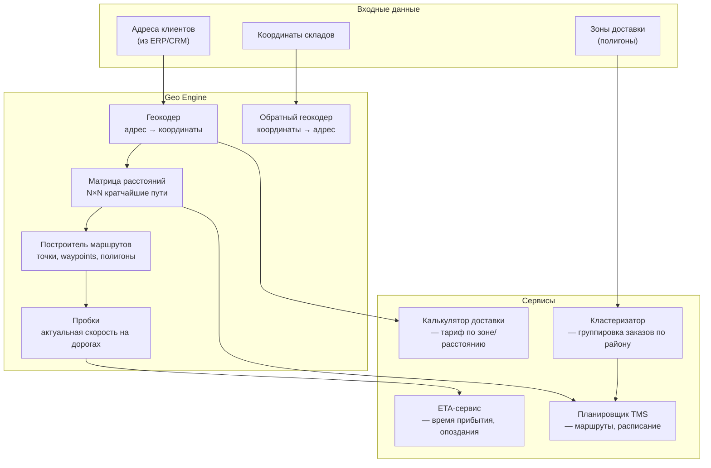
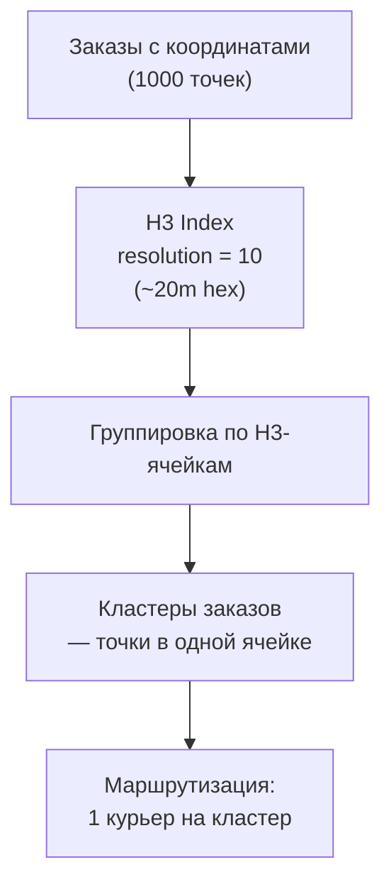

:::info[TL;DR]
Геоданные — фундамент логистики: координаты, адреса, полигоны, пробки, матрицы расстояний. Основные провайдеры: Яндекс.Карты (API Геокодер, Маршруты), 2GIS (справочник организаций), OpenStreetMap (бесплатные данные), Mapbox (кастомизация карт), Google Maps (глобальное покрытие). Задачи с геоданными: геокодинг (адрес → координаты), обратный геокодинг (координаты → адрес), матрица расстояний (кратчайшие пути), ETA (время прибытия), кластеризация заказов (Geohash, H3, k-means), полигоны (границы районов, тарифные зоны). Аналитик специфицирует требования к геоданным: точность геокодинга (уровень дома/улицы), формат координат (WGS-84), частоту обновления пробок (1-5 мин), покрытие регионов.
:::

## Для кого эта статья

Middle SA, проектирующий логистические решения. После прочтения вы:

- Поймёте типы геоданных и их применение в логистике: координаты, адреса, полигоны, графы дорог
- Узнаете API провайдеров: геокодинг, матрица расстояний, ETA, пробки
- Сможете выбрать провайдера под сценарий: такси, доставка, маршрутизация, аналитика
- Поймёте метрики качества геоданных: hit rate геокодинга, точность ETA, coverage

## 1. Геоданные в логистике

Геоданные — это не просто карта. В логистике они решают конкретные задачи:

| Задача | Что нужно | Пример провайдера | Точность |
|--------|-----------|-------------------|----------|
| **Геокодинг** | Адрес → координаты | Яндекс.Геокодер, Dadata | Уровень дома (90%) |
| **Обратный геокодинг** | Координаты → адрес | Яндекс.Геокодер | Ближайший адрес |
| **Матрица расстояний** | Кратчайшие пути | Яндекс.Маршруты, OSRM | ±5% от реального |
| **ETA** | Время прибытия | Яндекс.Пробки, Google Maps | ±3 мин (город), ±15 мин (трасса) |
| **Полигоны** | Границы районов | 2GIS, OpenStreetMap | Уровень квартала |
| **Кластеризация** | Группировка точек | Geohash, H3, k-means | Зависит от precision |
| **Изохроны** | Зона доступности за N минут | GraphHopper, Mapbox | ±2 мин |

## 2. Системы координат и форматы

### WGS-84 (стандарт)

```
Широта (latitude): 55.7558°N, Долгота (longitude): 37.6173°E
Формат: десятичные градусы (DD.dddd)
Погрешность: ~1 метр на 5 знаков после запятой
```

**Точность координат:**

| Знаков после запятой | Точность | Для чего |
|---------------------|----------|----------|
| 1 | 11 км | Страна |
| 2 | 1.1 км | Город |
| 3 | 110 м | Район |
| 4 | 11 м | Улица |
| 5 | 1.1 м | Дом |
| 6 | 0.11 м | Вход/парковка |

### Форматы обмена

| Формат | Описание | Пример использования |
|--------|----------|---------------------|
| **GeoJSON** | JSON-формат точек, линий, полигонов | API Яндекс.Маршрутов |
| **GPX** | XML для треков (GPS) | Треки курьеров |
| **KML** | XML для карт Google Earth | Визуализация в 2GIS |
| **WKT** | Well-Known Text для БД | PostGIS (PostgreSQL) |
| **S2 / H3** | Иерархические ячейки | Uber H3 для кластеризации |

## 3. Архитектура гео-сервиса



## 4. Провайдеры геоданных — сравнение

### API и возможности

| Провайдер | Геокодинг | Матрица расстояний | Пробки | Покрытие РФ | Цена (1000 запросов) |
|-----------|-----------|-------------------|--------|-------------|----------------------|
| **Яндекс.Карты** | Да (уровень дома) | Да (до 100 точек) | Да (1 мин) | Отличное | 200-500 ₽ |
| **2GIS** | Да (уровень дома) | Нет | Нет | Города РФ | Бесплатно (100K/день) |
| **Dadata** | Да (+ FIAS, КЛАДР) | Нет | Нет | Вся РФ | 200 ₽ |
| **OSRM** | Нет | Да (OpenStreetMap) | Нет | Open data | Бесплатно |
| **Mapbox** | Да | Да | Да (TomTom) | Среднее | $25 (50K запросов) |
| **Google Maps** | Да | Да | Да | Хорошее (крупные города) | $10-50 |

### Когда какого провайдера выбирать

| Сценарий | Провайдер | Почему |
|----------|-----------|--------|
| Такси / курьеры в реальном времени | Яндекс.Карты | Пробки в реальном времени, ETA с трафиком |
| Доставка по РФ, города | Dadata + Яндекс.Маршруты | Dadata — лучший геокодинг (FIAS), Яндекс — матрица |
| Междугородние перевозки | OSRM + OpenStreetMap | Бесплатно, покрытие трасс |
| Международная логистика | Google Maps + Mapbox | Глобальное покрытие |
| Аналитика (DWH, витрины) | H3 (Uber) + PostGIS | Кластеризация, Spatial SQL |
| Карта для визуализации | 2GIS (РФ) / Mapbox (мир) | Красивая отрисовка, кастомизация |

### Стоимость владения

| Провайдер | Eval (мес) | Production (мес, 1M запросов) | Ограничения |
|-----------|-----------|-------------------------------|-------------|
| Яндекс.Карты | 10K ₽ (грант) | 50-200K ₽ | Лицензия на отрисовку карты |
| 2GIS | Бесплатно | Бесплатно (до 100K/день) | Нет маршрутизации |
| Dadata | 5K ₽ | 20-100K ₽ | Только геокодинг |
| OSRM | Бесплатно | $500-2000 (хостинг) | Нужен свой сервер |
| Mapbox | $50 | $500-5000 | Ограничения по MAU |
| Google Maps | $200 | $1000-5000 | Дорогой при масштабировании |

## 5. H3 — кластеризация для логистики

Uber разработал H3 — иерархическую гексагональную сетку для кластеризации заказов.



**Почему H3, а не квадратная сетка:**

| Параметр | H3 (hexagon) | Квадратная сетка |
|----------|-------------|------------------|
| Соседи | 6, все на равном расстоянии | 8 (4 по ребру + 4 по углу, расстояния разные) |
| Искажение площади | Минимальное | Разное у полюсов/экватора |
| Иерархия | resolution 0-15 | Фиксированный размер |
| Пример | Uber, Lyft, Facebook | Простые системы |

## 6. Метрики качества геоданных

| Метрика | Описание | Хорошо | Плохо |
|---------|----------|--------|-------|
| **Geocode hit rate** | % адресов, найденных до уровня дома | > 90% | < 70% |
| **Geocode accuracy** | Отклонение от реального адреса | < 10 м | > 50 м |
| **ETA error (P50)** | Медианная ошибка ETA | < 3 мин | > 10 мин |
| **ETA error (P95)** | 95-й перцентиль | < 8 мин | > 20 мин |
| **Matrix coverage** | % маршрутов, где есть данные | > 99% | < 90% |
| **Update frequency** | Частота обновления пробок | < 1 мин | > 15 мин |

## 7. Когда использовать и когда НЕ использовать

### Когда нужен гео-сервис

- Доставка по городу — ETA с пробками, геокодинг адресов
- Маршрутизация — матрица расстояний для VRP-солвера
- Расчёт стоимости — тариф по зоне/расстоянию
- Аналитика — кластеризация заказов, heatmap спроса

### Когда достаточно простого решения

- Доставка по одному адресу (AB тест) — линейка в картах
- 5-20 заказов/день — ручной ввод адресов + Google Maps
- Зональная доставка (по районам, не по адресам) — список районов
- Междугородние регулярные маршруты — фикс расписание

## 8. Практический кейс: Внедрение H3 для кластеризации доставки в Яндекс.Еде

**Проблема:** Яндекс.Еда — 100K+ заказов/день в Москве. Курьеры получают заказы последовательно, маршрут не оптимален. Utilization курьеров 55%.

**Решение — H3-кластеризация:**
1. Город разбит на H3-ячейки resolution 9 (~500m hex)
2. Заказы группируются по ячейкам
3. Курьер получает кластер заказов в одной зоне
4. Маршрут внутри кластера оптимизируется (TSP-солвер)

**Результат:**
- Utilization: 55% → 78%
- Среднее время доставки: 42 мин → 34 мин
- Cost per delivery: -15%
- Курьеры довольны (меньше холостого пробега)

## Ссылки для самостоятельного изучения

| Ресурс | Описание | Ссылка |
|--------|----------|--------|
| Яндекс.Карты API — документация | Геокодер, Маршруты, Карты | https://yandex.ru/dev/maps/ |
| Dadata — геокодинг по ФИАС | API геокодинга с КЛАДР/ФИАС | https://dadata.ru/api/geocode/ |
| OpenStreetMap — документация | Бесплатная карта мира | https://wiki.openstreetmap.org/ |
| OSRM — Open Source Routing Machine | Маршрутизация по OSM | https://project-osrm.org/ |
| Uber H3 — документация | H3 hex grid system | https://h3geo.org/ |
| PostGIS — Spatial SQL документация | Гео-функции для PostgreSQL | https://postgis.net/documentation/ |
| Mapbox — документация | Карты, геокодинг, навигация | https://docs.mapbox.com/ |
| Google Maps Platform — документация | Google Maps API | https://developers.google.com/maps |
| GraphHopper — Routing API | Open-source маршрутизация | https://www.graphhopper.com/ |

## Проверь себя

1. **Какие задачи решают геоданные в логистике?**
   *Ответ:* Геокодинг (адрес → координаты), матрица расстояний (кратчайшие пути), ETA (время прибытия с пробками), полигоны (зоны доставки), кластеризация (группировка заказов), изохроны (зона доступности за N минут).

2. **Чем H3 отличается от квадратной сетки?**
   *Ответ:* H3 — гексагональная (6 соседей, равное расстояние до всех). Квадратная — 8 соседей (4 по ребру + 4 по углу, разные расстояния). H3 — иерархическая (resolution 0-15), квадратная — фикс размер. H3 = Uber, Lyft; квадратная = простые системы.

3. **Какого провайдера выбрать для доставки по РФ?**
   *Ответ:* Комбинация: Dadata (геокодинг — лучший по РФ, FIAS) + Яндекс.Маршруты (матрица расстояний с пробками) + 2GIS (карта для визуализации). Для международной — Mapbox или Google Maps.

4. **Какие метрики качества геоданных важны?**
   *Ответ:* Geocode hit rate (> 90%), geocode accuracy (< 10 м), ETA error P50 (< 3 мин), matrix coverage (> 99%), update frequency (< 1 мин для пробок).

5. **Когда можно обойтись без гео-сервиса?**
   *Ответ:* Меньше 20 заказов/день, доставка по одному адресу (AB тест), зональная доставка (не по адресам), регулярные междугородние маршруты. В этих случаях — ручной ввод + Google Maps или фикс расписание.
