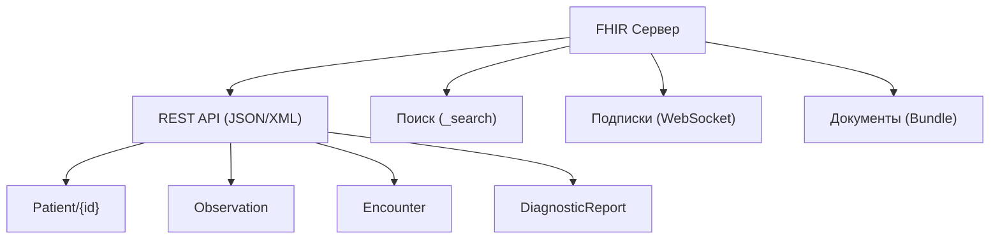

:::info[TL;DR]
HL7 FHIR (Fast Healthcare Interoperability Resources) — современный стандарт обмена медицинскими данными (JSON/XML, REST API). Заменяет HL7 v2 (текстовые сообщения). Ресурсы FHIR: Patient (пациент), Observation (результат анализа), Medication (препарат). Используется для интеграции МИС с ЕГИСЗ, ЛИС, PACS в РФ.
:::

## Основные ресурсы FHIR

| Ресурс | Описание |
|--------|----------|
| `Patient` | Пациент (демография) |
| `Practitioner` | Врач / медперсонал |
| `Encounter` | Посещение / приём |
| `Observation` | Результат измерения / анализа |
| `MedicationRequest` | Назначение лекарства |
| `DiagnosticReport` | Отчёт по лаборатории/радиологии |
| `ImagingStudy` | Исследование DICOM |

## Архитектура FHIR



## Пример: передача результата анализа

**Запрос (МИС → ЛИС):**
```
POST /fhir/ServiceRequest
{
  "resourceType": "ServiceRequest",
  "status": "active",
  "code": { "coding": [{ "system": "urn:oid:1.2.643.5.1.13.13", "code": "A09.05.003" }] },
  "subject": { "reference": "Patient/123" },
  "requester": { "reference": "Practitioner/456" }
}
```

**Ответ (ЛИС → МИС):**
```
POST /fhir/Observation
{
  "resourceType": "Observation",
  "status": "final",
  "code": { "coding": [{ "system": "http://loinc.org", "code": "718-7" }] },
  "subject": { "reference": "Patient/123" },
  "valueQuantity": { "value": 5.8, "unit": "mmol/l" },
  "referenceRange": [{ "low": { "value": 3.5 }, "high": { "value": 5.5 } }]
}
```

## HL7 v2 vs FHIR

| Параметр | HL7 v2 | HL7 FHIR |
|----------|--------|----------|
| Формат | Текстовый (сегменты `| ^ ~`) | JSON / XML |
| Транспорт | MLLP (TCP) | REST API / HTTP |
| Версионирование | v2.1–2.8 (обратная несовместимость) | R4, R5 |
| Номенклатура | Локальные таблицы | LOINC, SNOMED, ICD-10 |
| Современность | 80-е годы | 2010+ |
| Популярность в РФ | Наследие | ЕГИСЗ, новые проекты |

## Что дальше

- [ЕМИАС / ЕГИСЗ](/tech/emias)

## Проверь себя

1. **Что такое FHIR Resource?**
   *Ответ:* Стандартный JSON/XML-объект для обмена данными (Patient, Observation, MedicationRequest).

2. **Чем FHIR отличается от HL7 v2?**
   *Ответ:* FHIR использует REST API и JSON вместо текстовых сообщений MLLP, поддерживает современные веб-стандарты и номенклатуры (LOINC, SNOMED).
