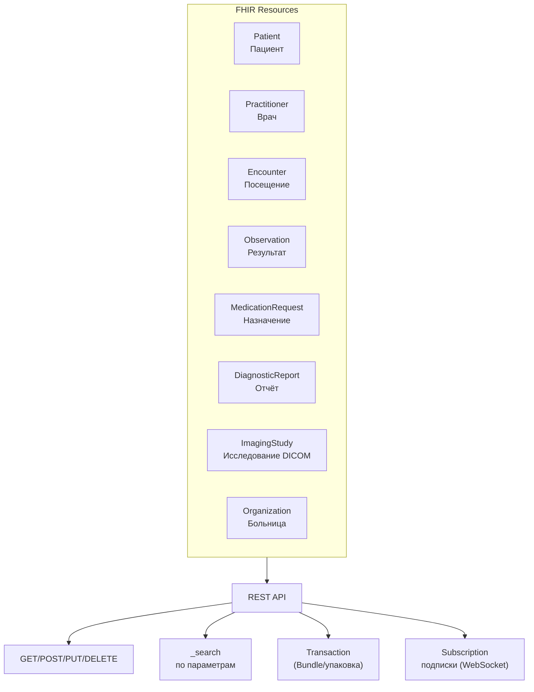

:::info[TL;DR]
HL7 FHIR (Fast Healthcare Interoperability Resources) — современный стандарт обмена медицинскими данными на REST API (JSON/XML). Вытесняет HL7 v2 (текстовые MLLP-сообщения). Ресурсы: Patient, Observation, MedicationRequest, DiagnosticReport. В РФ — обязательный стандарт для интеграции МИС с ЕГИСЗ (постановление № 1275). Крупнейшие потребители: ЕМИАС Москвы, региональные ЕГИСЗ, сети частных клиник.
:::

## Для кого эта статья

- SA, интегрирующий МИС с ЕГИСЗ
- Разработчик API для медицинского обмена
- Middle SA, переходящий с HL7 v2 на FHIR

После прочтения вы:
- Поймёте модель ресурсов FHIR (10 ключевых типов)
- Сможете работать с REST-эндпоинтами и search
- Узнаете, как FHIR используется в ЕГИСЗ РФ

## Что это такое

HL7 FHIR — стандарт обмена медицинскими данными, сочетающий REST API (JSON/XML) с моделью ресурсов. Каждый ресурс — структурированный объект (Patient, Observation, MedicationRequest), наследующий лучшие практики веб-API. FHIR — не «всё в одном»: он определяет каркас, а конкретные профили создаются под вендора/страну/систему.

В РФ — обязателен для ЕГИСЗ (версия R4, расширение Russian FHIR Core).

## Для чего используется

- Интеграция МИС с ЕГИСЗ (федеральный уровень)
- Обмен ЭМК между больницами и поликлиниками
- Передача результатов анализов ЛИС → МИС
- Радиология: результаты PACS → МИС (DiagnosticReport)
- Телемедицина: запись консультации в ЭМК
- Электронные рецепты: единый рецепт (ФЭР)

## Ключевые концепции



### Основные ресурсы

| Ресурс | Что описывает | Пример использования |
|--------|---------------|---------------------|
| `Patient` | Демография пациента | Создание/поиск пациента |
| `Practitioner` | Врач/медперсонал | Назначение ответственного |
| `Organization` | Медорганизация | Больница, отделение |
| `Encounter` | Посещение/приём | Запись факта приёма |
| `Observation` | Результат измерения или анализа | Уровень глюкозы, анализ крови |
| `DiagnosticReport` | Отчёт по исследованию | Заключение радиолога |
| `MedicationRequest` | Назначение лекарства | Рецепт |
| `ImagingStudy` | Исследование DICOM | Серия КТ-снимков |
| `Bundle` | Упаковка ресурсов | Пакетная передача ЭМК |
| `ServiceRequest` | Назначение процедуры | Направление на КТ |

## Пример: передача результата анализа

**Запрос (МИС → ЛИС, HL7 FHIR ServiceRequest):**

```json
POST /fhir/ServiceRequest
{
  "resourceType": "ServiceRequest",
  "status": "active",
  "code": {
    "coding": [
      {
        "system": "urn:oid:1.2.643.5.1.13.13",
        "code": "A09.05.003"
      }
    ]
  },
  "subject": { "reference": "Patient/123" },
  "requester": { "reference": "Practitioner/456" }
}
```

**Ответ (ЛИС → МИС, HL7 FHIR Observation):**

```json
POST /fhir/Observation
{
  "resourceType": "Observation",
  "status": "final",
  "code": {
    "coding": [
      {
        "system": "http://loinc.org",
        "code": "718-7"
      }
    ]
  },
  "subject": { "reference": "Patient/123" },
  "valueQuantity": {
    "value": 5.8,
    "unit": "mmol/l"
  },
  "referenceRange": [
    { "low": { "value": 3.5 }, "high": { "value": 5.5 } }
  ]
}
```

## HL7 v2 vs FHIR: сравнение

| Параметр | HL7 v2 | HL7 FHIR |
|----------|--------|----------|
| Формат | Текстовые сегменты (`MSH|^~\&`) | JSON / XML |
| Транспорт | MLLP (TCP, порт 2575) | REST / HTTP(S) |
| Версионирование | v2.1–2.8 (обратная несовместимость) | R4, R5 (совместимость внутри major) |
| Номенклатура | Локальные таблицы (user-defined) | LOINC, SNOMED, ICD-10 |
| Поиск | Не поддерживается | `_search` (параметры, фильтры) |
| Подписки | Нет | WebSocket, изменения в реальном времени |
| Современность | Разработка — 80-е, всё ещё используется | 2014+, принят в РФ |

## Когда использовать FHIR

- Новая интеграция МИС с ЕГИСЗ (постановление № 1275 — FHIR обязателен)
- Миграция с HL7 v2 на современный REST API
- Обмен данными между разными МИС (интероперабельность)
- Телемедицина и мобильные приложения (REST удобен для клиентов)

## Когда НЕ использовать FHIR

- Интеграция с legacy ЛИС/PACS, которые поддерживают только HL7 v2 (надо ставить конвертер)
- Высокоскоростные потоки данных реального времени (WebSocket — новые, но SLAs не устоялись)
- Простые обмены внутри одной МИС (избыточная сложность — достаточно внутреннего API)

## Альтернативы

| Стандарт | Формат | Когда использовать |
|----------|--------|-------------------|
| **HL7 v2** | MLLP | Legacy-системы, лабораторные анализаторы |
| **HL7 FHIR** | REST/JSON | Новые проекты, ЕГИСЗ, мобильные |
| **DICOM** | Специализированный | Радиология, изображения |
| **OpenEHR** | Модели протоколов | Долговременное хранение ЭМК (в РФ не принят) |

## Практический кейс: Переход с HL7 v2 на FHIR

**Проблема:** Сеть частных клиник (20 филиалов, Москва + регионы). МИС клиники интеграцию с ЕГИСЗ на HL7 v2. ЕГИСЗ объявила о переходе на FHIR R4. Клинике нужно адаптироваться за 6 месяцев.

**Анализ:**
- 15 интеграций: ЛИС (HL7 v2), PACS (DICOM), ЕГИСЗ (v2), телемедицина (SOAP)
- 10 000+ FHIR-транзакций в день (будет)
- Нет опыта работы с REST API

**Решение:**
1. FHIR-шлюз: конвертер v2 → FHIR (Mirth Connect / Nextgen Connect)
2. Первыми переведены: Observation + DiagnosticReport
3. Затем Patient + Encounter + MedicationRequest
4. Создан FHIR Sandbox для тестирования (HAPI FHIR Server)

**Результат:**
- Переход за 4 месяца (с запасом 2 месяца)
- Конвертер обрабатывает 100+ сообщений/сек
- ЕГИСЗ подтвердила совместимость профилей
- Стоимость: 3 млн руб. (интеграция + конвертер + обучение)
- Legacy v2 остался только для анализаторов (там v2 → FHIR — через конвертер)

## Проверь себя

1. **Что такое FHIR Resource?**  
   *Ответ:* Стандартный JSON/XML-объект для обмена медицинскими данными. Примеры: Patient, Observation, MedicationRequest, DiagnosticReport.

2. **Чем FHIR отличается от HL7 v2?**  
   *Ответ:* FHIR — REST API (JSON/XML) вместо MLLP (текстовые сообщения). FHIR поддерживает LOINC/SNOMED, поиск, подписки, лучше подходит для современных веб-приложений.

3. **Какой ресурс FHIR используется для передачи результатов анализа?**  
   *Ответ:* `Observation` для единичного результата (например, глюкоза 5.8), `DiagnosticReport` — для группы результатов с заключением (например, ОАК + описание).

4. **Почему FHIR обязателен для ЕГИСЗ, а HL7 v2 — наследие?**  
   *Ответ:* Постановление № 1275 предписывает FHIR. v2 не поддерживает REST, JSON и современные номенклатуры, что усложняет интеграцию между разными системами.

5. **Что такое FHIR Profile и зачем он нужен в РФ?**  
   *Ответ:* FHIR — каркас, профиль определяет обязательные поля, кодировки, ограничения для конкретной страны/системы. В РФ — Russian FHIR Core (обязательные поля для ЕГИСЗ).

## Ссылки для самостоятельного изучения

| Что | Описание | URL |
|-----|----------|-----|
| HL7 FHIR R4 — спецификация | Главная документация всех ресурсов | hl7.org/fhir |
| Russian FHIR Core | Профиль для РФ | fhir.ru |
| HAPI FHIR Server | Open-source сервер для тестирования | hapifhir.io |
| Mirth Connect | Конвертер v2 ↔ FHIR | nextgen.com |
| Постановление № 1275 | О ЕГИСЗ (требование FHIR) | government.ru |

## Что дальше

- [ЕМИАС / ЕГИСЗ](/tech/emias) — как FHIR используется в российских гос. системах
- [DICOM — медицинские изображения](/tech/dicom) — стандарт радиологии
- [МИС — медицинские ИС](/docs/specialization/medtech-mis) — интеграция МИС через FHIR
