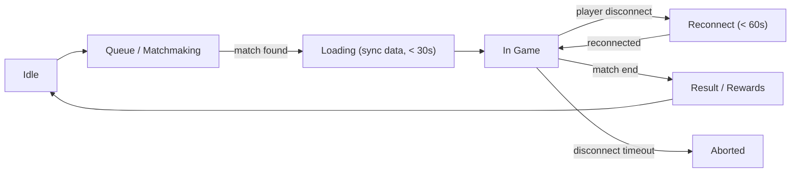

:::info[TL;DR]
Сетевой мультиплеер в играх — одна из самых сложных архитектурных задач. Photon (Exit Games) — популярное готовое решение: Photon PUN (простой мультиплеер для Unity), Photon Quantum (детерминированный lockstep), Photon Chat, Photon Voice. Альтернативы: Unity Netcode for GameObjects, Mirror (open-source), Nakama (Heroic Labs), Colyseus (JS), а также собственные серверные реализации. Выбор технологии зависит от типа игры: для казуального PvP хватит PUN, для соревновательного — нужен Quantum с детерминизмом, для MMO — собственный сервер на C++/Rust. Аналитик выбирает тип синхронизации (authoritative vs peer-to-peer), проектирует API сессии и статусную модель матча.
:::

## Что это и зачем

Сетевой мультиплеер позволяет игрокам взаимодействовать в реальном времени. Разные игры требуют разных подходов к синхронизации:

| Тип игры | Требования | Примеры |
|----------|-----------|---------|
| **Казуальный PvP (2-4 игрока)** | Sync состояний, tolerant к лагам | Brawl Stars, Clash Royale |
| **Соревновательный PvP (1v1)** | Детерминизм, rollback, античит | Street Fighter 6, StarCraft 2 |
| **Баттл-рояль (100 игроков)** | Interest management, dedicated servers | Fortnite, PUBG |
| **MMO (тысячи игроков)** | Шардирование, микросервисы, async | WoW, Genshin Impact (co-op) |
| **Co-op / Party (до 4)** | State sync, reconciliation | It Takes Two, Gears of War |

## Архитектура мультиплеера: два подхода

### State Sync (синхронизация состояния)

Сервер каждые 50–100ms рассылает состояние мира. Клиент отображает.

```
Плюсы:        Простота реализации, сервер авторитарен
Минусы:       Высокий трафик, требует много полосы
Когда:        Казуальные игры, Co-op, MMO (с Interest Management)
Пример:       Clash Royale, Brawl Stars
```

### Input Sync (синхронизация ввода) / Deterministic Lockstep

Игра детерминирована: при одинаковом вводе все клиенты получают одинаковый результат. Сервер только собирает и рассылает input'ы.

```
Плюсы:        Низкий трафик, идеален для честного PvP
Минусы:       Обязателен детерминизм (нет случайности), rollback netcode
Когда:        Fighting, RTS, Racing, симуляторы
Пример:       StarCraft 2, Street Fighter 6, Photon Quantum
```

## Photon — экосистема

Photon (Exit Games) — самый популярный сторонний мультиплеерный сервис в Unity. Работает поверх UDP с собственной транспортной прослойкой.

### Продукты Photon

| Продукт | Описание | Когда использовать | Лимиты |
|---------|----------|-------------------|--------|
| **Photon PUN** (Pun Universal Networking) | Простой API: RPC, Instantiate, Rooms | Казуальные, до 20 игроков | Бесплатно 20 CCU, платно от €95/мес |
| **Photon Quantum** | Deterministic lockstep engine (64+ игроков) | Соревновательные, Fighting, RTS | Платно, от €95/мес |
| **Photon Bolt** (legacy) | State sync альтернатива PUN | Устарел, заменён Quantum | — |
| **Photon Chat** | Чат поверх Photon | В чат в любой игре | Отдельная цена |
| **Photon Voice** | VoIP | Голосовой чат | Отдельная цена |
| **Photon Fusion** | Новый продукт (объединяет state + input sync) | Современные проекты (с 2023) | Платно |

**Photon Fusion** — новый стандарт Photon, который заменит PUN и Bolt. Поддерживает state sync, input sync, и гибридные режимы. Совместим с WebGL, DOTS, и Addressables.

## Альтернативы Photon

### Unity Netcode for GameObjects (UNGO) — официальное решение Unity

| Параметр | Photon PUN | Unity Netcode | Mirror | Nakama |
|----------|-----------|---------------|--------|--------|
| **Тип** | Cloud-сервис + SDK | SDK (нужен свой сервер) | Open-source SDK | Backend-as-a-Service |
| **Архитектура** | Client-Server (Photon Cloud) | Client-Server (ваш сервер) | Peer-to-Peer / Client-Server | Client-Server (Nakama Cloud) |
| **Детерминизм** | Нет (PUN) / Да (Quantum) | Нет | Нет | Нет |
| **CCU лимит** | 20 (free) / безлимит (paid) | Безлимит (ваш сервер) | Безлимит (ваш сервер) | Бесплатно до 10K MAU |
| **Платформы** | Unity, Unreal, Custom | Unity | Unity | Unity, Unreal, Godot, Custom |
| **Цена** | От €95/мес (1000 CCU) | Бесплатно (Unity) | Бесплатно | Бесплатно (self-host) / от $0.10/MAU |
| **Сложность** | Низкая (Plug & Play) | Средняя | Средняя | Средняя (есть бэкенд) |
| **Где используют** | Among Us (PUN), Brawl Stars (Quantum) | — | — | — |

### Другие альтернативы

| Технология | Описание | Лучше всего для |
|-----------|----------|-----------------|
| Colyseus | JS/TS-сервер, WebSocket, open-source | Web-игры, browser games |
| Nakama (Heroic Labs) | Go-бэкенд + Lua-скрипты, встроенные соц. функции | MMO, RPG с кланами |
| GameLift (AWS) | Выделенные сервера на AWS | AAA, Dedicated Servers |
| Azure PlayFab | Microsoft — multiplayer + LiveOps | Enterprise проекты |
| Custom Server (C++/Rust) | Полный контроль, максимальная производительность | MMO, 100K+ CCU |

## Что важно аналитику про мультиплеер

1. **Выбор Photon vs свой сервер = бюджет.** Photon — быстро, дорого на масштабе. Свой сервер — дёшево на масштабе, но долго разрабатывать.
2. **PUN vs Quantum:** если в игре есть соревновательный 1v1-режим — нужен детерминизм (Quantum). Если casual-мультиплеер — хватит PUN.
3. **Authoritative server обязателен:** без него читеры будут телепортироваться. Photon PUN — не authoritative (клиент может врать). Quantum — authoritative (сервер проверяет).
4. **Бюджет Photon:** бесплатно только для прототипа (20 CCU). Для релиза 1000 CCU = €95/мес, 10K CCU = €475/мес.
5. **Античит — отдельная работа:** Photon не предоставляет античит. Нужны дополнительные меры (детект аномалий, server-authoritative validation).

## Статусная модель мультиплеерной сессии

```
Player:  Idle → Queue → MatchFound → Loading → InGame → Result → Idle
Server:  Waiting → Matchmaking → SessionCreated → Running → Completed
```

Типовой жизненный цикл сессии:



**Таймауты, которые специфицирует аналитик:**
- Max queue time: 20 сек (после — расширение MMR)
- Loading timeout: 30 сек (если не загрузился — forfeit)
- Reconnect window: 60 сек (после — матч продолжается без игрока)
- Match timeout: макс 10 мин (если никто не победил — ничья)
- Turn timeout (для пошаговых): 30 сек на ход

## Как выбрать технологию: чек-лист для аналитика

| Вопрос | Ответ → Решение |
|--------|-----------------|
| Сколько игроков в матче? | 2-4 → PUN / Unity Netcode. 10-64 → Quantum / Nakama. 100+ → Dedicated Servers |
| Какой тип синхронизации? | Real-time action → Input Sync (Quantum). Состояние → State Sync |
| Бюджет на мультиплеер? | $0 → Mirror / Unity Netcode (self-host). $500/мес → Photon. $5000+ → GameLift / PlayFab |
| Платформа? | Mobile → Photon (UDP оптимизация). Web → Colyseus. Multiplatform → Nakama / Custom |
| Нужен ли античит? | Да → Quantum / Authoritative. Нет → PUN |

## Ссылки для самостоятельного изучения

| Ресурс | Описание | Ссылка |
|--------|----------|--------|
| Photon Documentation | Документация всех продуктов Photon | https://doc.photonengine.com/ |
| Photon PUN Tutorial | Unity SDK — первые шаги | https://doc.photonengine.com/pun/current/getting-started/pun-intro |
| Photon Quantum Docs | Детерминированный движок | https://doc.photonengine.com/quantum/current/quantum-intro |
| Photon Fusion | Новый гибридный продукт | https://doc.photonengine.com/fusion/current/fusion-intro |
| Unity Netcode Docs | Официальный мультиплеер Unity | https://docs.unity3d.com/Packages/com.unity.netcode.gameobjects@latest/ |
| Mirror Networking | Open-source альтернатива | https://mirror-networking.gitbook.io/ |
| Nakama Documentation | Backend for social/games | https://heroiclabs.com/docs/nakama/ |
| Colyseus Documentation | JS/TS мультиплеер | https://docs.colyseus.io/ |
| AWS GameLift | Dedicated game server hosting | https://aws.amazon.com/gamelift/ |
| Game Networking Tutorial | Gaffer on Games — классика | https://gafferongames.com/ |
| Glenn Fiedler's Networked Physics | Синхронизация физики (статья) | https://gafferongames.com/post/networked_physics_2004/ |
| Unity Multiplayer Guide | Официальный гайд Unity | https://docs-multiplayer.unity3d.com/ |

## Проверь себя

1. **Чем State Sync отличается от Input Sync?**
   *Ответ:* State Sync рассылает состояния мира (трафик большой). Input Sync — только ввод (трафик малый), требует детерминизма. Оба подхода могут быть authoritative.

2. **Когда нужен Photon Quantum, а когда хватит PUN?**
   *Ответ:* Quantum — для соревновательных игр (1v1, RTS, Fighting), где нужен детерминизм и античит. PUN — для casual PvP (4+ игроков), где можно простить небольшие расхождения.

3. **Какая максимальная бесплатная нагрузка Photon PUN?**
   *Ответ:* 20 CCU (concurrent users). Для релиза нужно платить от €95/мес за 1000 CCU.

4. **Почему authoritative server важен в мультиплеере?**
   *Ответ:* Без него клиент может «врать» (читерские координаты, бессмертие). Authoritative server пересчитывает всё и не доверяет клиенту.

5. **Какие есть альтернативы Photon для мультиплеера?**
   *Ответ:* Unity Netcode (официальный), Mirror (open-source), Nakama (соц. фичи + бэкенд), Colyseus (JS/Web), AWS GameLift (Dedicated Servers).
