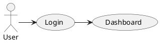

id: plantuml
audience: junior
title: "PlantUML"
sidebar_label: PlantUML
type: technology
tech_type: tool
category: modeling
tags: [modeling, uml, diagram, text, code]
official_url: "https://plantuml.com/"
vendor: "PlantUML Open Source"
license: "MIT"
first_seen: 2009
requires_articles: [modeling/what-is-model]
used_in_tasks: []
alternatives: [drawio, mermaid]
difficulty: 2
estimated_time: 15

# PlantUML

PlantUML — это инструмент для создания UML-диаграмм из текстового описания. Вы пишете код на специальном языке, PlantUML парсит его и генерирует диаграмму. Идеально для хранения диаграмм в Git и code review.

## Для чего используется

- Описание Use Case и Sequence диаграмм текстом
- Хранение диаграмм в одном репозитории с кодом
- Автоматическая генерация документации
- Интеграция в CI/CD — диаграммы обновляются при изменении кода

## Ключевые концепции

### Принцип «Диаграмма как код»

Преимущества текстового формата:
- Можно хранить в Git и делать diff
- Не нужно мышкой рисовать линии
- Легко переиспользовать фрагменты
- Можно генерировать из кода (Java, Python, JS)

### Поддерживаемые типы диаграмм

| Тип | Нотация |
|-----|---------|
| Sequence | Sequence diagram |
| Use Case | Use Case diagram |
| Class | Class diagram |
| Activity | Activity diagram |
| State | State machine |
| Component | Component diagram |
| Deployment | Deployment diagram |
| Gantt | Gantt chart (нетипично для UML) |

### Интеграции

- **VS Code / IntelliJ IDEA** — плагины с live preview
- **GitHub / GitLab** — рендеринг `.puml` файлов
- **Jenkins / CI** — генерация PNG/SVG при сборке
- **Confluence** — плагин для вставки PlantUML

## Когда использовать

- Команда использует Git для всего (включая документацию)
- Нужен code review для диаграмм
- Диаграммы часто меняются — проще править текст, чем перерисовывать
- Документация генерируется автоматически

## Когда НЕ использовать

- **Быстрый набросок на встрече** — быстрее нарисовать в Draw.io
- **Сложные BPMN-диаграммы** — PlantUML поддерживает BPMN плохо
- **Дизайн-ревью с заказчиком** — заказчику проще смотреть на визуальную диаграмму

## Альтернативы

| Инструмент | Плюсы | Минусы |
|-----------|-------|--------|
| **Mermaid** | Встроена в GitHub/Markdown, интеграция с Docusaurus | Меньше типов диаграмм |
| **Draw.io** | Визуальный, бесплатный, Confluence | Нет code review |
| **Enterprise Architect** | Полный спектр UML | Дорогой, сложный |

## Как начать

1. Установите плагин PlantUML для VS Code
2. Создайте файл `diagram.puml`
3. Напишите простую sequence diagram
4. Посмотрите превью в редакторе

## Ссылки

- [Официальный сайт](https://plantuml.com/)
- [Online сервер](http://www.plantuml.com/plantuml/uml/)
- [PlantUML для VS Code](https://marketplace.visualstudio.com/items?itemName=jebbs.plantuml)
- [PlantUML в Confluence](https://marketplace.atlassian.com/apps/1214252/plantuml-for-confluence)
