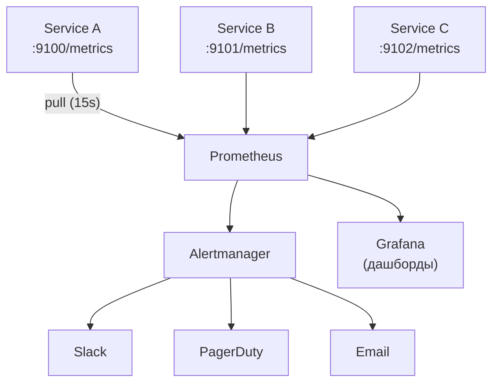

:::info[TL;DR]
Prometheus — open-source система сбора и хранения метрик, стандарт де-факто в Kubernetes / cloud-native. Использует pull-модель: сама забирает метрики с сервисов по HTTP (`/metrics`). PromQL — язык запросов. В e-commerce — мониторинг количества заказов, времени ответа OMS, ошибок. Альтернативы: Graphite, InfluxDB, Datadog.
:::

## Для кого эта статья

- Middle SA, специфицирующий метрики сервисов
- SA, работающий с мониторингом e-commerce

После прочтения вы:
- Поймёте pull-модель и компоненты Prometheus
- Узнаете PromQL для бизнес-метрик
- Сможете специфицировать метрики (RED) для сервисов

## Что это такое

Prometheus — система мониторинга и алертинга. Собирает метрики из сервисов (pull), хранит time-series, позволяет строить дашборды (через Grafana) и отправлять алерты (через Alertmanager).

## Архитектура



## Ключевые концепции

| Концепция | Описание |
|-----------|----------|
| **Pull model** | Prometheus сам опрашивает сервисы (scrape) по расписанию |
| **Metrics endpoint** | `GET /metrics` — HTTP-endpoint, отдающий метрики |
| **PromQL** | Язык запросов для аггрегации (rate, avg, histogram) |
| **Labels** | Ключи для фильтрации (service, method, status) |
| **Alertmanager** | Компонент алертинга: правила → уведомления |
| **Exporters** | Готовые сборщики метрик (PostgreSQL, Kafka, Node) |
| **Pushgateway** | Для batch-задач (push вместо pull) |

## Типы метрик

| Тип | Описание | Пример |
|-----|----------|--------|
| **Counter** | Только растёт | `http_requests_total` |
| **Gauge** | Может расти и падать | `memory_usage_bytes` |
| **Histogram** | Распределение значений | `request_duration_seconds` |
| **Summary** | Квантили | `request_duration_seconds_summary` |

## Пример метрик

```
# HELP http_requests_total Total number of HTTP requests
# TYPE http_requests_total counter
http_requests_total{method="POST", service="oms", status="200"} 1423
http_requests_total{method="GET", service="oms", status="404"} 12

# HELP order_processing_time_seconds Order processing time
# TYPE order_processing_time_seconds histogram
order_processing_time_seconds_bucket{le="0.1"} 1000
order_processing_time_seconds_bucket{le="0.5"} 5000
order_processing_time_seconds_bucket{le="1.0"} 8000
order_processing_time_seconds_bucket{le="+Inf"} 9000
order_processing_time_seconds_sum 4500
order_processing_time_seconds_count 9000
```

## PromQL — типовые запросы

| Что хотим | PromQL |
|-----------|--------|
| RPS за последние 5 мин | `rate(http_requests_total[5m])` |
| 95-й перцентиль времени ответа | `histogram_quantile(0.95, rate(order_processing_time_seconds_bucket[5m]))` |
| Количество заказов за сегодня | `sum(increase(orders_created_total[24h]))` |
| Ошибки > 5% от запросов | `rate(http_requests_total{status=~"5.*"}[5m]) / rate(http_requests_total[5m]) > 0.05` |
| Up/down сервисов | `up{service="oms"}` |

## Для аналитика e-commerce

Аналитик специфицирует метрики сервисов. Стандарт — **RED** (Rate, Errors, Duration):

| Сервис | Rate (RPS) | Errors (5xx) | Duration (p95) |
|--------|-----------|-------------|----------------|
| **OMS** | Заказы/сек | Ошибки создания заказа | Время создания заказа |
| **Каталог** | Поиски/сек | Ошибки поиска | Время поиска |
| **Платежи** | Платежи/сек | Ошибки оплаты | Время подтверждения |
| **Лояльность** | Начисления/сек | Ошибки начисления | Время начисления |

## Альтернативы

| Инструмент | Когда выбрать |
|------------|-------------|
| **Prometheus** | Kubernetes, cloud-native, pull-модель |
| **Graphite** | Простые метрики, legacy |
| **InfluxDB** | Time-series, агентная модель |
| **Datadog** | SaaS, платно, но не администрировать |
| **VictoriaMetrics** | Замена Prometheus для больших объёмов |

## Проверь себя

1. **Чем Prometheus отличается от InfluxDB?**
   *Ответ:* Prometheus — pull (опрос сервисов), InfluxDB — push (отправка метрик). Prometheus проще для K8s, InfluxDB — агентная модель.

2. **Что такое RED-метрики?**
   *Ответ:* Rate (RPS), Errors (ошибки), Duration (время ответа). Минимальный набор для мониторинга сервиса.

3. **Как посчитать 95-й перцентиль времени ответа в PromQL?**
   *Ответ:* `histogram_quantile(0.95, rate(order_processing_time_seconds_bucket[5m]))`

4. **Что такое Alertmanager?**
   *Ответ:* Компонент Prometheus, который обрабатывает алерты (но не хранит правила). Группирует, дедуплицирует и отправляет уведомления (Slack, PagerDuty, email).

## Ссылки для самостоятельного изучения

| Что | Описание | URL |
|-----|----------|-----|
| Prometheus — официальная документация | Все про Prometheus | prometheus.io |
| PromQL — язык запросов | Шпаргалка | prometheus.io |
| Grafana — дашборды | Визуализация метрик | grafana.com |
| Exporters | Сборщики метрик | prometheus.io |
| RED Method | Метрики для микросервисов | weave.works |
