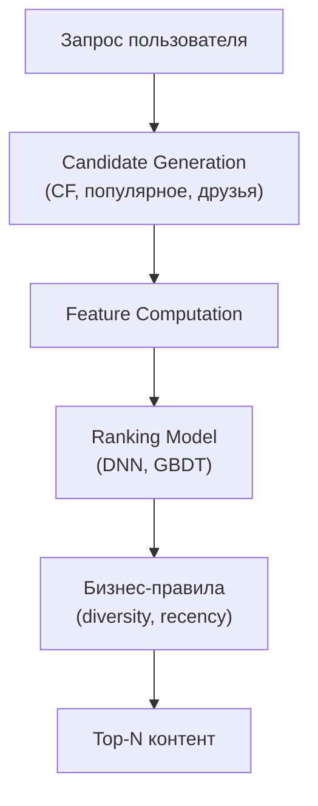

:::info[TL;DR]
Рекомендательные системы — ML-модели для подбора контента: collaborative filtering (user-based, item-based), content-based, hybrid. Современные подходы: two-tower DNN (запрос пользователя → кандидаты → ranking), real-time features с feature store. Аналитик описывает candidate generation, ranking, фильтры (diversity, freshness) и метрики (CTR, watch time, recall).
:::

## Типы рекомендаций

| Тип | Подход | Пример |
|-----|--------|--------|
| **Collaborative filtering** | User-based / Item-based | «Люди также смотрят» |
| **Content-based** | Похожие теги, категории | «Похожие видео» |
| **Two-tower DNN** | User embedding × Item embedding | TikTok, YouTube |
| **Popularity** | Тренды, горячее | Explore |
| **Hybrid** | Комбинация | Большинство платформ |

## Архитектура

## Что дальше

- [Лента контента](/docs/specialization/socnet-feed)

## Проверь себя

1. **Какие есть подходы к рекомендациям?**
   *Ответ:* Collaborative filtering, content-based, two-tower DNN, popularity, hybrid.

2. **Как устроен пайплайн рекомендаций?**
   *Ответ:* Запрос → Candidate Generation → Features → Ranking → Policies → Top-N.
