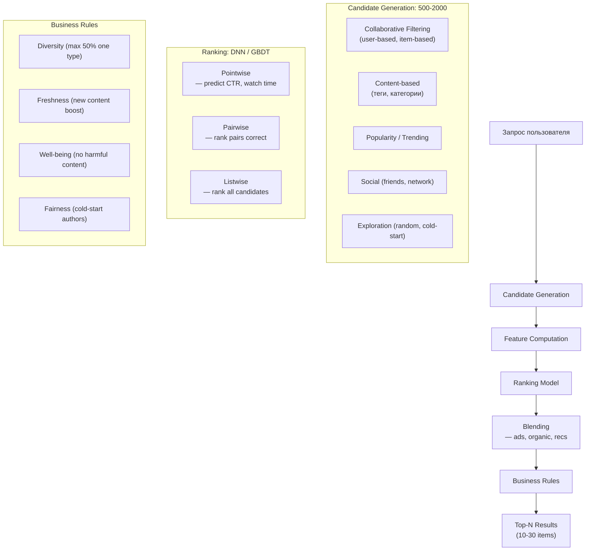
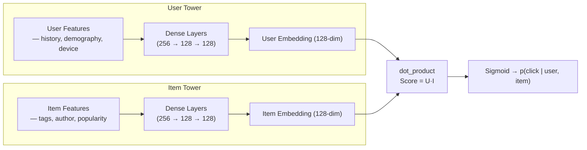
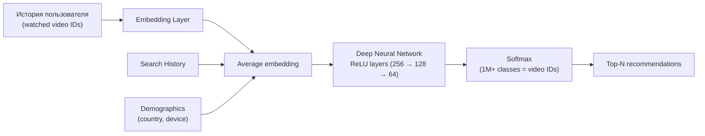

:::info[TL;DR]
Рекомендательные системы — ML-модели для подбора персонализированного контента. Основные подходы: collaborative filtering (user-based, item-based), content-based (теги, категории), two-tower DNN (TikTok FYP, YouTube Recommendations), popularity и hybrid. Архитектура: candidate generation (500-2000 кандидатов) → feature computation → ranking model (DNN/GBDT) → business rules (diversity, freshness, well-being). Аналитик описывает candidate generation, сигналы ранжирования, A/B эксперименты и метрики (CTR, watch time, recall, diversity).
:::

## Для кого эта статья

Senior SA, работающий с рекомендациями. После прочтения вы:

- Поймёте типы рекомендательных систем и когда какой применять
- Узнаете архитектуру: candidate generation → ranking → blending → business rules
- Сможете проектировать метрики качества рекомендаций (accuracy, diversity, freshness, exploration)
- Поймёте trade-off: personalization vs discovery, engagement vs well-being, bias vs fairness

## 1. Типы рекомендательных систем

| Тип | Подход | Пример | Требуемые данные | Сложность |
|-----|--------|--------|------------------|-----------|
| **Collaborative Filtering (CF)** | User-based / Item-based | «Люди также смотрят» | User-item matrix | Низкая |
| **Content-based** | Похожие теги, категории, текст | «Похожие видео» | Item features | Низкая |
| **Two-tower DNN** | User embedding × Item embedding | TikTok FYP, YouTube Recs | User history + item features | Высокая |
| **GBDT / XGBoost** | Gradient boosting on features | YouTube ranking, Facebook Feed | Feature engineering | Средняя |
| **Popularity** | Глобальные/локальные тренды | Explore page, Trending | Counts | Очень низкая |
| **Graph-based** | Node2Vec, GraphSAGE, PinSage | Pinterest Recs, LinkedIn FoF | Social graph | Высокая |
| **Hybrid** | Комбинация нескольких | Большинство платформ | Всё выше | Очень высокая |

## 2. Архитектура рекомендаций



### Candidate Generation

```
Input: user_id + context (device, time, location)
Output: 500-2000 candidate items

Methods:
1. CF — find similar users/items via user-item matrix
2. Content-based — items with similar tags/categories
3. Social — items from friends/subscriptions
4. Trending — items with recent velocity
5. Exploration — random items for new user/item cold-start
```

**Пример: 2-stage YouTube Recs**
```
Stage 1 (Candidate Gen): 100 videos из истории, поиска, подписок
Stage 2 (Ranking): DNN → expected watch time → 20 videos
Total candidates: 100 (не 1000, потому что YouTube большой)
```

## 3. Collaborative Filtering

### User-based CF

```
Найти пользователей, похожих на меня
→ Посмотреть, что им нравится, но я не видел
→ Посоветовать мне

Distance: cosine similarity(user_i, user_j)
Score: weighted average of ratings from similar users

Проблемы:
- Scalability: O(N²) для N пользователей
- Cold start: новый пользователь — нет истории
- Sparsity: user-item matrix очень разрежен
```

### Item-based CF

```
Найти элементы, похожие на те, что я лайкал
→ Посоветовать похожие

Distance: cosine similarity(item_i, item_j)
Score: weighted average of similarity × my rating

+ Scalability: O(M²) для M items (items < users)
+ Хорошо для маленьких каталогов
- Cold start: новый item — нет взаимодействий
```

### Matrix Factorization (SVD, ALS)

```
R = P × Q^T
R: user-item matrix
P: user factors (n_users × k)
Q: item factors (n_items × k)

Minimize: ||R - P×Q^T||² + reg(P, Q)

+
- Latent factors (интересы, категории)
- Good for sparse data
- SVD, ALS (Spark), BPR (Bayesian Personalized Ranking)
```

## 4. Two-Tower DNN

Современный стандарт для recommendation-систем (TikTok, YouTube, Instagram, Pinterest).

```
User Tower → user_embedding (128-dim)
Item Tower → item_embedding (128-dim)
Score = dot_product(user_vector, item_vector)
```

**Архитектура two-tower:**



**Features:**

| Тип | User features | Item features | Cross features |
|-----|--------------|---------------|----------------|
| **ID** | user_id embedding | item_id embedding | — |
| **Categorical** | language, country, device | category, author_id, license | author_affinity |
| **Temporal** | last_visit, session_start | upload_time, last_watched | recency_score |
| **Behavioural** | watch_history, likes, shares | avg_watch_time, completion_rate | similarity_to_history |
| **Context** | hour_of_day, network_speed | — | — |

**Пример: TikTok FYP Score**

```
Score = w1 × predicted_watch_time + w2 × predicted_like + w3 × predicted_share + w4 × predicted_comment

где predicted_watch_time — основной output two-tower DNN
w1 = 0.6, w2 = 0.2, w3 = 0.1, w4 = 0.1 (типичные веса)
```

## 5. Метрики рекомендаций

### Accuracy метрики

| Метрика | Что измеряет | Формула | Пример |
|---------|-------------|---------|--------|
| **CTR** | Кликабельность | clicks / impressions | 5-20% |
| **Watch time** | Время просмотра | total_watch_time / views | 15-60 min/day |
| **Completion rate** | % досмотревших | completed / started | 30-80% |
| **Recall@K** | % релевантных в топ-K | relevant_in_top_K / total_relevant | 70% @50 |
| **Precision@K** | % релевантных среди топ-K | relevant_in_top_K / K | 30% @50 |
| **NDCG@K** | Rank-weighted quality | DCG / IDCG | 0.7 |
| **MAP** | Mean Average Precision | avg precision across queries | 0.5 |

### Business метрики

| Метрика | Описание | Норма |
|---------|----------|-------|
| **Session length** | Средняя длительность сессии | 10-30 min |
| **Retention D7/D30** | Возврат через 7/30 дней | D7: 50%+, D30: 20%+ |
| **Engagement rate** | Лайки/комменты/репосты на 1000 просмотров | 10-50 |
| **Diversity** | % разных категорий в рекомендациях | > 50% |
| **Exploration rate** | % нового контента в рекомендациях | 10-20% |
| **Churn from recs** | % оттока из-за плохих рек-ций | < 5% |
| **Ad revenue per session** | Доход с сессии | $0.05-0.50 |

## 6. Практический кейс: YouTube Deep Neural Network (2016)

**Проблема:** YouTube — 1B+ часов просмотра/день. Рекомендации — основной источник трафика (70%+). Нужна recommendation-система, которая предсказывает, что пользователь будет смотреть.

**Архитектура YouTube DNN:**



**Ключевые решения:**

1. **Watch time prediction (не CTR).** YouTube обнаружил: predicted CTR ведёт к clickbait (пользователи кликают, но не смотрят). Watch time — «true north»: если пользователь смотрит долго, видео качественное.
2. **Weighted logistic regression.** Видео с долгим watch time = позитивный пример с весом = watch time. Короткие просмотры = негативные.
3. **Exploration.** В candidate generation добавляют случайные видео — иначе пользователь видит только популярное, новые авторы не пробиваются.
4. **Age-based features.** YouTube заметил: пользователи смотрят по-разному в разное время. Вечером — длинные видео, в обед — короткие.

**Результат:**
- Watch time: +50% за 2 года
- CTR: -10% (но это хорошо — меньше кликбейта)
- Cold-start: новые видео появляются в рекомендациях за 1 час

## Ссылки для самостоятельного изучения

| Ресурс | Описание | Ссылка |
|--------|----------|--------|
| Google — YouTube DNN Recommendations | Классическая статья 2016 | https://research.google/pubs/deep-neural-networks-for-youtube-recommendations/ |
| TikTok Engineering Blog | Архитектура FYP | https://www.tiktok.com/engineering |
| Twitter/X Recommendation Algorithm | Open-source код рекомендаций | https://github.com/twitter/the-algorithm |
| Google — Real-Time Recommendations at Scale | Two-tower в Google Play | https://research.google/pubs/real-time-recommendations/ |
| Pinterest PinSage | Graph convolutional recs | https://medium.com/pinterest-engineering/pinsage-a-graph-convolutional-network-for-recommendations-5e6f8c3e9f4d |
| Facebook — Deep Learning Recommendation Model (DLRM) | Модель для Ads Recs | https://research.facebook.com/publications/deep-learning-recommendation-model-for-personalized-ranking/ |
| Neural Collaborative Filtering (NCF) | Гибрид CF + DNN | https://arxiv.org/abs/1708.05031 |
| RecSys Conference Proceedings | Главная конференция по RecSys | https://recsys.acm.org/ |
| Evaluation Metrics for Recommender Systems | Обзор метрик | https://surprise.readthedocs.io/en/stable/evaluation.html |

## Проверь себя

1. **Какие есть подходы к рекомендациям?**
   *Ответ:* Collaborative filtering (user-based, item-based, matrix factorization), content-based (tags, categories), two-tower DNN (TikTok, YouTube), GBDT/XGBoost (ranking), popularity, graph-based (PinSage), hybrid.

2. **Как устроен пайплайн рекомендаций?**
   *Ответ:* Запрос → Candidate Generation (500-2000 кандидатов: CF, content, social, trending, exploration) → Feature Computation → Ranking (DNN/GBDT: pointwise/pairwise/listwise) → Blending (ads + organic) → Business Rules (diversity, freshness, well-being, fairness) → Top-N results.

3. **Чем two-tower DNN отличается от collaborative filtering?**
   *Ответ:* CF — similarity matrix (user-user, item-item). Two-tower — user tower → user embedding, item tower → item embedding, score = dot product. Two-tower: (1) handles cold-start лучше (features вместо matrix), (2) масштабируется на 1B+ items, (3) поддерживает context features (time, device).

4. **Почему YouTube использует predicted watch time, а не predicted CTR?**
   *Ответ:* CTR → clickbait (пользователи кликают на кликбейт, но не смотрят). Watch time — true north: если пользователь смотрит долго, видео реально интересное. YouTube обнаружил: predicted CTR растёт, но retention падает. Watch time коррелирует с retention.

5. **Какие бизнес-правила применяют к рекомендациям?**
   *Ответ:* Diversity (не более 50% одного типа/автора), Freshness (boost нового контента), Well-being (удалить triggers: disordered eating, violence), Fairness (10-20% exploration для холодного старта), Context (меньше видео в обед, больше вечером).
