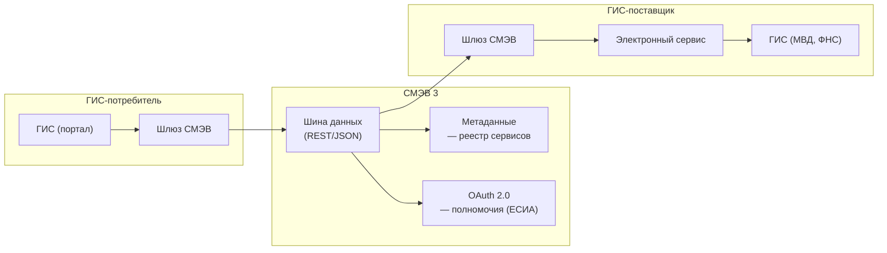

:::info[TL;DR]
СМЭВ — государственная «шина» для обмена данными между ГИС (25 000+ подключённых систем, 1B+ запросов/год). Версия 3 (текущая) — REST/JSON, OAuth 2.0 + УКЭП, асинхронные callback. Аналитик специфицирует: вид сведения (что запрашиваем), электронный сервис (как), метаданные (формат данных), SLA (5-30 сек), транспорт (REST/SOAP). Шлюз СМЭВ — сертифицированный компонент (ViPNet или альтернатива).
:::

## Для кого эта статья

Senior SA, проектирующий СМЭВ-интеграцию. После прочтения вы:

- Поймёте архитектуру СМЭВ 3.x: потребитель → шина → поставщик
- Узнаете протокол: OAuth 2.0, УКЭП, REST/JSON, callback
- Сможете выбрать транспорт (СМЭВ 2 vs 3) под legacy и новые системы
- Поймёте SLA и таймауты: синхронный (5-10 сек), асинхронный (24 часа)

## 1. СМЭВ — общая схема



## 2. Версии и транспорт

| Параметр | СМЭВ 2 | СМЭВ 3 |
|----------|--------|--------|
| **Транспорт** | SOAP 1.2 (XML) | REST (HTTP/2) |
| **Формат** | XML | JSON / XML |
| **Аутентификация** | УКЭП (каждый запрос) | OAuth 2.0 Client Credentials + УКЭП |
| **Асинхронность** | Нет (синхронный) | Асинхронный (callback) |
| **Коннектор** | ViPNet Coordinator (обязателен) | Шлюз СМЭВ (любой сертифицированный) |
| **SLA** | 30 сек | 5-30 сек |
| **Статус** | Поддержка до 2025 | Актуальная версия |

## 3. Типы запросов

| Тип | Когда | Таймаут | Кол-во попыток | Пример |
|-----|-------|---------|---------------|--------|
| **Синхронный** | Короткий запрос (проверка статуса) | 5-10 сек | 2-3 | Проверка полиса, ИНН |
| **Асинхронный** | Долгая обработка (запрос выписки) | 24 часа | — | Выписка ЕГРН, запись в ЗАГС |
| **Массовый (batch)** | Пул запросов (список граждан) | 72 часа | — | Ежемесячные реестры |

## 4. Сериализация данных

**Запрос (синхронный, REST):**

```http
POST /smev/v3/request HTTP/1.1
Content-Type: application/json
Authorization: Bearer <OAuth2_token>
X-Signature: base64(УКЭП запроса)

{
  "requestId": "REQ-2025-001",
  "sender": "7701777777-PORTAL",
  "recipient": "7701888888-MVD",
  "serviceCode": "MVD-PASSPORT-CHECK",
  "data": {
    "documentSeries": "4501",
    "documentNumber": "123456",
    "surname": "Иванов"
  }
}
```

**Ответ:**

```json
{
  "requestId": "REQ-2025-001",
  "status": "SUCCESS",
  "data": {
    "valid": true,
    "fullName": "Иванов Иван Иванович",
    "birthDate": "1990-01-01",
    "department": "ОВД ЦАО Москвы"
  },
  "signature": "base64(УКЭП ответа)",
  "timestamp": "2025-01-01T10:00:00Z"
}
```

## 5. Ключевые термины

| Термин | Пояснение |
|--------|-----------|
| **Вид сведения (ВС)** | Тип данных — «Паспорт РФ», «ИНН», «СНИЛС» |
| **Электронный сервис** | API ГИС-поставщика для запроса ВС |
| **Метаданные** | JSON Schema вида сведения |
| **ЕСИА-полномочия** | Право потребителя запрашивать ВС (настройка в ЕСИА) |
| **Шлюз СМЭВ** | Сертифицированный компонент для подключения |
| **ОГВ/ОМСУ** | Органы госвласти / местного самоуправления |

## Ссылки для самостоятельного изучения

| Ресурс | Описание | Ссылка |
|--------|----------|--------|
| Технологический портал СМЭВ 3 | Документация, спецификация | https://smev3.gosuslugi.ru |
| ЕСИА — OAuth 2.0 и полномочия | Аутентификация запросов | https://esia.gosuslugi.ru |
| ViPNet Coordinator — шлюз | Сертифицированный коннектор | https://infotecs.ru |
| Реестр электронных сервисов СМЭВ | Поиск видов сведений | https://smev.gosuslugi.ru/services |
| 210-ФЗ об организации госуслуг | Правовая база СМЭВ | https://www.consultant.ru |

## Проверь себя

1. **Чем СМЭВ 3 отличается от СМЭВ 2?**
   *Ответ:* REST вместо SOAP, JSON вместо XML, OAuth 2.0 вместо УКЭП на каждый запрос, асинхронность (callback), любой сертифицированный шлюз вместо ViPNet.

2. **Как форматируется СМЭВ-запрос?**
   *Ответ:* POST / REST JSON: requestId, sender (ОГВ), recipient, serviceCode, data. Заголовки: Authorization (Bearer), X-Signature (УКЭП). Синхронный: таймаут 5-10 сек, асинхронный: callback до 24 часов.

3. **Какие бывают типы запросов?**
   *Ответ:* Синхронный (5-10 сек, проверка статуса), асинхронный (24 часа, выписка), массовый batch (72 часа, реестры).

4. **Что такое «вид сведения» и «ЕСИА-полномочия»?**
   *Ответ:* Вид сведения — тип данных (Паспорт РФ, ИНН). ЕСИА-полномочия — право ГИС-потребителя запрашивать этот вид: настроено в ЕСИА, соответствует госфункции органа.

5. **Какой SLA у СМЭВ-запросов?**
   *Ответ:* Синхронный: таймаут 5-10 сек, сервер должен ответить за < 3 сек (P95). Асинхронный: callback до 24 часов, в среднем 1-60 мин. Ошибка таймаута → 2-3 ретрая.
