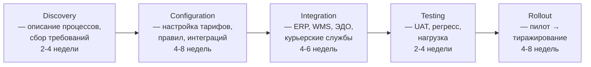

:::info[TL;DR]
TMS (Transportation Management System) — класс систем для планирования, исполнения и контроля транспортировки грузов. Ключевые вендоры: 1С:TMS (РФ), SAP TM (enterprise), Oracle OTM, Solomon TMS (SaaS, ритейл), RetaiLite. TMS решает задачи: маршрутизация, управление перевозчиками, тарификация, трекинг, ЭДО, взаиморасчёты. Аналитик на проекте TMS описывает бизнес-процессы перевозок, настраивает тарифные схемы, интегрирует TMS с WMS/ERP и провайдерами ЭДО.
:::

## Для кого эта статья

Middle SA, участвующий в автоматизации логистики. После прочтения вы:

- Поймёте функциональную архитектуру TMS и место TMS в логистическом ландшафте
- Узнаете методологию внедрения: discovery → configure → integration → rollout
- Сможете проектировать тарифные схемы и выбирать перевозчиков по KPI
- Поймёте метрики транспортной логистики: cost per delivery, OTIF, SLA compliance

## 1. Что такое TMS

TMS — это система-оркестратор транспортировки. Она принимает заказы на доставку (из WMS/ERP), планирует маршруты, назначает перевозчиков, отслеживает исполнение и закрывает фин-цикл (акты, оплата).

```
TMS в цепочке логистики:

ERP (заказы клиентов)
  → WMS (сборка, упаковка, отгрузка)
    → TMS (транспорт до клиента)
      → Courier Service (последняя миля)
      → EDO (электронные документы)
```

Глобальный рынок TMS — $12.5B (2024), CAGR 15%. В РФ — рост 20-30% в год из-за ухода западных вендоров и перехода на 1С:TMS и Solomon.

## 2. Архитектура TMS

```mermaid
flowchart TD
    subgraph Input["Входные данные"]
        ERP["ERP — заказы, клиенты, товары"]
        WMS["WMS — отгрузки, упаковочные листы"]
        GEO["Геоданные — адреса, матрица расстояний"]
    end

    subgraph TMS["TMS"]
        PLAN["Планирование<br/>— маршруты, расписание, консолидация"]
        CARR["Управление перевозчиками<br/>— тендеры, договоры, рейтинг"]
        TARIFF["Тарификация<br/>— base rate, надбавки, fuel surcharge"]
        TRACK["Трекинг<br/>— GPS, статусы, ETA"]
        EDO["ЭДО<br/>— УПД, ЭТРН, счета"]
        FIN["Взаиморасчёты<br/>— акты, сверка, оплата"]
    end

    subgraph Output["Выходные данные"]
        COURIER["Курьерская служба<br/>— заказы, этикетки, трекинг"]
        EDO_SYS["Система ЭДО<br/>— Диадок, СБИС, 1С-ЭДО"]
        FIN_SYS["Фин. системы<br/>— 1С:Бухгалтерия, ERP"]
        DWH["Хранилище данных<br/>— аналитика, отчёты"]
    end

    ERP --> PLAN
    WMS --> PLAN
    GEO --> PLAN
    PLAN --> CARR
    CARR --> TARIFF
    TARIFF --> TRACK
    TRACK --> EDO
    EDO --> FIN

    PLAN --> COURIER
    TRACK --> COURIER
    EDO --> EDO_SYS
    FIN --> FIN_SYS
    FIN --> DWH
```



## 3. Функции TMS — детально

### 3.1 Планирование

| Функция | Описание | Типичные параметры |
|---------|----------|-------------------|
| **Маршрутизация** | Построение маршрутов с учётом ограничений | Временные окна, вместимость, вес |
| **Консолидация** | Объединение грузов в одну машину | LTL → FTL, cross-dock |
| **Расписание** | Slot booking, dispatch schedule | 30-60 min slots |
| **Wave planning** | Волновое планирование отгрузок | 3-5 волн/день |

**Типы маршрутов:**

| Тип | Описание | Пример |
|-----|----------|--------|
| **Line haul** | Магистральная перевозка склад → склад | МСК → НН, 400 км |
| **Milk run** | Сбор от нескольких поставщиков | 3 поставщика → 1 склад |
| **Local delivery** | Доставка с одного склада | 1 склад → 30 магазинов |
| **Cross-dock** | Транзит через сортировочный центр | МСК → РЦ → города |

### 3.2 Управление перевозчиками

| Этап | Описание | Артефакт |
|------|----------|----------|
| **Тендер** | Запрос ставок у перевозчиков | Таблица ставок (rate card) |
| **Отбор** | Проверка лицензий, страховок, рейтинга | Критерии отбора (checklist) |
| **Договор** | Закрепление условий | Договор + SLA (OTIF, cost) |
| **Рейтинг** | Пост-оплата по KPI | Scorecard (повреждения, опоздания) |

**Пример рейтинга перевозчика:**

| Критерий | Вес | Оценка | Взвешенная |
|----------|-----|--------|------------|
| OTIF (on-time, in-full) | 40% | 95% | 38 |
| Повреждения | 20% | 2% повреждений | 18 |
| Стоимость | 20% | 1.2× market | 16 |
| Коммуникация | 10% | Быстрая | 9 |
| EDI-готовность | 10% | Есть | 10 |
| **Итого** | **100%** | | **91/100** |

### 3.3 Тарификация

**Структура тарифа:**

```
Base rate: 500 ₽/час или 20 ₽/км
Надбавки:
  - Fuel surcharge: +15% при цене дизеля > 60 ₽/л
  - Night delivery: +20%
  - Weekend delivery: +30%
  - Oversize (1.2× стандарта): +50%
  - Region (удалённые): +100-200%

Пример: Москва → область, 60 км, день
  Base: 60 км × 20 ₽ = 1 200 ₽
  + Fuel: 0 (дизель < 60 ₽)
  + Night: 0 (день)
  Итого: 1 200 ₽
```

**Типы тарифов:**

| Тип | Расчёт | Когда использовать |
|-----|--------|-------------------|
| **Per km** | За каждый километр | Магистральные, long haul |
| **Per hour** | Повременная | Local delivery, простой |
| **Per stop** | За точку выгрузки | Milk run, multi-drop |
| **Per pallet** | За паллетоместо | FTL, LTL |
| **Per kg** | За вес | Почта, экспресс |
| **Flat rate** | Фикс за маршрут | Регулярные, одинаковые |

## 4. Вендоры TMS в РФ

### Сравнение

| Система | Платформа | Масштаб | Интеграция | Стоимость |
|---------|-----------|---------|------------|-----------|
| **1С:TMS** | 1С | Средний | 1С:ERP, 1С:Бухгалтерия | 1-5 млн ₽ |
| **Solomon** | SaaS | Крупный | Любая через API | 50-500 т. ₽/мес |
| **RetaiLite** | SaaS | Средний | WB, Ozon, СДЭК | 30-200 т. ₽/мес |
| **SAP TM** | SAP | Enterprise | SAP S/4HANA | От $500K |
| **Oracle OTM** | Oracle | Enterprise | Oracle EBS, JDE | От $300K |

**Тренд 2024-25:** Уход SAP/Oracle → переход на 1С:TMS и Solomon. Solomon растёт 40%+ в год за счёт ритейла и FMCG.

### Когда выбирать

| Сценарий | Рекомендация |
|----------|-------------|
| Ритейл, FMCG, 100-500 доставок/день | Solomon или RetaiLite |
| Крупный ритейл, 1000+ доставок/день | 1С:TMS или Solomon Enterprise |
| Enterprise с SAP S/4HANA | SAP TM (если возможен) |
| Маркетплейс (WB, Ozon интеграция) | RetaiLite |
| Такси/доставка еды | Собственная разработка |

## 5. Внедрение TMS — этапы



**Типичные риски внедрения:**

| Риск | Последствие | Митигация |
|------|-------------|-----------|
| Неполные тарифные данные | Ошибки в расчётах, переплата | Аудит rate card до конфигурации |
| Интеграция ERP ≠ TMS | Ручной ввод заказов | Тест интеграции на load |
| Отказ перевозчиков от EDI | Ручная загрузка статусов | Альтернатива: личный кабинет |
| Изменение процессов | Саботаж пользователей | Change management + training |

## 6. Метрики TMS

| Метрика | Формула | Норма | Что делать если плохо |
|---------|---------|-------|----------------------|
| **On-time delivery** | вовремя / всего | > 95% | Пересмотреть SLA, маршруты |
| **Full delivery (in-full)** | без повреждений / всего | > 99% | Упаковка, перевозчик |
| **OTIF** | on-time AND in-full | > 94% | Композит — смотреть составляющие |
| **Cost per delivery** | затраты / кол-во доставок | — | Сравнить с market benchmark |
| **Transportation cost / revenue** | транспорт / выручка | < 5% (ритейл) | Оптимизация маршрутов |
| **Utilization rate** | загрузка / вместимость | > 80% | Консолидация, LTL → FTL |
| **Dwell time** | простой под загрузкой | < 2 hours | Slot booking, cross-dock |
| **Claims rate** | претензии / доставки | < 1% | Quality check перевозчика |

## 7. Когда использовать TMS и когда НЕ использовать

### Когда нужен TMS

- Более 50 доставок/день
- Несколько перевозчиков (3+)
- Сложная тарификация (надбавки, регионы)
- Требуется трекинг для клиентов
- ЭДО с контрагентами

### Когда TMS избыточен

- 5-20 доставок/день — достаточно Excel или Google Maps
- Один постоянный перевозчик — прямой договор + трекинг по телефону
- Доставка внутри одного города — курьерский сервис (СДЭК, Boxberry) без TMS
- Такси/доставка еды — нужна диспетчерская (не TMS), а routing engine

## 8. Практический кейс: Внедрение TMS в сети гипермаркетов

**Проблема:** Сеть гипермаркетов (200 магазинов, 4 РЦ, 1 500 доставок/день) — ручное планирование в Excel, 5 перевозчиков, OTIF = 82%, cost per delivery = 1 200 ₽.

**Анализ:**
- Ручное планирование → 2 часа/день на диспетчера, 40% маршрутов неоптимальны
- Нет консолидации → 30% машин едут полупустыми (utilization 55%)
- Бумажные документы → задержка закрытия заказа до 2 недель
- Нет рейтинга перевозчиков → 15% заказов у самого дешёвого (но 8% повреждений)

**Решение — внедрение Solomon TMS:**
1. **Discovery (3 недели):** описали процессы, rate cards, сняли 200+ маршрутов
2. **Configuration (6 недель):** настроили тарифы, интеграцию с 1С:ERP, ЭДО Диадок
3. **Integration (4 недели):** интеграция с WMS (штрихкоды, паллеты), купольные камеры (фото повреждений)
4. **Rollout (6 недель):** пилот на 1 РЦ → 4 РЦ

**Результат:**
- OTIF: 82% → 96% (+14 п.п.)
- Cost per delivery: 1 200 ₽ → 870 ₽ (-27%, = 495K ₽/день экономии)
- Utilization: 55% → 84%
- Время закрытия заказа: 2 недели → 2 дня
- ROI: 4 месяца

## Ссылки для самостоятельного изучения

| Ресурс | Описание | Ссылка |
|--------|----------|--------|
| Gartner — TMS Magic Quadrant | Анализ рынка TMS | https://www.gartner.com/en/supply-chain/topics/transportation-management |
| Solomon TMS Documentation | Документация Solomon | https://solomon.ru/products/tms/ |
| 1С:TMS — описание | Страница продукта 1С | https://solutions.1c.ru/catalog/tms |
| SAP TM — Product Page | SAP Transportation Management | https://www.sap.com/products/scm/transportation-management.html |
| Oracle OTM Documentation | Oracle Transportation Management | https://www.oracle.com/scm/logistics/transportation-management/ |
| RetaiLite — документация | TMS для ритейла | https://retailite.ru/ |
| Яндекс.Маршрутизация | API для Vehicle Routing | https://yandex.ru/dev/maps/route/ |
| Logistic OS — блог про TMS | Статьи о внедрении TMS в РФ | https://logistic-os.ru/blog/ |

## Проверь себя

1. **Какие функции выполняет TMS?**
   *Ответ:* Планирование маршрутов, управление перевозчиками, тарификация, трекинг, ЭДО, взаиморасчёты. TMS — оркестратор транспортировки между WMS/ERP и курьерскими службами.

2. **Какие типы тарифов бывают и когда какой использовать?**
   *Ответ:* Per km (магистральные), per hour (local delivery), per stop (milk run), per pallet (FTL/LTL), per kg (экспресс), flat rate (регулярные). Выбор зависит от типа маршрута и груза.

3. **Чем отличается Solomon от 1С:TMS?**
   *Ответ:* Solomon — SaaS (аренда, 50-500 т. ₽/мес), подходит для крупного ритейла, интеграция через API. 1С:TMS — коробка (1-5 млн ₽), глубокая интеграция с 1С:ERP. Выбор: SaaS vs on-premise, масштаб, бюджет на сопровождение.

4. **Какие метрики показывают эффективность TMS?**
   *Ответ:* OTIF (on-time + in-full, норма > 94%), cost per delivery (сравнение с market benchmark), utilization rate (> 80%), dwell time (< 2 hours), claims rate (< 1%). Главная — OTIF, композит качества доставки.

5. **Когда TMS не нужен?**
   *Ответ:* Меньше 50 доставок/день, один перевозчик, простые тарифы (фикс), доставка по одному городу. В этих случаях достаточно Excel + курьерский сервис. Такси/еда — нужна диспетчерская, а не TMS.
