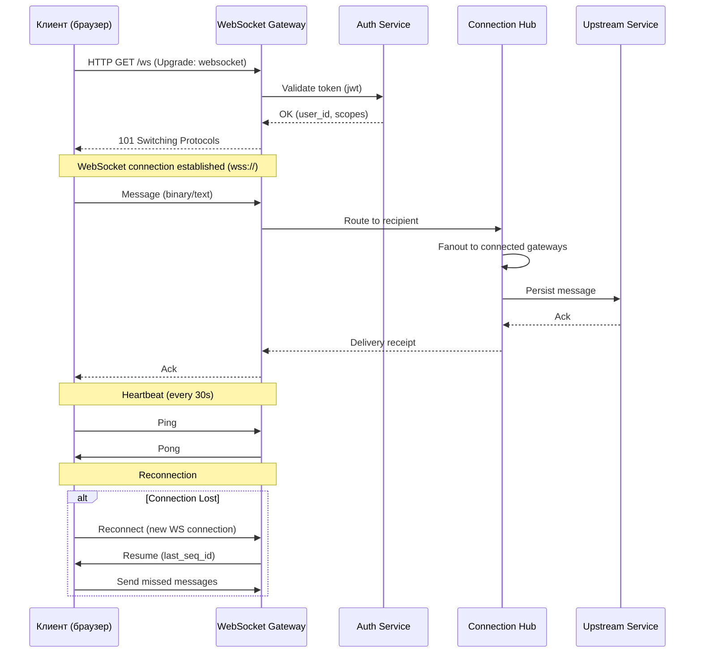

:::info[TL;DR]
WebSocket — full-duplex протокол поверх TCP (RFC 6455) для real-time коммуникаций (чаты, уведомления, коллаборация, live-стримы). SSE (Server-Sent Events) — однонаправленный протокол от сервера к клиенту (лента, тикеры, уведомления). Long Polling — fallback для браузеров без WebSocket. Аналитик выбирает протокол под сценарий: WebSocket для мессенджеров/игр, SSE для ленты/уведомлений, Long Polling — fallback. Примеры: Discord (WebSocket Gateway), Telegram (MTProto), Signal (WebSocket), Slack (WebSocket RTM).
:::

## Для кого эта статья

Middle SA, работающий с real-time системами. После прочтения вы:

- Поймёте разницу между WebSocket, SSE и Long Polling и когда что применять
- Узнаете архитектуру WebSocket Gateway (sharding, reconnection, heartbeat, compression)
- Сможете выбрать протокол для сценария (чат, лента, уведомления, live-stream)
- Поймёте метрики real-time доставки: latency, throughput, connection stability

## 1. Сравнение протоколов

| Параметр | WebSocket | SSE | Long Polling |
|----------|-----------|-----|-------------|
| **Направление** | Full-duplex (↔) | Server → Client (←) | Bidirectional (чередование) |
| **Протокол** | ws:// / wss:// | HTTP (text/event-stream) | HTTP (POST/GET) |
| **Формат** | Сообщения (binary/text) | События (text streams) | HTTP response body |
| **Handshake** | Upgrade: HTTP → WS | HTTP (text/event-stream) | HTTP |
| **Keep-alive** | Постоянное соединение | Постоянное соединение | Пересоздаётся каждый раз |
| **Браузерная поддержка** | 97%+ (IE 10+ via polyfill) | 96%+ (IE 8+ via EventSource polyfill) | 100% |
| **Fallback** | Polling, SSE | — | Есть из коробки |
| **Auto-reconnect** | Нужен клиент (handshake) | Авто (EventSource API) | Авто (HTTP errors) |
| **Лучший сценарий** | Чат, игры, коллаборация | Лента, уведомления, тикеры | Fallback, не real-time |
| **Сложность реализации** | Средняя | Низкая | Низкая |

## 2. WebSocket — подробно

### 2.1 Архитектура



### 2.2 WebSocket Gateway — масштабирование

**Проблема:** Один WebSocket сервер держит N соединений. Для 10M одновременных соединений нужно горизонтальное масштабирование.

```
Архитектура Discord WebSocket Gateway:

1. Multiple Gateway instances (shards)
2. Client connects to one shard (based on user_id % shard_count)
3. Shard-to-Shard: Redis Pub/Sub или Kafka
4. Reconnection: stateful (resume with session_id)
5. Rate limits: 50 connections/sec per IP, 1k messages/sec per shard
```

**Sharding:**

| Параметр | Без шардирования | Со шардированием |
|----------|-----------------|------------------|
| **Max connections** | 10K per instance | 10K × N instances |
| **Message routing** | Direct (monolith) | Pub/Sub (Redis/Kafka) |
| **Reconnection** | Full reconnect | Resume on same shard |
| **State** | In-memory | Redis session store |
| **Deployment** | Single server | K8s + auto-scaling |

### 2.3 Message format

WebSocket не определяет формат сообщения — это делает приложение.

```
JSON (чат): {"type": "message", "id": 123, "text": "hello", "from": "user1"}
Binary (игра): protobuf-serialized game state (10 bytes vs 200 bytes JSON)
```

**Protocol buffers vs JSON для WebSocket:**

| Параметр | JSON | Protobuf | MessagePack |
|----------|------|----------|-------------|
| **Size** | 200 bytes | 50 bytes (4× меньше) | 80 bytes |
| **Parse speed** | 1ms (JS) | 0.5ms (native) | 0.8ms |
| **Human-readable** | Да | Нет | Нет |
| **Schema** | Optional | Required (.proto) | Optional |
| **Лучше для** | Debug, development | Production (low latency) | Mixed |

**Discord:** JSON для Gateway API (developer-friendly), binary для voice (latency-critical).

### 2.4 Heartbeat, Reconnection, State

| Механизм | Описание | Пример параметров |
|----------|----------|-------------------|
| **Heartbeat** | Ping/Pong каждые N секунд | Every 30s (Discord), 15s (Slack) |
| **Reconnection** | Повторная попытка с exponential backoff | 1s → 2s → 4s → 8s → max 60s |
| **Resume** | Продолжить с last_sequence_id | session_id + last_seq → state restore |
| **Idle timeout** | Закрыть неактивное соединение | 300s без heartbeat |
| **Rate limiting** | Максимум сообщений/сек на соединение | 100 msg/sec (Discord) |

**Exponential Backoff:**
```
Retry 1: 1s
Retry 2: 2s
Retry 3: 4s
Retry 4: 8s
Retry 5: 16s
Retry 6+: 30-60s (cap)
Jitter: ±20% random
Total time to stable connection: ~120s (worst case)
```

## 3. SSE (Server-Sent Events)

### 3.1 Формат

```
HTTP Response:

Content-Type: text/event-stream
Cache-Control: no-cache
Connection: keep-alive

data: {"event": "new_post", "post_id": 123, "text": "Hello!"}

event: notification
data: {"type": "like", "user": "user2"}

:comment (ignored - for debugging)
```

### 3.2 Когда использовать SSE vs WebSocket

| Сценарий | Протокол | Почему |
|----------|----------|--------|
| **Чат** | WebSocket | Full-duplex: отправка + получение |
| **Лента уведомлений** | SSE | Только от сервера: «у вас новое сообщение» |
| **Live-тикер (цены, курсы)** | SSE | Только от сервера |
| **Коллаборация (Google Docs)** | WebSocket | Bidirectional: edit + receive |
| **Трансляция логов** | SSE | Только от сервера |
| **Real-time игра** | WebSocket | Low latency, binary protocol |
| **Push-уведомления** | SSE | Проще, чем WebSocket + Push API |

**Почему SSE проще:**
- На HTTP/2 — мультиплексирование (не расходует соединения)
- Автоматический reconnect в браузере (EventSource API)
- Простая реализация на сервере (EventStream)
- Pass-through через прокси лучше (HTTP vs WebSocket Upgrade)

## 4. Long Polling

### 4.1 Как работает

```
1. HTTP GET /feed?since=last_update_id → сервер держит запрос
2. Если новое событие — возвращает ответ (200 OK)
3. Если прошло timeout (30s) — возвращает 204 No Content
4. Client immediately sends new request

Latency: timeout / 2 в среднем (для timeout = 30s → avg 15s)
Throughput: 2 запроса на событие (request + response)
```

### 4.2 Когда использовать

| Сценарий | Использовать Long Polling | Почему |
|----------|--------------------------|--------|
| **WebSocket недоступен** (firewall, proxy) | Да | HTTP-only environments |
| **Low-frequency updates** | Да | < 10 events/min — overhead WebSocket не оправдан |
| **High-frequency (чаты)** | Нет | Latency 15s avg — неприемлемо |
| **Mobile (экономия батареи)** | Нет | Long Polling держит radio active |
| **Serverless (AWS Lambda)** | Да | WebSocket требует Gateway, Lambda ~ Long Polling |

## 5. Метрики real-time доставки

| Метрика | WebSocket | SSE | Long Polling |
|---------|-----------|-----|-------------|
| **Connection latency** | ~10ms (after handshake) | ~5ms (SSE start) | ~200ms (per request) |
| **Message latency (P50)** | < 50ms | < 100ms | < 5s |
| **Message latency (P99)** | < 500ms | < 1s | < 30s |
| **Throughput per connection** | 10K msg/sec | 1K msg/sec | 100 req/sec |
| **Max concurrent connections** | 65K per port (TCP limit) | 30K per port (HTTP connection limit) | Unlim (HTTP basis) |
| **Bandwidth overhead** | ~10% (header + framing) | ~5% (text/event-stream) | ~30% (HTTP headers) |
| **Battery (mobile)** | Средняя | Высокая (авто-reconnect) | Низкая (худшая) |

## Ссылки для самостоятельного изучения

| Ресурс | Описание | Ссылка |
|--------|----------|--------|
| RFC 6455 — WebSocket Protocol | Спецификация WebSocket | https://datatracker.ietf.org/doc/html/rfc6455 |
| W3C WebSocket API | Web API для браузеров | https://websockets.spec.whatwg.org/ |
| MDN — WebSocket | MDN документация | https://developer.mozilla.org/en-US/docs/Web/API/WebSocket |
| MDN — Server-Sent Events | MDN документация по SSE | https://developer.mozilla.org/en-US/docs/Web/API/Server-sent_events |
| Discord Developer — Gateway | Реализация WebSocket Gateway | https://discord.com/developers/docs/topics/gateway |
| Slack RTM API | WebSocket для Slack | https://api.slack.com/rtm |
| WebSocket.org | Тестирование WebSocket | https://websocket.org/ |
| Socket.IO | WebSocket библиотека с fallback | https://socket.io/ |
| Pusher | WebSocket как сервис | https://pusher.com/ |

## Проверь себя

1. **Чем WebSocket отличается от SSE?**
   *Ответ:* WebSocket — full-duplex (отправка + получение), SSE — однонаправленный от сервера к клиенту. WebSocket подходит для чатов/игр, SSE — для ленты/уведомлений. SSE проще (авто-reconnect, HTTP, больше прокси-дружественный), но не поддерживает отправку от клиента.

2. **Как масштабировать WebSocket для миллионов соединений?**
   *Ответ:* Sharding: разделить клиентов по gateway instances (user_id % shard_count). Каждый gateway держит 10K соединений. Shard-to-shard communication через Redis Pub/Sub или Kafka. Session state в Redis для resume после reconnection.

3. **Когда использовать Long Polling вместо WebSocket?**
   *Ответ:* (1) Enterprise firewall блокирует WebSocket (WS требует Upgrade, не всегда работает), (2) Низкая частота обновлений (< 10/min), (3) Серверная архитектура не поддерживает persistent connection (Lambda, Heroku). Минусы: latency (avg timeout/2), больше трафика (HTTP headers), не подходит для real-time.

4. **Какие метрики важны для real-time доставки?**
   *Ответ:* Connection latency, Message latency (P50, P99), Throughput (msg/sec/connection), Max concurrent connections, Reconnection time (exponential backoff), Heartbeat rate. Для WebSocket: resume success rate, shard utilization.

5. **Как работает WebSocket handshake?**
   *Ответ:* Client → Server: HTTP GET с заголовком Upgrade: websocket. Server → Client: 101 Switching Protocols. Connection переключается с HTTP на WebSocket (same TCP socket). Поддержка wss:// (WebSocket Secure) через TLS.
