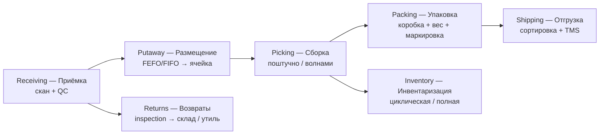
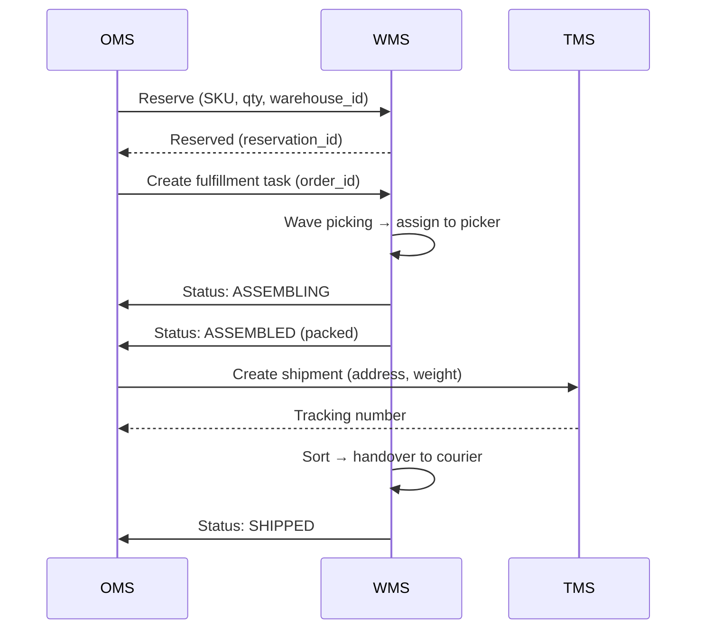

:::info[TL;DR]
WMS (Warehouse Management System) — система управления складом: приёмка, размещение, сборка, отгрузка, инвентаризация. Управляет ячейками (bin locations), а не просто «складом». OMS отправляет заказ как задание на сборку, WMS управляет маршрутом сборщика. Интеграция — через MQ (Kafka/RabbitMQ). Крупнейшие: SAP EWM, Oracle WMS, Manhattan, 1С:WMS.
:::

## Для кого эта статья

- Middle SA, интегрирующий OMS с WMS
- SA в фулфилмент-проекте
- SA, работающий с инвентаризацией

После прочтения вы:
- Поймёте 7 ключевых функций WMS
- Узнаете сущности: location, SKU, lot, task, wave
- Сможете спроектировать интеграцию OMS → WMS

## Что это такое

WMS — система управления складом. Отличается от простого учёта тем, что управляет **ячейками** (местами хранения), а не общими остатками. Знает, в какой стеллаж положить товар и откуда его забрать.

**Место WMS в архитектуре:**

```
OMS (заказы) ←→ WMS (склад) → TMS (доставка)
                    ↑
               ERP (учёт)
```

## Ключевые функции



### 1. Receiving (Приёмка)

- Сканирование штрихкода поставки
- Проверка количества и качества (QC)
- Привязка к партии (lot), сроку годности
- Создание задания на Putaway

### 2. Putaway (Размещение)

- Система предлагает ячейку по правилу (ABC, FEFO, FIFO)
- Сборщик сканирует ячейку и товар → подтверждение
- Обновление inventory

### 3. Picking (Сборка)

| Метод | Описание | Когда использовать |
|-------|----------|-------------------|
| **Piece picking** | Поштучная сборка | Мелкие заказы |
| **Wave picking** | Волна (группа заказов за раз) | Массовые заказы |
| **Cluster picking** | Один сборщик — несколько заказов | Неполные заказы |
| **Zone picking** | Каждый собирает в своей зоне | Большой склад |

### 4. Packing (Упаковка)

- Выбор коробки (по весу/размеру товара)
- Добавление накладной, рекламных материалов
- Контроль качества (5% случайных)
- Взвешивание → расчёт стоимости доставки

### 5. Shipping (Отгрузка)

- Сортировка по службам доставки
- Печать наклеек (трекинг)
- Передача в TMS
- Обновление статуса в OMS

### 6. Returns (Возвраты — RMA)

- Приёмка → Inspection
- Решение: на склад / утилизация / назад клиенту
- Обновление inventory

### 7. Inventory (Инвентаризация)

| Тип | Периодичность | Объём |
|-----|--------------|-------|
| Циклическая | Ежедневно — 1/N склада | 5-10% |
| Полная | Раз в год | 100% |
| По товару | При падении остатка ниже порога | Выборочно |

## Основные сущности WMS

| Сущность | Описание | Пример |
|----------|----------|--------|
| **Location** | Ячейка хранения (ряд-стеллаж-полка) | A-12-03 |
| **SKU** | Товарная позиция | IP15-BLK-128 |
| **Lot** | Партия (срок годности, серийный номер) | L2024-123 |
| **Task** | Задание сборщику | Собрать order 12345 |
| **Wave** | Волна (группа заказов) | Wave 2024-11-01-MSK |
| **Container** | Тара (коробка, паллета) | CONT-001 |
| **Zone** | Зона склада | Freezer, Dry, Hazard |

## Интеграция OMS → WMS



## Когда использовать

- Склад > 1 000 SKU
- > 100 заказов/день
- Несколько складов
- FEFO/FIFO — обязательное управление

## Когда НЕ использовать

- Мелкий склад (< 500 SKU) — достаточно Excel
- Только учёт (без сборки) — нужен ERP, не WMS

## Альтернативы

| Система | Тип | Когда выбрать |
|---------|-----|-------------|
| **SAP EWM** | Enterprise | Крупный склад, SAP-lover |
| **Manhattan WMS** | Enterprise | Ритейл, высокая производительность |
| **1С:WMS** | РФ, Enterprise | 1С-экосистема, РФ |
| **Oracle WMS** | Enterprise | Oracle DB |
| **myWMS** | Open-source | Маленький склад, бюджет |
| **Logistix** | SaaS | Средний бизнес |

## Проверь себя

1. **Чем WMS отличается от ERP в части склада?**
   *Ответ:* ERP — учёт остатков (сколько всего). WMS — управление ячейками (где лежит, как собрать). WMS знает physical layout склада.

2. **Какие есть методы сборки?**
   *Ответ:* Piece (поштучно), Wave (волна), Cluster (кластер), Zone (по зонам).

3. **Как OMS интегрируется с WMS?**
   *Ответ:* Асинхронно через MQ: OMS → резервирование → задание на сборку → WMS → статусы → OMS.

4. **Что такое cyclic inventory?**
   *Ответ:* Ежедневная инвентаризация части склада (1/N). В отличие от полной — не требует остановки работы.

## Ссылки для самостоятельного изучения

| Что | Описание | URL |
|-----|----------|-----|
| SAP EWM — документация | Управление складом | sap.com |
| 1С:WMS | WMS для РФ | 1c.ru |
| Manhattan WMS | WMS для ритейла | manh.com |
| Ozon — фулфилмент | Как устроен склад Ozon | ozon.ru |
